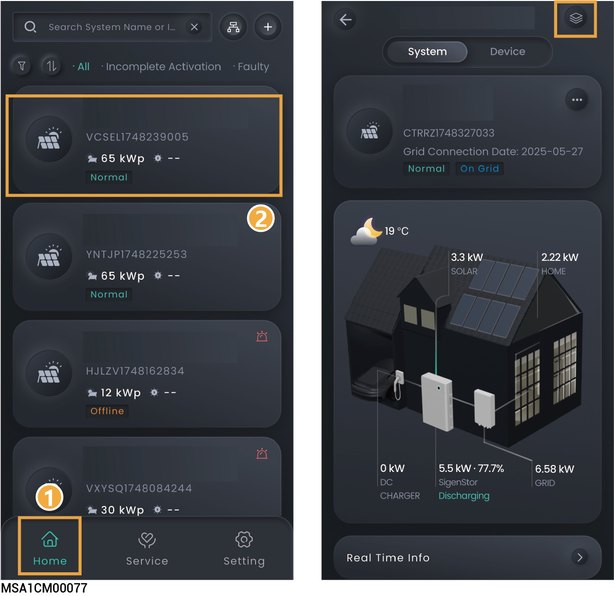

# System information



* <mark style="color:blue;">**On the "Home" screen, you can click the station name you want to query to check its detailed information, such as generating capacity and revenue.**</mark>
* <mark style="color:blue;">**In parallel connection scenarios, you can click "**</mark><mark style="color:blue;">**" to check the operation information of multiple devices.**</mark>

<figure><figcaption></figcaption></figure>
