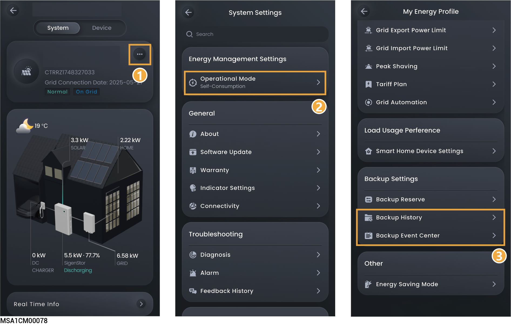

# Viewing backup power history and records



<mark style="color:blue;">**After Gateway is installed in the system, the system records on-grid/off-grid events. You can view the time and reason for the on-/off-grid switchover through the following methods.**</mark>

<figure><figcaption></figcaption></figure>
