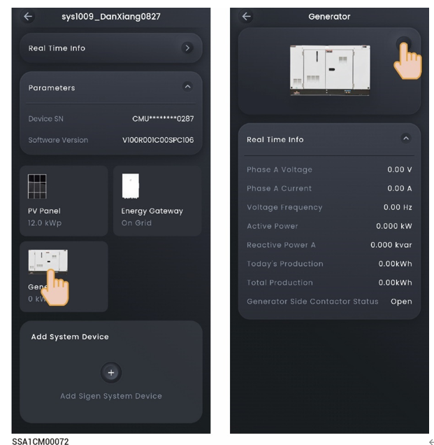

# Diesel generator



<mark style="color:blue;">Before connecting a diesel generator, please ensure that the Gateway that can be connected to the diesel generator has been configured in the networking and connected correctly. For details about the Gateway, please refer to the respective Installation Guide.</mark>

The system can automatically recognize and connect the diesel generator. Check the details and make settings in "Device" → "GENERATOR.”

<figure><figcaption></figcaption></figure>

### **Manual start by operating the generator's switch**

In this mode, you must switch on and off the system on the generator side.

<table><thead><tr><th width="72">No.</th><th width="143">Parameter name</th><th>Description</th></tr></thead><tbody><tr><td><strong>1</strong></td><td>Rated Power</td><td>Sets the rated power of the diesel generator.</td></tr><tr><td><strong>2</strong></td><td>Maximum Power Duty</td><td>To guarantee the optimal functioning status of the system, you are advised to control the output power of the diesel generator not more than 80%.</td></tr><tr><td><strong>3</strong></td><td>Minimum Power Duty</td><td>To ensure that the diesel generator does not run at no-load, it is suggested to control the output power of the generator. The recommended default value is 0%.</td></tr><tr><td><strong>4</strong></td><td>Battery Charging Cut-off SOC for Generator</td><td>When the SOC of the battery pack is lower than the "Battery Charging Cut-off SOC for Generator" setting, the diesel generator will charge the battery pack to the set value.</td></tr></tbody></table>

### **two - wire – start**

In this mode, you can start and stop the diesel generator in the App, or the diesel generator can start or stop automatically.

<table><thead><tr><th width="78">No.</th><th width="148">Parameter name</th><th>Description</th></tr></thead><tbody><tr><td><strong>1</strong></td><td>Operating Mode</td><td><ul><li>Manual</li><li>Auto</li></ul></td></tr><tr><td><strong>2</strong></td><td>Generator Start</td><td>In "Manual" mode, when it is set to , you can start or stop the diesel generator using the  icon in the App.</td></tr><tr><td><strong>3</strong></td><td>Rated Power</td><td>Sets the rated power of the diesel generator.</td></tr><tr><td><strong>4</strong></td><td>Maximum Power Duty</td><td>To guarantee the optimal functioning status of the system, you are advised to control the output power of the diesel generator not more than 80%.</td></tr><tr><td>5</td><td>Minimum Power Duty</td><td>To ensure that the diesel generator does not run at no-load, it is suggested to control the output power of the generator. The recommended default value is 0%.</td></tr><tr><td>6</td><td>Battery Charging Cut-off SOC for Generator</td><td>When the SOC of the battery pack is lower than the "Battery Charging Cut-off SOC for Generator" setting, the diesel generator will charge the battery pack to the set value.</td></tr><tr><td>7</td><td>Exercise</td><td>
In "Auto" mode, when it is set to ,the startup mode can be set.
<ul><li>Duration: Startup mode:Forced Start: Forced start at the set time.Smart Start: Smart start at the set time.</li><li>Interval: Scheduled start interval, with a cycle of 1 to 52 weeks.</li><li>Day In Week: Scheduled start date, Monday to Sunday.Start Time: Scheduled start time.</li></ul></td></tr><tr><td>8</td><td>Load Condition</td><td>
In "Auto" mode, when it is set to , the load power measurement type is Total Load Power:
<ul><li>Total load power.Maximum Power Per-phase: Maximum load power per phase.</li></ul></td></tr><tr><td>9</td><td>Generator Start Tatal Load Power Threshold</td><td>Total load power threshold for diesel generator start.When the total load power is greater than the threshold, the diesel generator is started.</td></tr><tr><td>10</td><td>Generator Stop Tatal Load Power Threshold</td><td>Total load power threshold for diesel generator stop.When the total load power is less than the threshold, the diesel generator is stopped.</td></tr><tr><td>11</td><td>Time of use</td><td>In "Auto" mode, when it is set to , you can set a schedule to start the diesel generator.</td></tr><tr><td>12</td><td>Auto Start SOC</td><td>Diesel generator start SOC threshold.When the battery SOC is greater than the threshold, the diesel generator is started.</td></tr><tr><td>13</td><td>Auto Stop SOC</td><td>Diesel generator stop SOC threshold.When the battery SOC is less than the threshold, the diesel generator is stopped.</td></tr></tbody></table>
