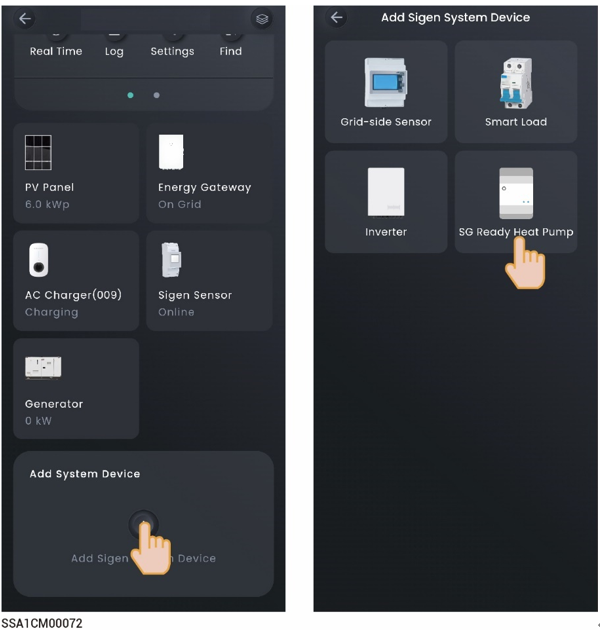

# SG heat pump



<mark style="color:blue;">Before connecting to a heat pump, make sure that:</mark>

* <mark style="color:blue;">The heat pump has been properly connected to the DO port of the company's inverter, and the software version of the inverter enables users to connect the heat pump.</mark>
* <mark style="color:blue;">"DO Custom Function Enable" in the "System Settings" menu has been set to</mark> 

## Control Mode

On the device interface, click the SG heat pump to set the SG heat pump control mode.

<figure><figcaption></figcaption></figure>

<table><thead><tr><th width="59.54547119140625">No.</th><th width="108.36358642578125">Parameter name</th><th width="138.63623046875">Parameter name</th><th>Description</th></tr></thead><tbody><tr><td>1</td><td>Manual Control</td><td>-</td><td><ul><li>When it is displayed as In Use, you can turn on and off the SG heat pump through " " on the App.</li><li>When displayed as Disable, You can click "Enable Manual" to switch to manual mode.</li></ul></td></tr><tr><td>2</td><td>Auto (Time-based)</td><td>-</td><td><ul><li>When displayed as In Use, it indicates automatic control mode. You can modify or create a schedule.</li><li>When displayed as Disable, you can click "Set a Schedule" → "Yes, save and use" to switch to automatic mode.</li></ul></td></tr><tr><td>3</td><td>Schedule</td><td>Energy Source Control</td><td>
Set the Energy Source Type. The following three modes can be set:
<ul><li>
Depends on System
<ul><li>Battery Boost: When set to , it can charge using the home battery.</li></ul></li></ul><ul><li>
Surplus PV Only
<ul><li> Starting Power: Set the starting power of the SG heat pump.</li><li>Rated Power: Set the rated power of the connected device, which can be checked on the SG heat pump's label.</li><li>Battery Boost: When set to , the home battery charges the SG heat pump.</li></ul></li></ul><ul><li>
Battery Level Control
<ul><li>Device Activation Threshold: The SG heat pump will activate when the actual SOC is greater than the set parameter.</li><li>Device Deactivation Threshold: The SG heat pump will deactivate when the actual SOC is less than the set parameter.</li></ul></li></ul></td></tr><tr><td>4</td><td>Ready by</td><td>Activation For</td><td>Total running time. Before the time set in Be Ready By, if the running time on that day is less than the set value, the SG heat pump will be turned on.</td></tr><tr><td>5</td><td>Ready by</td><td>Be Ready By</td><td>Set the running time. It is used in conjunction with the total running time.</td></tr><tr><td>6</td><td>Resume Schedule</td><td>-</td><td>If a schedule has been added, you can click to delete the schedule parameters.</td></tr></tbody></table>

SG Ready Heat Pump Settings
