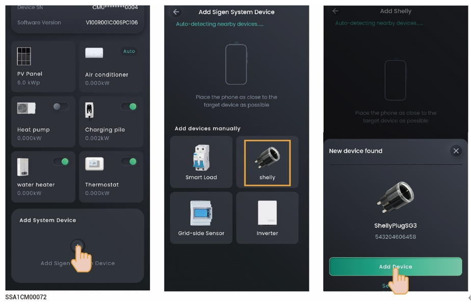

# Shelly smart switch



* <mark style="color:blue;">Shelly needs to connect to the same WLAN network as SigenStor.</mark>
* <mark style="color:blue;">You need to turn on the Bluetooth feature before connecting to Shelly.</mark>

<figure><figcaption></figcaption></figure>
