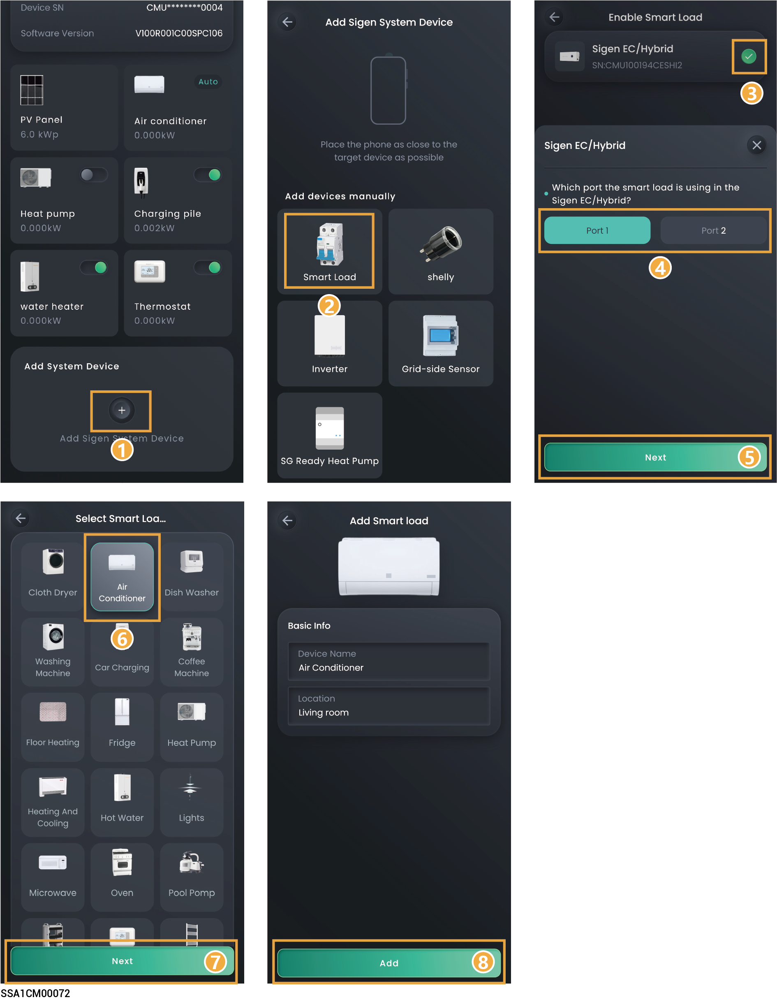
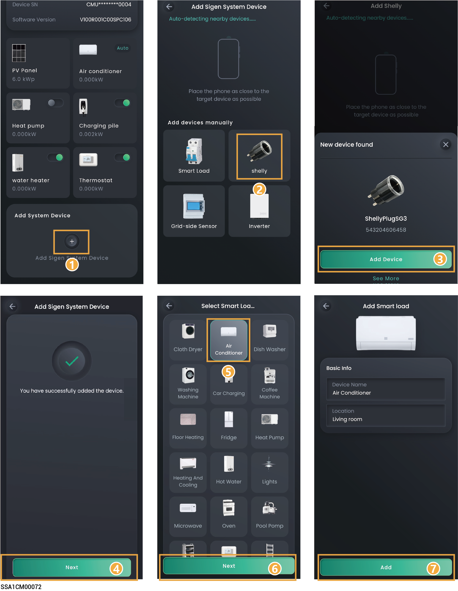

# Smart load

### Method 1: Connecting using Gateway



* <mark style="color:blue;">**Before connecting a smart load, please ensure that a Gateway is configured in the networking.**</mark>
* <mark style="color:blue;">**The number of smart loads that can be connected is determined by the supported capacity of the Gateway.**</mark>
* <mark style="color:blue;">**After adding the smart load to the App, you can switch the smart load on and off through the App. Alternatively, the system can remotely control the equipment on and off based on the actual running conditions and the SOC threshold you set.**</mark>
* <mark style="color:blue;">**If you cannot locate the icon of the connected device, for example, an immersion heater, select "Other" and connect it. You can check the connected smart load on the "Device" screen.**</mark>

<figure><figcaption></figcaption></figure>

### Method 2: Connecting using Shelly



* <mark style="color:blue;">**You need to turn on the Bluetooth feature on the phone before connecting to Shelly.**</mark>
* <mark style="color:blue;">**Shelly needs to connect to the same WLAN network as SigenStor.**</mark>
* <mark style="color:blue;">**Shelly consists of smart plugs, smart relays, and other devices designed for power/energy monitoring and remote control of electrical loads.**</mark>

<figure><figcaption></figcaption></figure>



* <mark style="color:blue;">**For Shelly-related information, please refer to the user manual and specifications of the corresponding Shelly model.**</mark>
* <mark style="color:blue;">**Table 1 shows the supported Shelly models and related information for SigenStor Home series inverters. Please match them according to actual requirements.**</mark>

Table 1

<table><thead><tr><th width="50" align="center">No.</th><th width="121">Product Type</th><th width="167">Model Number</th><th width="203.22216796875">Recommended firmware versions supporting Shelly</th><th>Maximum supported load current</th></tr></thead><tbody><tr><td align="center">1</td><td>Smart plugs</td><td>Shelly Plug S Gen3</td><td>1.2.2, 1.2.3</td><td>AC power supply: 12A</td></tr><tr><td align="center">2</td><td>Smart plugs</td><td>Shelly Plus Plug S</td><td>1.0.7, 1.3.3, 1.4.4</td><td>AC power supply: 12A</td></tr><tr><td align="center">3</td><td>Smart plugs</td><td>Shelly Plus Plug UK</td><td>1.0.7, 1.3.3, 1.4.4</td><td>AC power supply: 13A</td></tr><tr><td align="center">4</td><td>Smart relays</td><td>Shelly 1PM Gen3</td><td>1.2.2, 1.3.3</td><td>
AC power supply: 16A

DC power supply: 10A
</td></tr><tr><td align="center">5</td><td>Smart relays</td><td>Shelly 2PM Gen3</td><td>1.2.2, 1.3.3</td><td>AC power supply: 10A per channel, 16A total</td></tr><tr><td align="center">6</td><td>Smart relays</td><td>Shelly 1PM Mini Gen3</td><td>1.3.3, 1.4.4, 1.5.0-beta1</td><td>AC power supply: 8A</td></tr><tr><td align="center">7</td><td>Smart relays</td><td>Shelly Plus 1PM</td><td>1.3.3, 1.4.4, 1.5.0-beta1</td><td>
AC power supply: 16A

DC power supply: 10A
</td></tr><tr><td align="center">8</td><td>Smart relays</td><td>Shelly Plus 2PM</td><td>1.3.3, 1.4.4, 1.5.0-beta1</td><td>AC power supply: 10A per channel, 16A total</td></tr><tr><td align="center">9</td><td>Smart relays</td><td>Shelly Pro 1PM</td><td>0.10.2-beta1, 1.4.4, 1.5.0-beta1</td><td>AC power supply: 16A per channel</td></tr><tr><td align="center">10</td><td>Smart relays</td><td>Shelly Pro 2PM</td><td>0.10.2-beta1, 1.4.4, 1.5.0-beta1</td><td>AC power supply: 16A per channel, 25A total</td></tr><tr><td align="center">11</td><td>Smart relays</td><td>Shelly Pro 4PM</td><td>0.10.2-beta1, 1.4.4, 1.5.0-beta1</td><td>AC power supply: 16A per channel, 40A total</td></tr></tbody></table>

### Control Mode

On the device interface, click the smart load you want to configure to set the smart load control mode.

<figure><figcaption></figcaption></figure>

<table><thead><tr><th width="54.0909423828125" align="center">No.</th><th width="98.18182373046875">Parameter name</th><th width="104.4544677734375">Parameter name</th><th>Description</th></tr></thead><tbody><tr><td align="center">1</td><td>Manual Control</td><td>-</td><td><ul><li>When it is displayed as In Use, you can turn on and off the Smart Load through "" on the App.</li><li>When displayed as Disable, You can click "Enable Manual" to switch to manual mode.</li></ul></td></tr><tr><td align="center">2</td><td>Auto (Time-based）</td><td>-</td><td><ul><li>When displayed as In Use, it indicates automatic control mode. You can modify or add a schedule.</li><li>When displayed as Disable, you can click "Set a Schedule" → "Yes, save and use" to switch to automatic mode.</li></ul></td></tr><tr><td align="center">3</td><td>Schedule</td><td>Energy Source Control</td><td>
Set the Energy Source Type. The following three modes can be set:
<ul><li>
Depends on System：此模式下，智能负载根据设置时间启动和关闭。
<ul><li>Battery Boost: When set to , home batteries charge smart loads.</li></ul></li></ul><ul><li>
Surplus PV Only：此模式下，智能负载根据设置功率启动和关闭。
<ul><li>Starting Power: Set the starting power of the load.</li><li>Rated Power: Set the rated power of the load, which can be checked on the load's label.</li><li>Battery Boost: When set to , home batteries charge smart loads. </li></ul></li></ul><ul><li>
Battery Level Control：此模式下，负载根据电池SOC值启动或关闭。
<ul><li>Device Activation Threshold: The smart load will activate when the actual SOC is greater than the set parameter.</li><li>Device Deactivation Threshold: The smart load will deactivate when the actual SOC is less than the set parameter.</li></ul></li></ul></td></tr><tr><td align="center">4</td><td>Ready by</td><td>Activation For</td><td>Total running time.Before the time set in Be Ready By, if the running time on that day is less than the set value, the load will be turned on.</td></tr><tr><td align="center">5</td><td>Ready by</td><td>Be Ready By</td><td>Set the running time.It is used in conjunction with the total running time.</td></tr><tr><td align="center">6</td><td>Resume Schedule</td><td>-</td><td>If a schedule has been added, you can click to delete the schedule parameters.</td></tr></tbody></table>

### Smart Load Settings

On the device interface, click the smart load you want to configure → click " " in the upper right corner to set the smart load parameters.

<table><thead><tr><th width="56.2728271484375" align="center">No.</th><th width="149.2728271484375">Parameter name</th><th width="132.45458984375">Parameter name</th><th>Description</th></tr></thead><tbody><tr><td align="center">1</td><td>General Settings</td><td>Device Type</td><td>Set the smart load type.</td></tr><tr><td align="center">2</td><td>General Settings</td><td>Device Name</td><td>Set the smart load name.</td></tr><tr><td align="center">3</td><td>General Settings</td><td>Room</td><td>Set the room where the smart load is located.</td></tr><tr><td align="center">4</td><td>Operation Settings</td><td>PV Excess Setting</td><td><ul><li>Starting Power: Set the starting power of the load.</li><li>Rated Power: Set the rated power of the load, which can be checked on the load's label.</li></ul></td></tr><tr><td align="center">5</td><td>Operation Settings</td><td>Minimum Running Time</td><td>Set the minimum running time for the smart load.</td></tr><tr><td align="center">6</td><td>Operation Settings</td><td>Backup Management (When configuring the Gateway in the network setup, this parameter is displayed.)</td><td><ul><li>
When Essential Load is set to , the SOC for load startup and shutdown can be configured.
<ul><li>Cut-in: The smart load will activate when the actual SOC is greater than the set parameter.</li><li>Cut-off: The smart load will deactivate when the actual SOC is less than the set parameter.</li></ul></li></ul></td></tr><tr><td align="center">7</td><td>Remove Smart Device</td><td>-</td><td>Click to remove the smart load.</td></tr></tbody></table>

