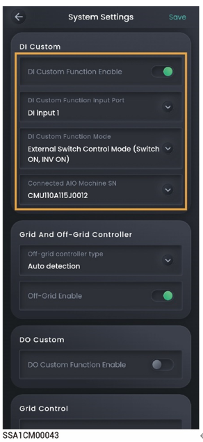

# DI自定义

<figure><figcaption></figcaption></figure>

<table><thead><tr><th width="88">序号</th><th width="139">参数名称</th><th width="527">说明</th></tr></thead><tbody><tr><td><strong>1</strong></td><td>DI Custom Function Enable</td><td>当设置为 时，DI自定义功能生效，可设置相关参数，反之功能不生效。</td></tr><tr><td><strong>2</strong></td><td>DI Custom Function Input Port</td><td>根据实际接线，设置连接设备的DI端口。</td></tr><tr><td><strong>3</strong></td><td>DI Custom Function Mode</td><td><ul><li>设置为“External Switch Control mode (switch ON, INV ON)”时，所连设备开关闭合，逆变器开机；设备开关断开，逆变器关机。</li><li>设置为“DRM0 mode (switch ON, INV OFF)”时，所连设备开关闭合，逆变器关机；设备开关断开，逆变器开机。</li><li>设置为“Micro-grid Control mode:(Switch OFF: Off grid INV standby, On-grid INV ON)”时，所连设备开关断开，电网掉电时，逆变器交流侧为待机状态，电网恢复并网时，逆变器正常运行；设备开关闭合，电网掉电时，允许逆变器离网运行。</li><li>设置为“Micro-grid Control mode:(Switch ON: Off grid INV standby, On-grid INV ON)”时，所连设备开关闭合，电网掉电时，逆变器交流侧为待机状态，电网恢复并网时，逆变器正常运行；设备开关断开，电网掉电时，允许逆变器离网运行。</li><li>设置为“Gateway Bypass mode (state of switch) ”时，所连设备开关断开，Gateway旁路开关闭合，禁止逆变器离网运行；设备开关闭合，Gateway旁路开关断开，允许逆变器离网运行。</li><li>设置为“Transfer Switch Position II Status Detection”时，所连设备开关断开，转换开关处理并网状态，禁止逆变器离网运行；设备开关闭合，转换开关处于离网状态，允许逆变器离网运行。</li></ul></td></tr><tr><td><strong>4</strong></td><td>Connected AIO Machine SN</td><td>设置连接设备的逆变器SN。</td></tr></tbody></table>
