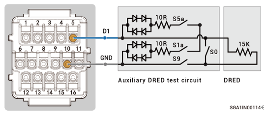

# DRM0参数

根据澳大利亚AS/NZS 4777.2:2020+A1:2021标准，逆变器并网需要满足DRM（Demand Response Mode）功能，其中DRM0是强制性要求。

图 接线关系示意 &#x20;

<figure><figcaption></figcaption></figure>



<mark style="color:blue;">在设置DRM0参数前，请确保设备GEN未被占用，且已正确连接DRED装置。</mark>

<table><thead><tr><th width="78">序号</th><th width="195.933349609375">参数名称</th><th>设置值</th></tr></thead><tbody><tr><td><strong>1</strong></td><td>DI Custom Function Enable</td><td></td></tr><tr><td><strong>2</strong></td><td>DI Custom Function Input Port</td><td><mark style="color:$danger;">DI Input 1  (改成DRM0)</mark></td></tr><tr><td><strong>3</strong></td><td>DI Custom Function Mode</td><td>DRM0 mode (switch ON, INV OFF) 注： <mark style="color:$danger;">DRED装置的开关S9为常闭，通过控制S0来控制逆变器的开关机：S0闭合，逆变器关机；S0断开， 逆变器开机。</mark></td></tr><tr><td><strong>4</strong></td><td>Connected AIO Machine SN</td><td>连接DRED装置的逆变器SN。</td></tr></tbody></table>
