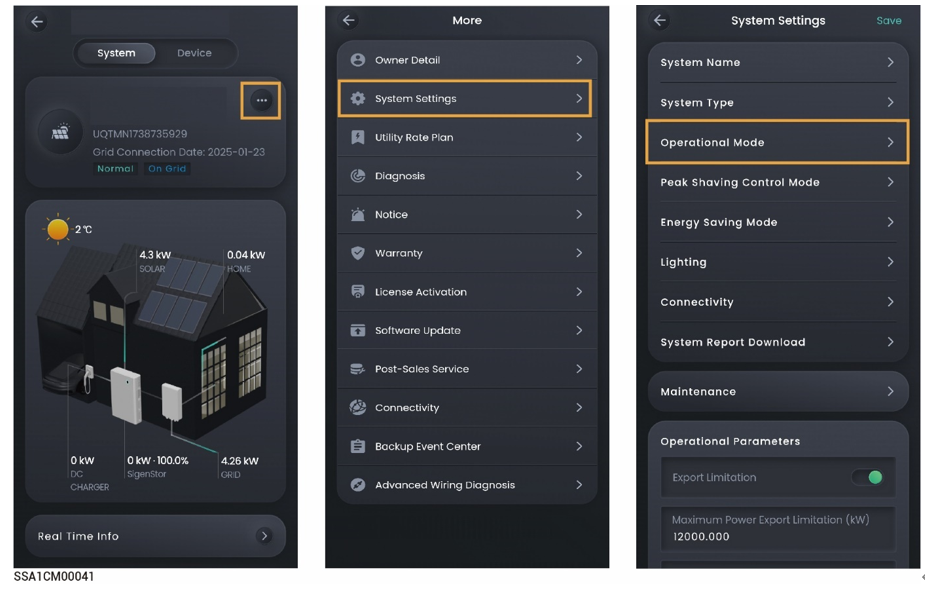

# 储能工作模式



* <mark style="color:blue;">**SigenStor储能系统主要应用于户用屋顶电站系统和工商业场景小型电站并网系统，最大可以支持20台SigenStor并机，如果需要更多SigenStor并机，可以接入数采SigenLogger满**</mark>
* <mark style="color:blue;">**储能系统支持多种工作模式，分别为：“Sigen AI mode”，“Fully Feed-in to Grid”，“Time-based Control”，“Self-Consumption” “Remote EMS Mode”，“Load Shedding mode”。**</mark>
* <mark style="color:blue;">**部分国家支持Load Shedding mode，以App界面显示为准。**</mark>

<figure><figcaption></figcaption></figure>
