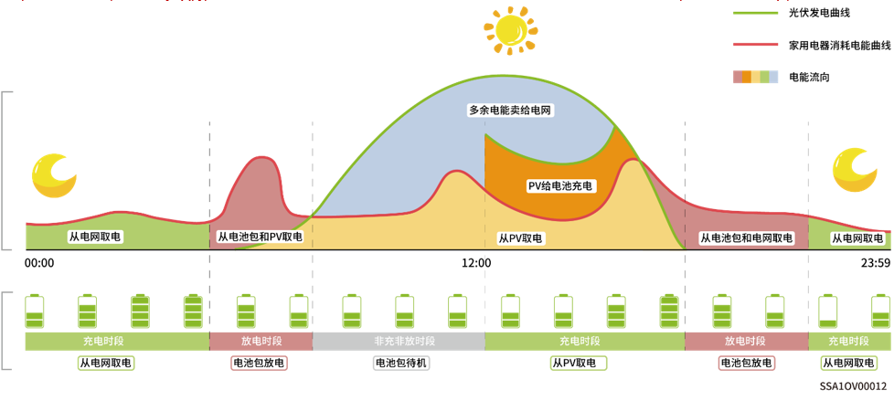

# Time-based Control

* 需要手动设置充电时段、放电时段和自发自用时段。在电价较高时光伏发电的剩余电力和电池电力可以卖给电网，在电网低电价时段给电池充电，可节省电费支出。
* 未设置时间段储能待机不放电，光伏优先供给负载，余电供给储能充电\*。
* 最多可以设置24个充放电或自发自用时间段。
* 适用于峰谷电价且价差较大的区域。

\*进入该时段时，会记录电池电量，当光伏功率大于负载时，剩余光伏功率给电池充电，当光伏功率小于负载时，电池可以放电给负载，但是电池电量下降并且接近进入该时段时的电池电量值时，电池会结束放电。

<figure><figcaption></figcaption></figure>

<figure><figcaption></figcaption></figure>

<table><thead><tr><th width="89">序号</th><th width="142">参数名称</th><th>参数名称</th><th>Description</th></tr></thead><tbody><tr><td>1</td><td>Charging</td><td>Maximum charging power for BAT</td><td>在此时间段，系统中所有电池包充电功率之和不能大于“PACK充电最大功率”。系统默认为无穷大。</td></tr><tr><td>2</td><td>Charging</td><td>Grid Charging Cut-off SOC</td><td>设置在此时间段，电池包利用电网充电的截止充电电量值。系统默认为100%</td></tr><tr><td>3</td><td>Charging</td><td>Maximum power for importing from grid</td><td>在此时间段，允许从电网侧买入的最大功率值。系统默认值，按照系统设置System Settings -> Operational Parameters 的参数生效</td></tr><tr><td>4</td><td>Charging</td><td>Maximum Charging Power from Grid to BAT</td><td>在此时间段，电网给电池包充电的最大功率。系统默认值为无穷大</td></tr><tr><td>5</td><td>Discharging</td><td>Maximum discharging power for BAT</td><td>在此时间段，系统中所有电池包放电功率之和不能大于“PACK放电最大功率”。系统默认为无穷大。</td></tr><tr><td>6</td><td>Discharging</td><td>Maximum power for exporting to grid</td><td>在此时间段，系统允许向电网侧卖出的最大功率值。系统默认值，按照系统设置System Settings -> Operational Parameters 的参数生效</td></tr><tr><td>7</td><td>Discharging</td><td>Maximum Discharging Power from BAT to Grid</td><td>在此时间段，电池包放电给电网的最大功率。系统默认值为无穷大</td></tr><tr><td>8</td><td>Self-Consumption</td><td>Maximum power for importing from grid</td><td>在此时间段，允许从电网侧买入的最大功率值。系统默认值，按照系统设置System Settings -> Operational Parameters 的参数生效</td></tr><tr><td>9</td><td>Self-Consumption</td><td>Maximum power for exporting to grid</td><td>在此时间段，系统允许向电网侧卖出的最大功率值。系统默认值，按照系统设置System Settings -> Operational Parameters 的参数生效</td></tr></tbody></table>



<mark style="color:blue;">未手动设置的时间段，当PV侧有电，优先供给家庭负载，剩余功率给电池包充电；电池包不进行放电。</mark>
