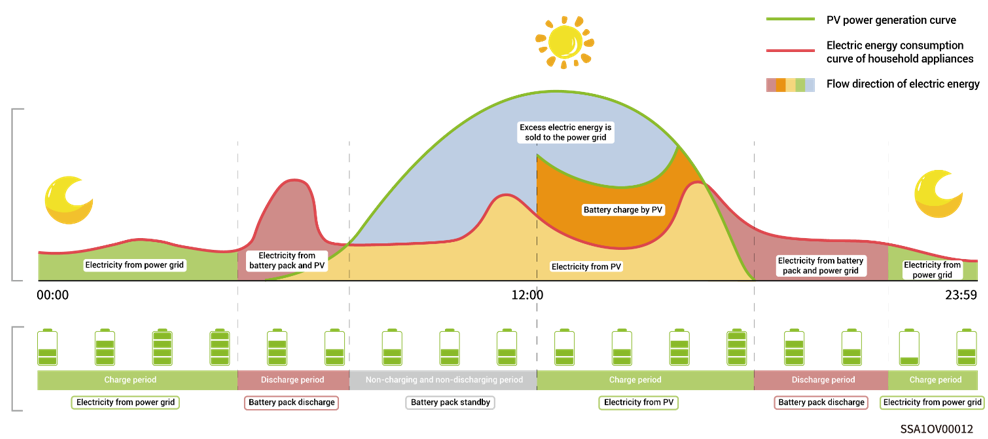
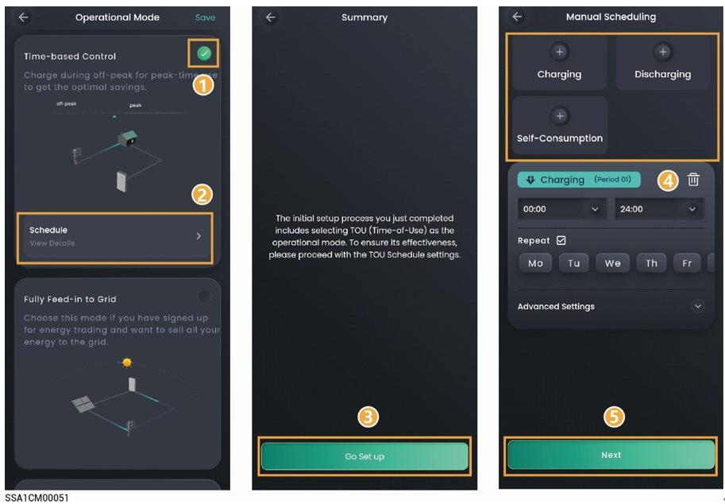

# Time-based Control

* The charging period, discharging period, and self-consumption period need to be set manually.When electricity prices are high, the surplus power from photovoltaic power generation and battery power can be sold to the grid, and the battery can be charged during periods of low electricity prices to save electricity bills.
* If no period is set, the energy storage system will be in standby mode without discharging. The photovoltaic power will prioritize supplying the load, and the surplus power will be used for charging energy storage system.\*
* Up to 24 charging and discharging or self-consumption periods can be set.
* It is suitable for areas with peak and valley electricity prices and significant price differences.

\*When entering this period, the battery capacity will be recorded. When the photovoltaic power is greater than the load, the remaining photovoltaic power will charge the battery. When the photovoltaic power is less than the load, the battery can be discharged to the load. However, when the battery capacity decreases and approaches the battery capacity value when entering this period, the battery will stop discharging.

<figure><figcaption></figcaption></figure>

<figure><figcaption></figcaption></figure>

<table><thead><tr><th width="89">No.</th><th width="142">Parameter name</th><th>Parameter name</th><th>Description</th></tr></thead><tbody><tr><td>1</td><td>Charging</td><td>Maximum charging power for BAT</td><td>During this period, the sum of the charging power of all battery packs in the system cannot be greater than the "PACK maximum charging power."The system default is infinity.</td></tr><tr><td>2</td><td>Charging</td><td>Grid Charging Cut-off SOC</td><td>Set the cut-off charging capacity value for the battery pack to be charged from the grid during this period.The system default is 100%.</td></tr><tr><td>3</td><td>Charging</td><td>Maximum power for importing from grid</td><td>The maximum power that can be imported from the grid during this period. System default values are effective according to the parameters in System Settings -> Operational Parameters.</td></tr><tr><td>4</td><td>Charging</td><td>Maximum Charging Power from Grid to BAT</td><td>The maximum power that the grid charges the battery pack during this period. The system default value is infinity.</td></tr><tr><td>5</td><td>Discharging</td><td>Maximum discharging power for BAT</td><td>During this period, the sum of the discharging power of all battery packs in the system cannot be greater than the "PACK maximum discharging power." The system default is infinity.</td></tr><tr><td>6</td><td>Discharging</td><td>Maximum power for exporting to grid</td><td>The maximum power that the system is allowed to export to the grid during this period. System default values are effective according to the parameters in System Settings -> Operational Parameters.</td></tr><tr><td>7</td><td>Discharging</td><td>Maximum Discharging Power from BAT to Grid</td><td>The maximum power that the battery pack discharges to the grid during this period. The system default value is infinity.</td></tr><tr><td>8</td><td>Self-Consumption</td><td>Maximum power for importing from grid</td><td>The maximum power that can be imported from the grid during this period. System default values are effective according to the parameters in System Settings -> Operational Parameters.</td></tr><tr><td>9</td><td>Self-Consumption</td><td>Maximum power for exporting to grid</td><td>
The maximum power that the system is allowed to export to

the grid during this period. System default values are effective according to the parameters in System Settings -> Operational Parameters.
</td></tr></tbody></table>



<mark style="color:blue;">The system will operate based on the PV power situation in periods that you do not specify as charging and discharging periods. The PV power will first be used to power home loads, with excess energy charging the batteries, and the batteries will not discharge.</mark>
