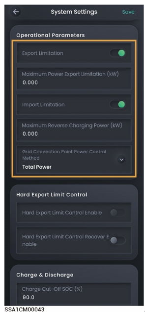

# 防逆流参数



* <mark style="color:blue;">开局时，安装商根据用户需求设置防逆流参数。</mark>
* <mark style="color:blue;">若开局后要更改参数，请根据当地法律法规和电网协议手动设置防逆流参数。</mark>
* <mark style="color:blue;">在设置防逆流参数前，请确保组网中已连接电表或Gateway。</mark>
* <mark style="color:blue;">不同的设备，显示参数会有所不同，请以实际界面为准。</mark>

<figure><figcaption></figcaption></figure>

<table><thead><tr><th width="75">序号</th><th width="154">参数名称</th><th>说明</th></tr></thead><tbody><tr><td><strong>1</strong></td><td>Export Limitation</td><td>设置为 时，允许并网点输出功率</td></tr><tr><td><strong>2</strong></td><td>Maximum Power Export Limitation</td><td>设置并网点输出的最大功率值</td></tr><tr><td><strong>3</strong></td><td>Maximum Power Import Limitation</td><td>设置为 时，允许并网点输入功率。</td></tr><tr><td><strong>4</strong></td><td>Maximum Power Import Limitation</td><td>设置并网点输入的最大功率值</td></tr><tr><td><strong>5</strong></td><td>Grid Connection Point Power Control Method</td><td><ul><li>Total Power：并网点按照三相总功率控制，即三相功率之和不能够超过Maximum Power Export Limitation和Maximum Reverse Charging Power</li><li>Power Per Phase：并网点按照每相独立控制，即每相功率不能超过Maximum Power Export Limitation的1/3 和Maximum Reverse Charging Power的1/3。</li></ul></td></tr></tbody></table>
