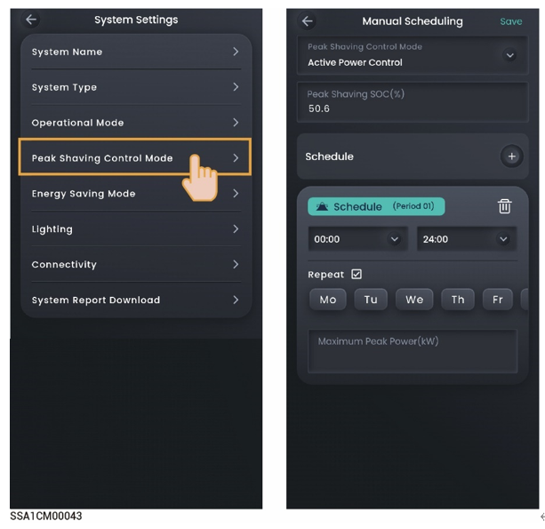

# Peak Shaving

* The electricity bill in some regions is calculated as follows: Total electricity bill = Cost at peak power + cost for electricity usage + other costs. Wherein, peak power refers to the maximum power imported from the grid. This mode is suitable for areas with peak and valley electricity prices and significant price differences.
* The Peak Shaving function can be used with all working modes, configuring the maximum peak power drawn from the grid to reduce the maximum peak power drawn from the grid during peak periods, thereby lowering the electricity bill.

<figure><figcaption></figcaption></figure>

### Active Power Control

<table><thead><tr><th width="61">No.</th><th width="174">Parameter name</th><th>Description</th></tr></thead><tbody><tr><td><strong>1</strong></td><td>Peak shaving SOC</td><td>This parameter setting affects the capacity of peak shaving, and the system charges the battery to the set SOC value during the off-peak period. The larger the parameter setting, the stronger the peak shaving capability.</td></tr><tr><td><strong>2</strong></td><td>Schedule</td><td>A maximum of 24 timetables can be added.Maximum Peak Power: Set the maximum peak power for drawing electricity from the grid for household loads and battery packcharging.</td></tr></tbody></table>

## Self-Consumption Mode Settings for Peak Shaving

## Time-based Control Mode Settings for Peak Shaving
