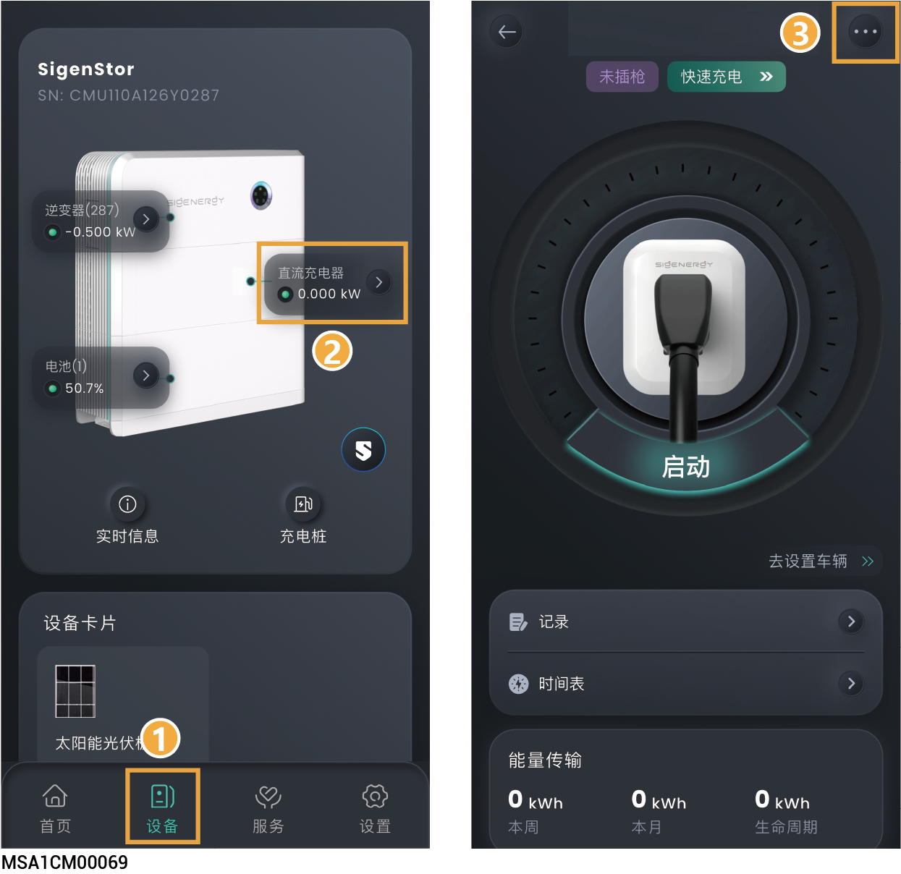

# 直流充电桩

<figure><figcaption></figcaption></figure>

<table><thead><tr><th width="76" align="center">序号</th><th width="159.818115234375">参数名称</th><th>说明</th></tr></thead><tbody><tr><td align="center">1</td><td>记录</td><td>点击可查看充电记录。</td></tr><tr><td align="center">2</td><td>时间表</td><td>若接入的车支持预约充电功能，可设置预约充放电时段。</td></tr></tbody></table>

### **充电偏好**

<table><thead><tr><th width="76" align="center">序号</th><th width="126.70703125">参数名称</th><th>说明</th></tr></thead><tbody><tr><td align="center"><strong>1</strong></td><td>充电模式</td><td><ol><li><strong>快速充电：大幅提升充电速率，短时间为设备补充大量电量的快速充电模式。</strong></li><li><strong>光伏盈余充电：利用光伏发电系统中多余电能给电池充电的光伏余电充电模式。</strong></li><li><strong>（可选）双向充放电：将直流充电桩作为额外的“储能”，参与整个电站的调度，为家用设备或电网放电。(开启V2X功能后，可选择此模式。具体操作步骤参见</strong><a href="ke-xuan-v2x-gong-neng-kai-tong-yu-yi-jian-fang-dian.md"><strong>（可选）V2X功能设置</strong></a><strong>。)</strong></li></ol><ul><li>电池增强：设置为时，可通过家用电池充电。</li><li>充电截止SOC：电池增强使能时，当实际SOC＜设置参数时，电池停止给直流充电桩充电。</li><li>车辆放电功率：设置电动车的最大放电功率，直流充电桩放电功率＜设置参数。</li><li>停止放电：放电截止SOC，当电动车的SOC小于该值时，电动车停止放电。</li><li>电网充电：设置为时，在PV余电模式下，允许从电网给电动车充电。</li><li>光伏盈余优先级：选中设备，上下拖动可修改设备优先级。</li></ul></td></tr><tr><td align="center"><strong>2</strong></td><td>充电设置</td><td><ul><li>EVDC 允许充电功率：设置直流充电桩允许最大充电功率。</li><li>车辆充电截止 SOC：设置充电截止SOC参数。当电动车的SOC值＞设置参数时，停止给车充电。</li></ul></td></tr><tr><td align="center"><strong>3</strong></td><td>OCPP 管理</td><td><ul><li>OCPP 状态：显式OCPP连接状态。</li><li>OCPP设置：设置为时，直流充电桩可以连接到OCPP的服务器，使用者可以从URL下拉菜单选择OCPP的平台。</li></ul></td></tr><tr><td align="center"><strong>4</strong></td><td>授权</td><td>充电鉴权设置。设置为 时，可无鉴权充电。</td></tr><tr><td align="center"><strong>5</strong></td><td>卡片管理</td><td>绑定Sigen RFID card。</td></tr><tr><td align="center"><strong>6</strong></td><td>我的车辆</td><td>点击可添加和修改电动车信息。</td></tr></tbody></table>

### **充电桩设置**

<table><thead><tr><th width="151.54547119140625">参数名称</th><th>说明</th></tr></thead><tbody><tr><td>维护</td><td><ul><li>复位：设备重启。</li><li>数据清除：可清除5min性能数据、告警、小时&#x26;日&#x26;月&#x26;年发电量、运行日志、设备信息等，请谨慎操作。</li></ul></td></tr></tbody></table>



<mark style="color:blue;">直流充电桩用户日常使用方式及注意事项请参见《直流充电桩用户手册》。</mark>
