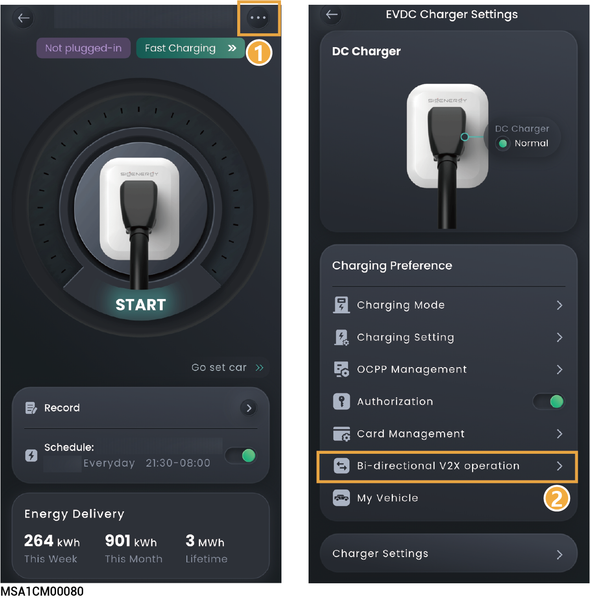
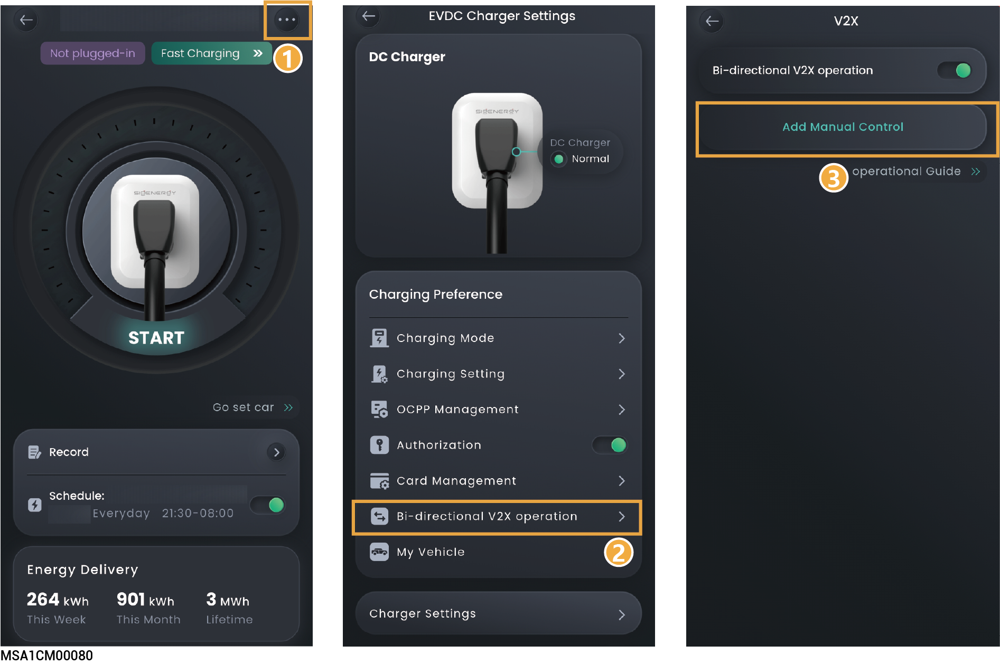

# (Optional) V2X Function Activation and Manual Control

## V2X Function Activation



* <mark style="color:blue;">After activating the V2X function, the Sigen EV DC Charging Module can serve as additional "energy storage" for power station dispatching, providing power to households during off-grid scenarios or discharging alongside other "energy storage" systems.</mark>
* <mark style="color:blue;">The device firmware version (SPC110) must support the V2X Discharge Enable function.</mark>

<figure><figcaption></figcaption></figure>

<table><thead><tr><th width="68">No.</th><th width="187.22216796875">Parameter Name</th><th>Description</th></tr></thead><tbody><tr><td>1</td><td>Bi-directional V2X operation</td><td>For first-time use, click Activate V2X Function, then sign the Risk Disclosure Agreement and fill in the basic vehicle information.</td></tr><tr><td>2</td><td>My Car</td><td><ul><li>The added Electric Vehicle must support the V2X function.</li><li>Multiple Electric Vehicles can be added, with one set as the Preferred Vehicle.</li><li>Battery Capacity: Enter the Electric Vehicle's actual battery capacity.</li></ul></td></tr></tbody></table>

## Manual Control



* <mark style="color:blue;">The V2X function must be activated before configuring this parameter.</mark>
* <mark style="color:blue;">Once set, the Sigen EV DC Charging Module will be forced to discharge, and the system will prioritize this setting.</mark>

<figure><figcaption></figcaption></figure>

<table><thead><tr><th width="74">No.</th><th width="189">Parameter Name</th><th>Description</th></tr></thead><tbody><tr><td>1</td><td>Add Manual Control</td><td><ul><li>Period: Set the discharge duration for the Sigen EV DC Charging Module.</li><li>Power: Set the discharge power (range: 0–25).</li></ul></td></tr><tr><td>2</td><td>Stop Discharging</td><td>Click to stop forced reverse discharging of the Sigen EV DC Charging Module.</td></tr></tbody></table>
