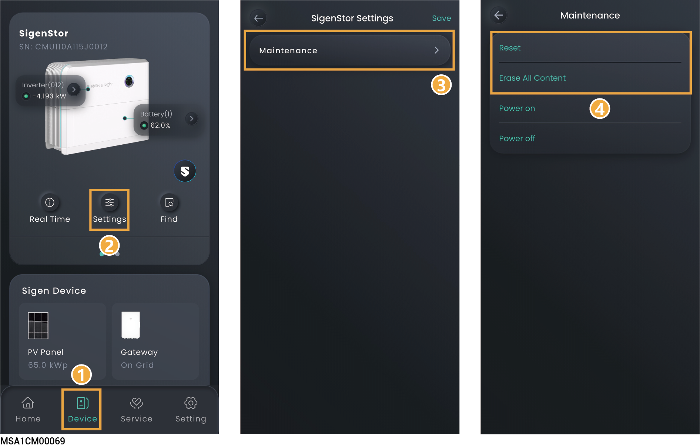

# SigenStor/SigenStack Unit Settings

## History maintenance



* <mark style="color:blue;">When you click "Reset,” the device restarts.</mark>
* <mark style="color:blue;">When you click "Erase All Content,” performance data within 5 minutes, alarms, and hourly/daily/monthly/yearly generating capacity, operation logs, device information will be cleared. Please exercise caution with this action.</mark>

<figure><figcaption></figcaption></figure>

## Power on/off



<mark style="color:blue;">This function is not supported in the Japan region.</mark>

<figure><figcaption></figcaption></figure>
