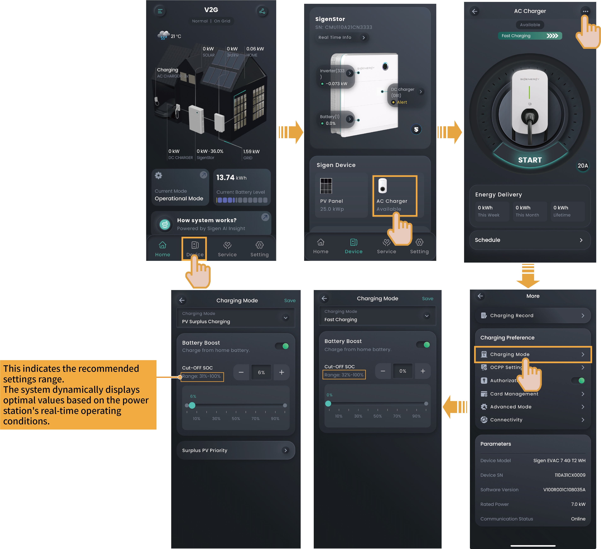

# Instructions to Charging Modes

After Sigen EV AC Charger is connected to our inverters, Fast Charging, and PV Surplus Charging modes are supported to adapt to different networking applications.



* <mark style="color:blue;">**Networking of the charger:**</mark> <mark style="color:blue;"></mark><mark style="color:blue;">Fast Charging is used by default, and no manual setting is required.</mark>
* <mark style="color:blue;">**PV charging or PV storage & charging networking:**</mark> <mark style="color:blue;"></mark><mark style="color:blue;">The options for charging modes include Fast Charging, and</mark> <mark style="color:blue;">PV Surplus Charging</mark><mark style="color:blue;">. You must set the charging mode in your App before charging.</mark>

**The charging mode setting method is the same for PV charging and PV storage & charging networking. Here, one setting method is taken as an example. The actual screen display shall prevail.**

