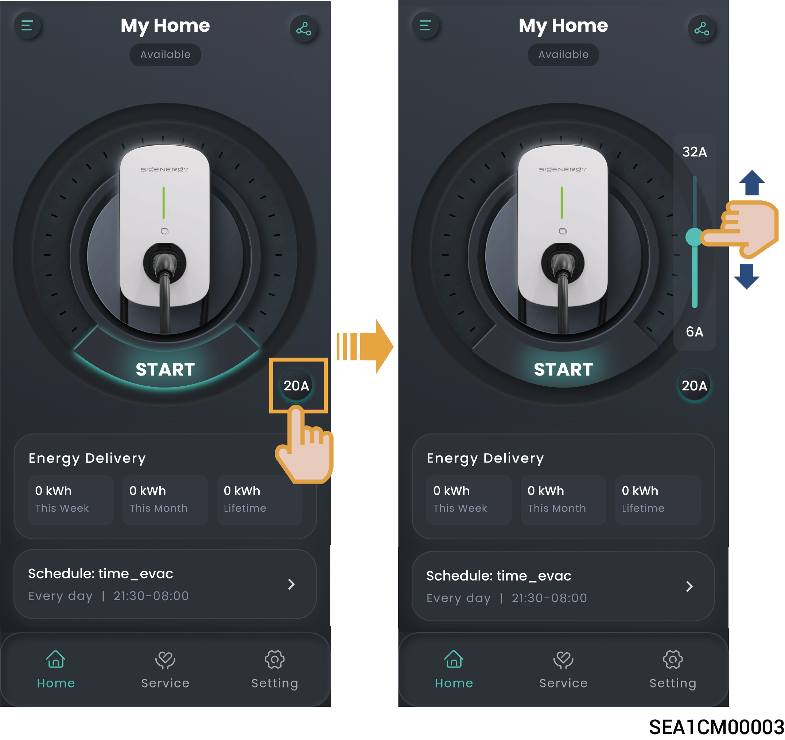
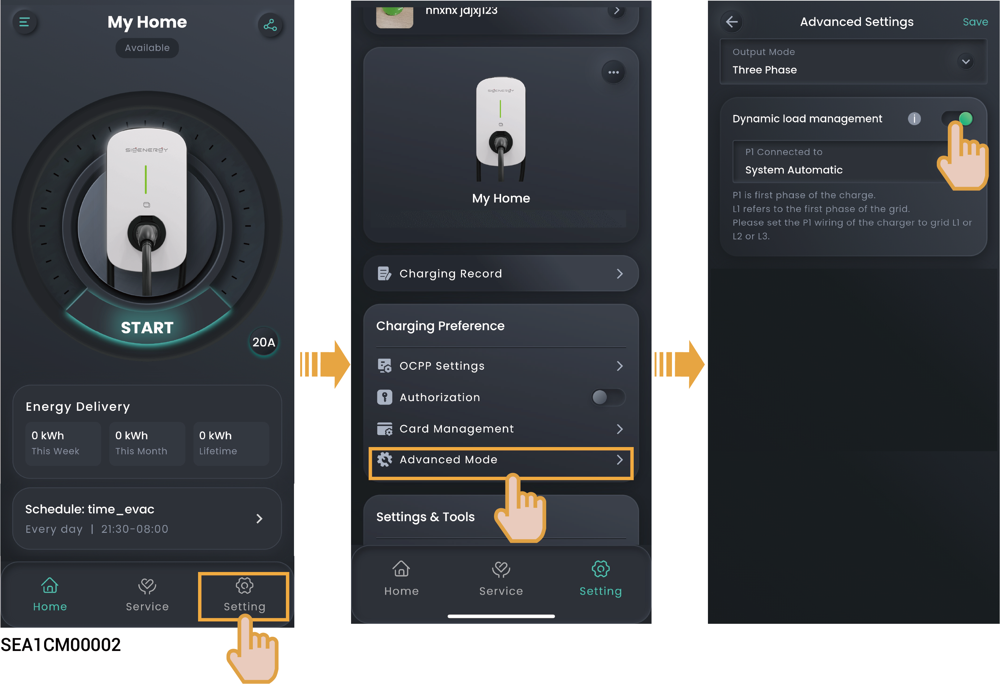

# Charging Current Adjustment



<mark style="color:blue;">**The higher the output current is, the higher the charging power is.**</mark>

### **Manual adjustment**

<figure><figcaption></figcaption></figure>

### **Adjustment by DLM**

When Power Sensor is installed in the networking and is not in off-grid state, Sigen EV AC Charger will support dynamic load management (DLM). Sigen EV AC Charger quickly and intelligently adjusts the charging current (power) by comparing the power at the grid-connection point reported by the Power Sensor with the "Rated Household Circuit Breaker Current" set by the installer when creating new systems. This prevents the household circuit breaker (inside the distribution panel) from being disconnected.

