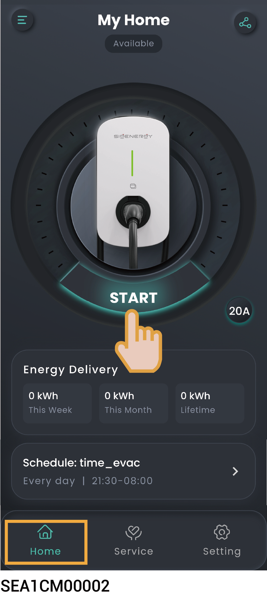

# App authenticated or RFID card authenticated charging (Recommended)

1. Install the charging connector in place.
2. Start charging on the equipment.

* **Method 1: App authenticated charging**

<figure><figcaption></figcaption></figure>

* **Method 2: RFID card authenticated charging**

Swipe the Sigen RFID Card.
