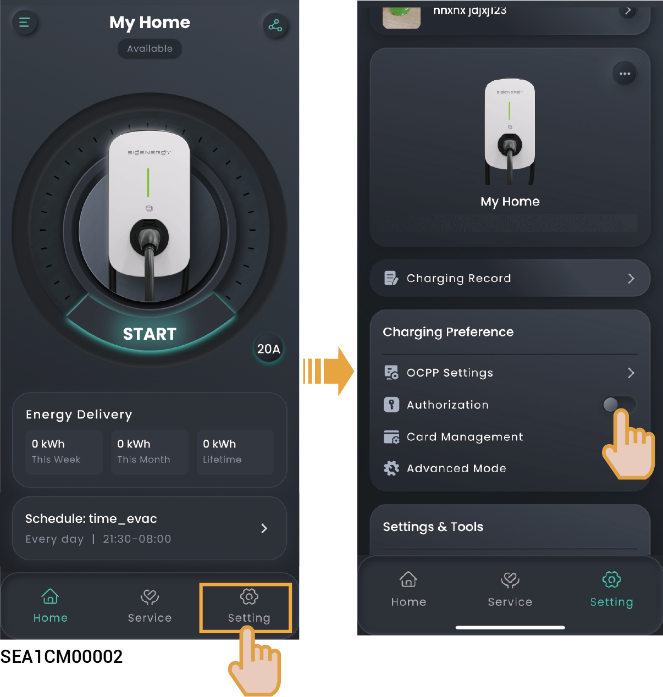

# Unauthenticated Charging Mode

1. Turn "Authorization" off, that is, 。

<figure><figcaption></figcaption></figure>

2. Install the charging connector in place.



<mark style="color:blue;">**It should be noted that when the unauthenticated charging mode is enabled, any vehicles can use this equipment for charging.**</mark>
