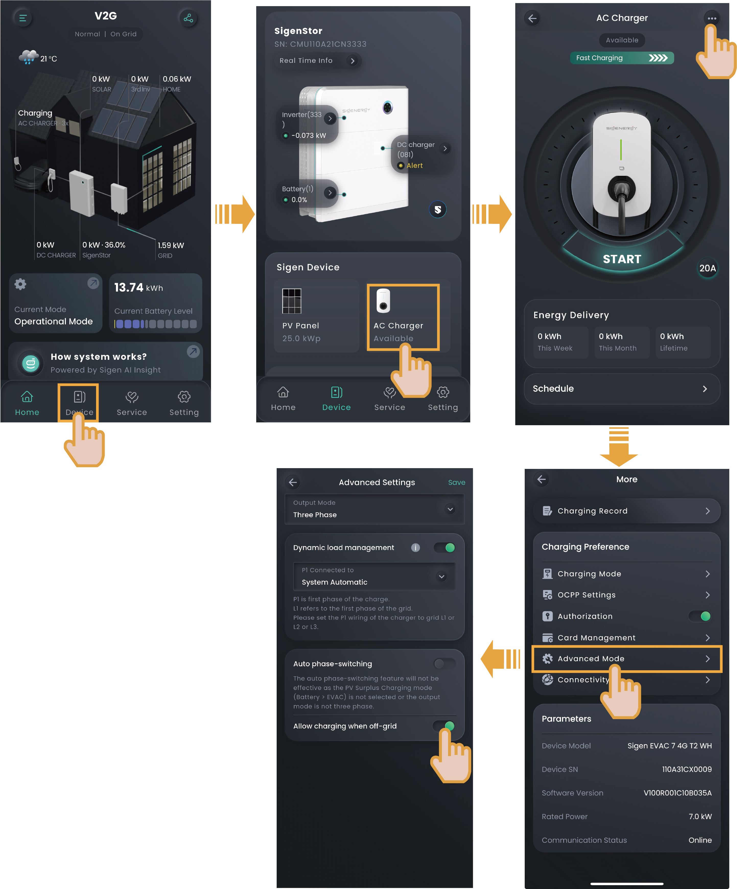

# Off-grid Charging Settings

When PV storage and charging networking is adopted and the device is connected to the Sigen Gateway, if you want to use the Sigen EV AC Charger to charge the vehicle off-grid, you can set this parameter.

<figure><figcaption></figcaption></figure>
