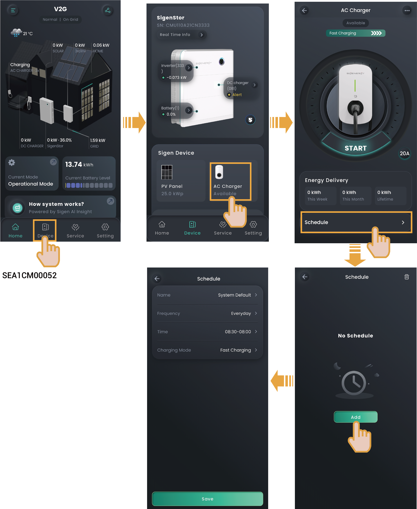

# Scheduled Charging

<figure><figcaption></figcaption></figure>



* <mark style="color:blue;">**Add the time range available for charging, during which the system will automatically start charging when a vehicle meets charging conditions (the charging connector is installed, and the vehicle is ready to be charged).**</mark>
* <mark style="color:blue;">**When adding a time range, you can set the charging mode for each time range (for an explanation of the charging mode, see**</mark> [<mark style="color:blue;">**Charging Mode Introduction**</mark>](../../chong-dian-mo-shi-jie-shao/)<mark style="color:blue;">**). The system will prioritize the execution of charging mode according to the scheduled commands. For the unscheduled time ranges, the charging mode will be executed according to the commands in the setting menu shown in the**</mark> [<mark style="color:blue;">**Charging Mode Introduction**</mark>](../../chong-dian-mo-shi-jie-shao/)<mark style="color:blue;">**.**</mark>
* <mark style="color:blue;">**The system will not start charging or will automatically stop charging if the current time is not within the set time range. To start charging, use the App authenticated charging mode or RFID card authenticated charging mode, or change the time range available for charging.**</mark>
