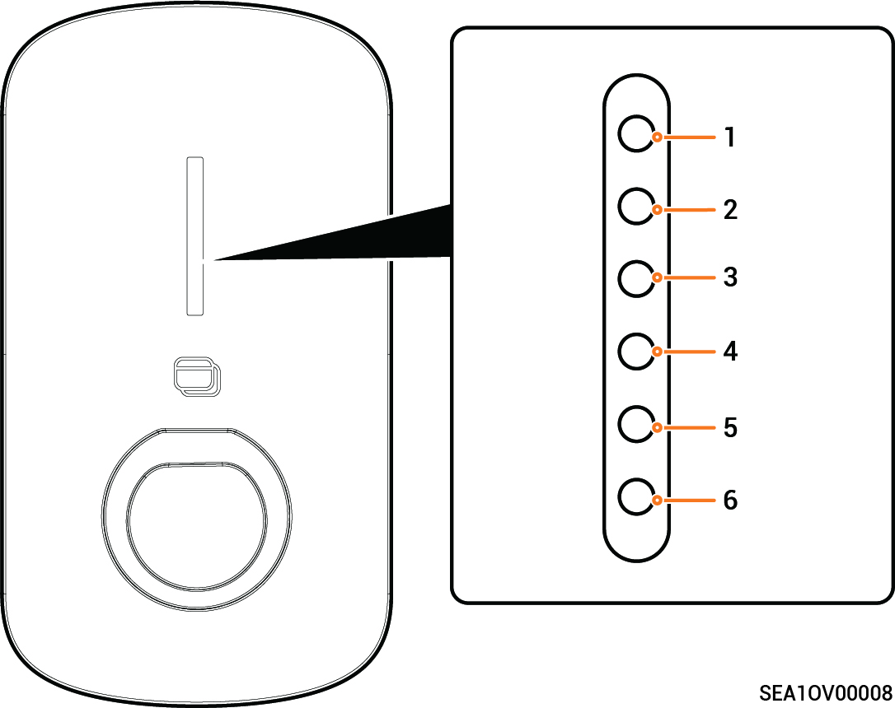

# LED Indicator Status

<figure><figcaption></figcaption></figure>

<table><thead><tr><th>Illuminated Indicator</th><th width="187">Color</th><th>Status</th><th>Meaning</th></tr></thead><tbody><tr><td>All</td><td>Multicolored</td><td>Steady on</td><td>Starting, initializing configuration.</td></tr><tr><td>1</td><td></td><td>Steady on</td><td>In standby mode. Not connected to the internet, charging connector not inserted into the vehicle.</td></tr><tr><td>1</td><td></td><td>Breathing blink</td><td>In standby mode. Connected to the internet, charging connector not inserted into the vehicle.</td></tr><tr><td>All</td><td></td><td>Steady on</td><td><ul><li>Sigen RFID Card not read. The charging connector is connected to the vehicle.</li><li>Charging completed</li></ul></td></tr><tr><td>All</td><td></td><td>Breathing blink</td><td>You have registered the charging time, and the charging connector has already been connected to your vehicle.</td></tr><tr><td>All</td><td></td><td>Blink</td><td>Sigen RFID Card read. Get ready to charge vehicles.</td></tr><tr><td>All</td><td></td><td>Flowing blink</td><td>Charging.</td></tr><tr><td>None</td><td>-</td><td>-</td><td>Not powered on or low voltage.</td></tr><tr><td>1</td><td></td><td>Blink</td><td>Equipment electrical leakage.</td></tr><tr><td>1</td><td></td><td>Steady on</td><td>Relays within the equipment getting stuck.</td></tr><tr><td>1、2</td><td></td><td>Blink</td><td>Overvoltage or undervoltage protection.</td></tr><tr><td>1~3</td><td></td><td>Blink</td><td>Overcurrent protection</td></tr><tr><td>1~4</td><td></td><td>Blink</td><td>Overtemperature protection.</td></tr><tr><td>1~5</td><td></td><td>Blink</td><td>Grounding fault.</td></tr><tr><td>All</td><td></td><td>Blink</td><td>Communication failure between the equipment and the vehicle.</td></tr><tr><td>1、2</td><td></td><td>Steady on</td><td>Other malfunctions.</td></tr></tbody></table>
