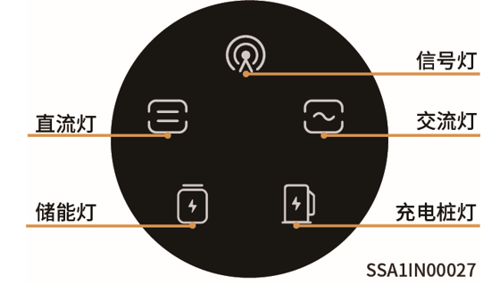
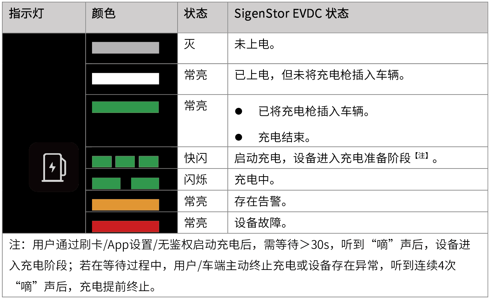

# LED指示灯状态

SigenStor EVDC状态，通过逆变器正面充电桩灯展示。

<figure><figcaption></figcaption></figure>

<figure><figcaption></figcaption></figure>

注：用户通过刷卡/App设置/无鉴权启动充电后，需等待＞30s，听到“嘀”声后，设备进入充电阶段；若在等待过程中，用户/车端主动终止充电或设备存在异常，听到连续4次“嘀”声后，充电提前终止。
