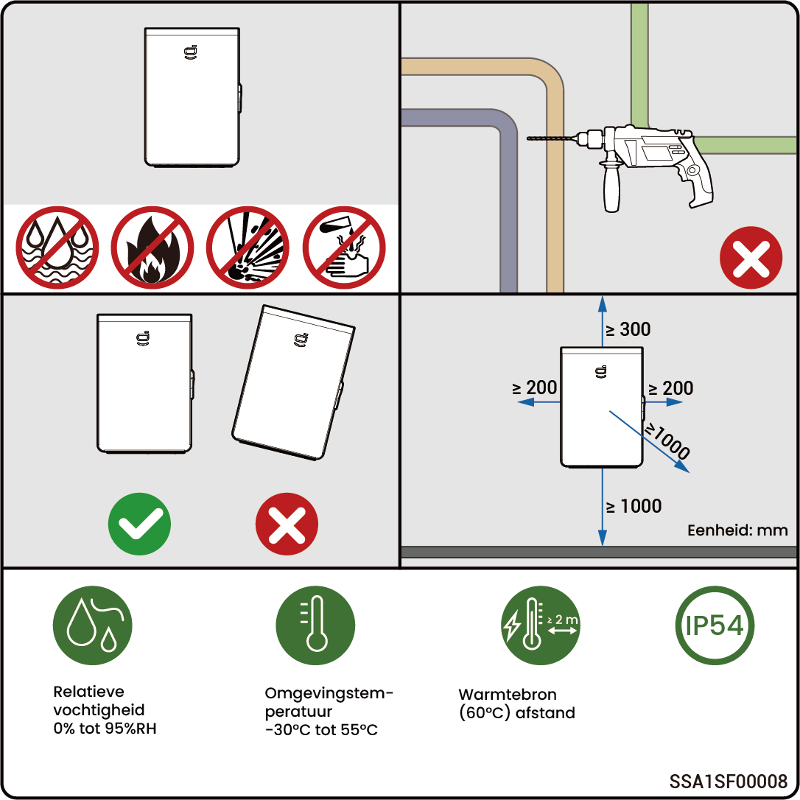

# Vereisten voor locatieselectie



* <mark style="color:blue;">**Lees de onderstaande installatievereisten zorgvuldig door voordat u de apparatuur installeert. Het bedrijf is niet aansprakelijk voor functionele afwijkingen of schade die voortkomen uit het gebruik van de apparatuur als de installatievereisten niet worden nageleefd, zelfs niet in gevallen die leiden tot incidenten met persoonlijke veiligheid.**</mark>
* <mark style="color:blue;">**Bij de daadwerkelijke installatie moet de keuze van de installatielocatie voldoen aan de lokale regelgeving, brandveiligheidsvoorschriften en andere relevante wetten. De specifieke planning van de installatielocatie moet worden bepaald door de installateur of de contracten voor engineering, inkoop en constructie (EPC).**</mark>

### **Vereisten voor installatieomgeving**

* Installeer de apparatuur niet in rokerige, ontvlambare of explosieve omgevingen.
* Vermijd blootstelling van de apparatuur aan direct zonlicht, regen, stilstaand water, sneeuw of stof. Het wordt aanbevolen de apparatuur op een beschutte plaats te installeren. Neem preventieve maatregelen in bedieningsgebieden die gevoelig zijn voor natuurrampen, zoals overstromingen, modderstromen, aardbevingen en orkanen.
* Installeer de apparatuur niet in een omgeving met sterke elektromagnetische interferentie.
* De temperatuur en vochtigheid van de installatieomgeving moeten voldoen aan de vereisten van de apparatuur.
* De apparatuur moet worden geïnstalleerd op een locatie die minstens 500 m verwijderd is van corrosiebronnen die schade door zout of zuur kunnen veroorzaken. Corrosiebronnen omvatten, maar zijn niet beperkt tot, kustgebieden, thermische krachtcentrales, chemische fabrieken, smelterijen, kolencentrales, rubberfabrieken en galvaniseringsfabrieken.

### **Vereisten voor installatiepositie**

* Kantel de apparatuur niet en zet deze niet ondersteboven. Zorg ervoor dat de apparatuur horizontaal wordt geïnstalleerd.
* Installeer het apparaat niet op een plek die gemakkelijk door kinderen kan worden bereikt.
* Installeer de apparatuur niet op een plaats met brandgevaar of op een plek die vatbaar is voor vocht.
* De apparatuur produceert geluid wanneer deze in werking is. Installeer de apparatuur op een plaats met voldoende afstand, zodat het geen invloed heeft op het dagelijks werk en het leven.
* Installeer de apparatuur niet op een afgesloten, slecht geventileerde locatie zonder brandbeveiligingsmaatregelen en die niet toegankelijk is voor brandweerlieden.
* De apparatuur wordt warm tijdens het gebruik. Als de apparatuur binnenshuis wordt geïnstalleerd, zorg dan voor goede ventilatie en voorkom een aanzienlijke temperatuurstijging van meer dan 3°C in de ruimte terwijl de apparatuur in werking is. Anders zal de apparatuur minder goed gaan werken.
* Installeer de apparatuur niet in mobiele scenario’s zoals recreatievoertuigen, cruiseschepen en treinen.
* U wordt geadviseerd de apparatuur te installeren op een locatie waar u deze eenvoudig kunt bereiken, installeren, bedienen, onderhouden en de status van de indicatoren kunt bekijken.
* Plaats de apparatuur niet in de doorgang van het voertuig wanneer deze in een garage wordt geïnstalleerd, om botsingen te voorkomen.

### **Vereisten voor montageoppervlak**

* Installeer de apparatuur niet op een brandbare ondergrond. Als dit niet te vermijden is, voeg dan een brandbarrière toe tussen de apparatuur en de brandbare ondergrond.
* De installatiebasis moet aan draagkrachteisen voldoen. Een stevige baksteen-betonstructuur en betonnen muren worden aanbevolen.
* De installatiebasis moet vlak zijn en de installatie-omgeving moet voldoen aan de vereisten.
* Er mogen zich geen leidingen of elektrische aansluitingen in de installatiebasis bevinden om mogelijke boorgevaren tijdens installatie van de apparatuur te voorkomen.

<figure><figcaption></figcaption></figure>
