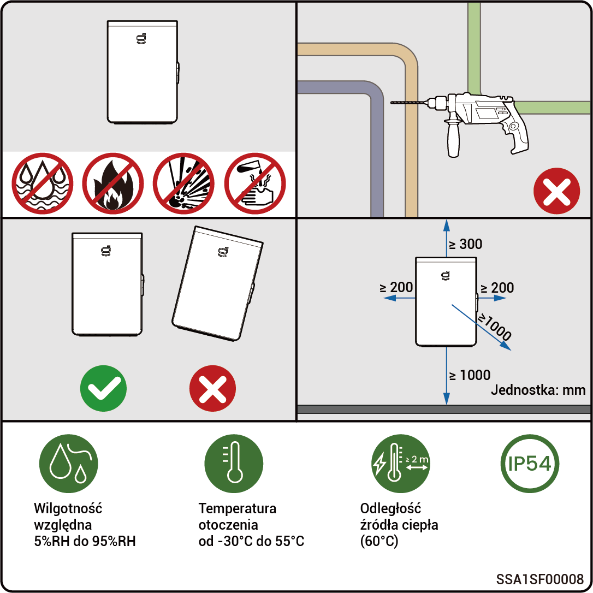

# Wymagania dla miejsca instalacji



* <mark style="color:blue;">**Przed zainstalowaniem sprzętu prosimy o dokładne zapoznanie się z poniższymi wymaganiami dotyczącymi instalacji. Firma nie ponosi odpowiedzialności za jakiekolwiek nieprawidłowości w funkcjonowaniu lub szkody powstałe na skutek eksploatacji sprzętu, jeśli nie zostaną spełnione wymagania instalacyjne, nawet w przypadkach prowadzących do wypadków zagrażających bezpieczeństwu ludzi.**</mark>
* <mark style="color:blue;">**Podczas instalacji należy wybrać miejsce montażu zgodne z miejscowymi regulacjami, przepisami przeciwpożarowymi i innymi obowiązującymi przepisami. Wybór miejsca instalacji powinien być zgodny z umową zawartą z instalatorem lub umową w zakresie inżynierii, zaopatrzenia i budownictwa (EPC).**</mark>

### **Wymagania w środowisku instalacji**

* Nie instalować urządzenia w miejscu zadymionym, środowisku zapalnym lub zagrożonym wybuchem.
* Chronić urządzenie przed bezpośrednim działaniem promieni słonecznych, deszczu, stojącej wody, śniegu lub kurzu. Zalecana jest instalacja w miejscu osłoniętym. Zastosować środki zapobiegawcze na obszarach pracy narażonych na klęski żywiołowe, takie jak powodzie, lawiny błotne, trzęsienia ziemi i tajfuny.
* Nie instalować urządzenia w środowisku, w którym występują silne zakłócenia elektromagnetyczne.
* Temperatura i wilgotność środowiska instalacji powinny odpowiadać wymaganiom określonym dla sprzętu.
* Urządzenie należy zainstalować w obszarze oddalonym o co najmniej 500 m od źródeł korozji, które mogą powodować uszkodzenia wywołane przez sole lub kwasy. Źródła korozji obejmują, ale nie ograniczają się do: obszarów nadmorskich, elektrowni cieplnych, zakładów chemicznych, hut, koksowni, zakładów gumiarskich i zakładów prowadzących galwanizację.

### **Wymagania dotyczące miejsca instalacji**

* Nie przechylać urządzenia ani nie umieszczać go do góry dnem. Upewnić się, że sprzęt jest zainstalowany poziomo.
* Nie instalować urządzenia w miejscach łatwo dostępnych dla dzieci.
* Nie instalować w miejscu, w którym występuje zagrożenie pożarowe lub gdzie urządzenie jest narażone na działanie wilgoci.
* Pracujące urządzenie generuje hałas. Zainstalować w odpowiedniej odległości, aby generowany hałas nie zakłócał codziennej pracy i życia ludzi.
* Nie należy instalować urządzenia w szczelnym, słabo wentylowanym miejscu bez zabezpieczeń przeciwpożarowych, ani miejscu niedostępnym dla straży pożarnej.
* Podczas pracy urządzenie jest gorące. Gdy urządzenie jest montowane wewnątrz, należy zapewnić dobrą wentylację i unikać znacznych wzrostów temperatury w pomieszczeniu o więcej niż 3°C w czasie pracy urządzenia. W przeciwnym razie klasyfikacja urządzenia jest obniżana.
* Nie instalować w środowiskach mobilnych, takich jak kampery, statki wycieczkowe i pociągi.
* Zaleca się zainstalowanie urządzenia w miejscu, w którym zapewniony będzie łatwy dostęp, obsługa, konserwacja i podgląd stanu wskaźników.
* Aby uniknąć kolizji, podczas instalacji w garażu nie umieszczać sprzętu na drodze poruszania się pojazdów.

### **Wymagania dotyczące powierzchni montażowej**

* Nie instalować urządzenia na podłożu łatwopalnym. Jeżeli nie da się tego uniknąć, zapewnić przegrodę ogniotrwałą pomiędzy urządzeniem a palnym podłożem.
* Podłoże montażowe musi spełniać wymagania dotyczące nośności. Zalecana jest lita konstrukcja ceglano-betonowa, betonowe ściany.
* Podstawa montażowa powinna być płaska, a obszar instalacji powinien spełniać wymagania dotyczące przestrzeni instalacyjnej.
* Wewnątrz podstawy montażowej nie są dozwolone żadne instalacje kanalizacyjno-wodociągowe ani elektryczne, aby uniknąć potencjalnych zagrożeń związanych z wierceniem podczas instalacji sprzętu.

<figure><figcaption></figcaption></figure>
