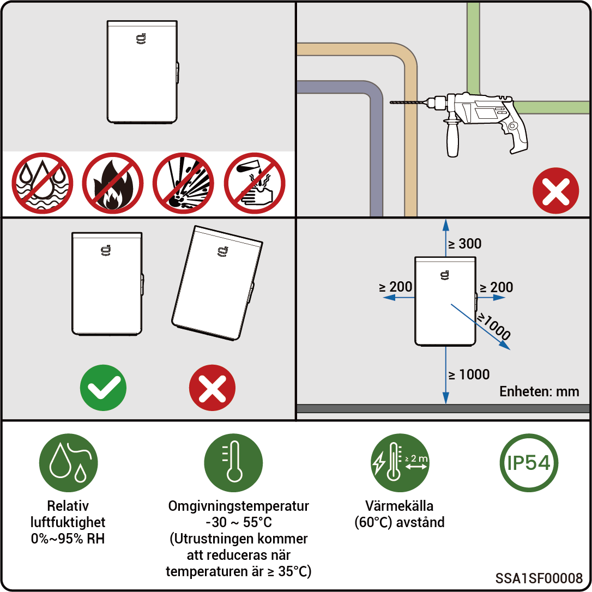

# Val av installationsplats



* <mark style="color:blue;">**Läs noggrant igenom följande installationskrav innan du installerar utrustningen. Företaget avsäger sig allt ansvar för funktionsfel eller skador som uppkommer till följd av drift av utrustningen där installationskraven inte har uppfyllts, inklusive fall där säkerhetsincidenter har skett.**</mark>
* <mark style="color:blue;">**Under den faktiska installationen ska valet av installationsplats uppfylla lokala bestämmelser, bestämmelser om brandbekämpning och andra relevanta lagar. Planeringen av den specifika installationsplatsen bör vara föremål för installatörs- eller EPC-avtalet (Engineering, Procurement and Construction).**</mark>

### **Krav på installationsomgivning**

* Installera inte utrustningen i rökiga, brandfarliga eller explosiva omgivningar.
* Undvik att utsätta utrustningen för direkt solljus, regn, vattensamling, snö eller damm. Det rekommenderas att installera utrustningen på en skyddad plats. Vidta förebyggande åtgärder i områden som är utsatta för naturkatastrofer såsom översvämningar, lerskred, jordbävningar och orkaner.
* Installera inte utrustningen där starka elektromagnetiska störningar förekommer.
* Temperaturen och luftfuktigheten i installationsmiljön ska uppfylla utrustningens krav.
* Utrustningen ska installeras i ett område beläget minst 500 meter från korrosionskällor som kan ge upphov till saltskador eller frätskador. Korrosionskällor inkluderar men begränsas inte till kuster, värmekraftverk, kemiska anläggningar, smältverk, kolkraftverk, gummianläggningar och elektropläteringsanläggningar.

### **Krav på installationsposition**

* Luta inte utrustningen och placera den inte upp och ned. Kontrollera att utrustningen installeras horisontellt.
* Installera inte utrustningen på en plats som är lättillgänglig för barn.
* Installera inte utrustningen på en plats där brandrisk förekommer eller som är utsatt för fukt.
* Utrustningen ger upphov till buller under drift. Installera utrustningen på lämpligt avstånd från områden där arbete eller vardagliga aktiviteter vanligtvis utförs.
* Installera inte utrustningen på en sluten, dåligt ventilerad plats som saknar brandskyddsåtgärder och är oåtkomlig för brandmän.
* Utrustningen blir varm under drift. Om utrustningen monteras inomhus ska du se till att ventilationen inomhus är bra och undvika att inomhustemperaturen stiger med mer än 3 °C när utrustningen är i drift. Annars kommer utrustningens effekt att minskas.
* Installera inte utrustningen i rörliga enheter som fritidsfordon, kryssningsfartyg eller tåg.
* Det rekommenderas att installera utrustningen på en plats där den är lätt att komma åt, installera, sköta och underhålla och där indikatorerna är lätta att läsa av.
* När utrustningen installeras i ett garage ska den inte placeras i fordonens väg för att undvika kollisioner.

### **Krav på installationsunderlag**

* Installera inte utrustningen på brandfarligt underlag. Om detta inte kan undvikas ska en brandbarriär läggas till mellan utrustningen och det brandfarliga underlaget.
* Installationsunderlaget ska uppfylla kraven på bärighet. Tegel- och betongkonstruktion eller betongvägg rekommenderas.
* Installationsunderlaget ska vara plant och installationsområdet ska uppfylla kraven på installationsutrymme.
* Inga rör- eller elinstallationer tillåts inom installationsunderlaget för att undvika potentiella borrningsrisker under installationen av utrustningen.

<figure><figcaption></figcaption></figure>
