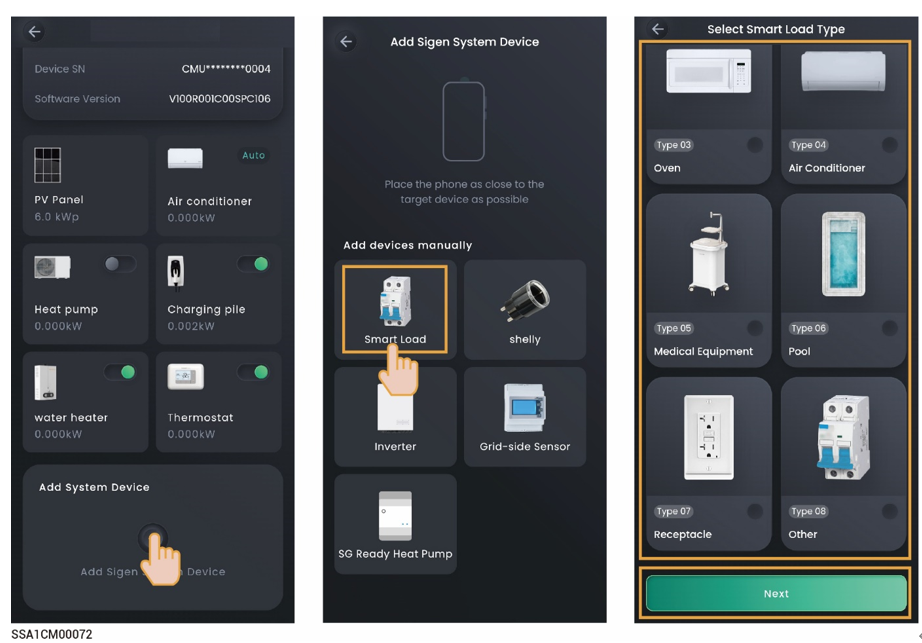

# Smart load



* <mark style="color:blue;">Before connecting a smart load, please ensure that a Gateway is configured in the networking.</mark>
* <mark style="color:blue;">The number of smart loads that can be connected is determined by the supported capacity of the Gateway.</mark>
* <mark style="color:blue;">After adding the smart load to the App, you can switch the smart load on and off through the App. Alternatively, the system can remotely control the equipment on and off based on the actual running conditions and the SOC threshold you set.</mark>

<figure><figcaption></figcaption></figure>

If you cannot locate the icon of the connected device, for example, an immersion heater, select "Other" and connect it. You can check the connected smart load on the "Device" screen.

### Control Mode

<table><thead><tr><th width="75">No.</th><th width="141">Parameter name</th><th width="135">Parameter name</th><th>Description</th></tr></thead><tbody><tr><td><strong>1</strong></td><td>Manual</td><td>-</td><td><ul><li>When it is displayed as In Use, you can turn on and off the Smart Load through "" on the App.</li><li>When displayed as Disable, you can add Schedule and Ready by to automatically control the Smart Load.</li></ul></td></tr><tr><td><strong>2</strong></td><td>Schedule</td><td>Load Consumption Mode</td><td><ul><li>Depends on System：Automatically selects the most available power source from the system– solar, battery, or grid.</li><li>Solar Excess only：Operates appliances exclusively on solar surplus energy.</li><li>Battery Level Control：Allows precise energy management by setting start and stop thresholds for battery usage(e. g., start at 60%, stop at 20%). Recommended for users who demand detailed control of their system.</li></ul></td></tr><tr><td><strong>3</strong></td><td>Schedule</td><td>Auto charge</td><td>When set to , energy storage discharge is allowed.Use Battery Stop SOC: When the SOC value of the energy storage battery is less than this threshold, the load will be turned off.</td></tr><tr><td><strong>4</strong></td><td>Ready by</td><td>Activation For</td><td>Total running time.Before the time set in Be Ready By, if the running time on that day is less than the set value, the load will be turned on.</td></tr><tr><td><strong>5</strong></td><td>Ready by</td><td>Be Ready By</td><td>Set the running time.It is used in conjunction with the total running time.</td></tr></tbody></table>
