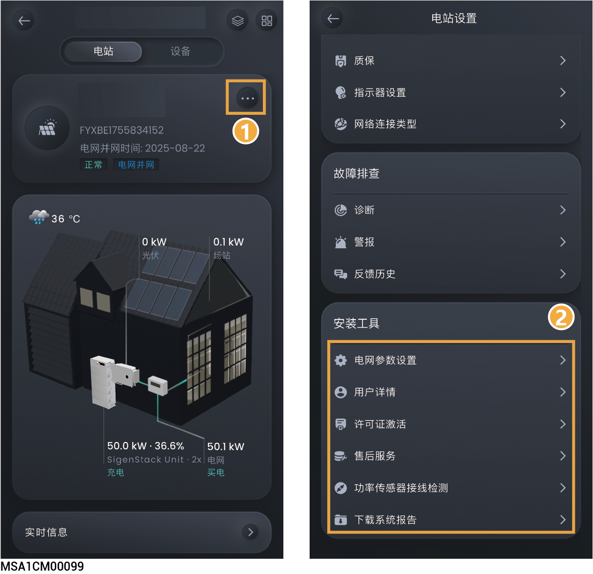

# 安装商工具

<figure><figcaption></figcaption></figure>

<table><thead><tr><th width="69" align="center" valign="middle">序号</th><th width="244.5555419921875" valign="middle">参数名称</th><th valign="middle">说明</th></tr></thead><tbody><tr><td align="center" valign="middle">1</td><td valign="middle">电网参数设置</td><td valign="middle">点击可设置电站相关参数。</td></tr><tr><td align="center" valign="middle">2</td><td valign="middle">用户详情</td><td valign="middle">点击可设置用户名称、地址、邮箱。</td></tr><tr><td align="center" valign="middle">3</td><td valign="middle">许可证激活</td><td valign="middle">点击可激活许可证。</td></tr><tr><td align="center" valign="middle">4</td><td valign="middle">售后服务</td><td valign="middle">当您对设备完成增加、替换、删减安装（如电池、EVDC等）后，需要通过本功能进行最终确认。</td></tr><tr><td align="center" valign="middle">5</td><td valign="middle">功率传感器接线检测</td><td valign="middle">点击可检测功率传感器线缆是否正确连接。</td></tr><tr><td align="center" valign="middle">6</td><td valign="middle">下载系统报告</td><td valign="middle">点击可下载电站报告。</td></tr></tbody></table>
