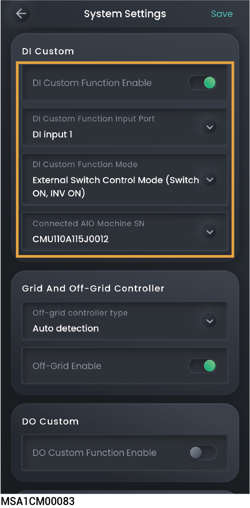

# DI自定义

## **DI自定义说明**

<figure><figcaption></figcaption></figure>

<table><thead><tr><th width="60" align="center" valign="middle">序号</th><th width="233" valign="middle">参数名称</th><th valign="middle">说明</th></tr></thead><tbody><tr><td align="center" valign="middle">1</td><td valign="middle">DI Custom Function Enable</td><td valign="middle">当设置为时，DI自定义功能生效，可设置相关参数，反之功能不生效。</td></tr><tr><td align="center" valign="middle">2</td><td valign="middle">DI Custom Function Input Port</td><td valign="middle">根据实际接线，设置连接设备的DI端口。</td></tr><tr><td align="center" valign="middle">3</td><td valign="middle">DI Custom Function Mode</td><td valign="middle">
<strong>External Switch Control mode (switch ON, INV ON)</strong>

所连设备开关闭合，逆变器开机；设备开关断开，逆变器关机。

<mark style="color:red;"><strong>Australia</strong></mark><strong> DRM0 (switch ON, INV OFF)</strong>

所连设备开关闭合，逆变器关机；设备开关断开，逆变器开机。

<strong>Micro-grid Control mode:(Switch OFF: Off grid INV standby, On-grid INV ON)</strong>

所连设备开关断开，电网掉电时，逆变器交流侧为待机状态，电网恢复并网时，逆变器正常运行；设备开关闭合，电网掉电时，允许逆变器离网运行。

<strong>Micro-grid Control mode:(Switch ON: Off grid INV standby, On-grid INV ON)</strong>

所连设备开关闭合，电网掉电时，逆变器交流侧为待机状态，电网恢复并网时，逆变器正常运行；设备开关断开，电网掉电时，允许逆变器离网运行。

<strong>Gateway Bypass mode (state of switch)</strong>

所连设备开关断开，Gateway旁路开关闭合，禁止逆变器离网运行；设备开关闭合，Gateway旁路开关断开，允许逆变器离网运行。

<strong>Transfer Switch Position II Status Detection</strong>

所连设备开关断开，转换开关处理并网状态，禁止逆变器离网运行；设备开关闭合，转换开关处于离网状态，允许逆变器离网运行。

<mark style="color:$danger;"><strong>Manual Switch Box Position II Status</strong></mark>

<mark style="color:$danger;">短路状态离网使能（三位旋钮开关），当检测到DI口处于短路状态时，一体机离网使能</mark>

<mark style="color:$danger;"><strong>$14a EnWG</strong></mark>

<mark style="color:$danger;">For §14a EnWG compliance</mark>

<mark style="color:$danger;"><strong>Oil generator grid port access: Open circuit oil generator, short circuit grid</strong></mark>

<mark style="color:$danger;">油机电网口接入：开路油机，短路电网</mark>

<mark style="color:$danger;">用于区分逆变器输出接入的是电网还是油机，当DI口处于开路状态，接入油机；当DI口处于短路状态，接入电网。</mark>

<mark style="color:$danger;"><strong>OVGR: Open Circuit Shutdown</strong></mark>

日本OVGR装置<mark style="color:$danger;">通过DI口控制一体机开关机，当DI口处于开路状态，一体机关机。</mark>

<mark style="color:$danger;"><strong>OVGR: Short Circuit Shutdown</strong></mark>

日本OVGR装置<mark style="color:$danger;">通过DI口控制一体机开关机，当DI口处于短路状态，一体机关机。</mark>

<mark style="color:$danger;"><strong>RPR: Open Circuit Shutdown</strong></mark>

<mark style="color:$danger;">日本RPR装置通过DI口控制一体机开关机，当DI口处于开路状态，一体机关机。</mark>

<mark style="color:$danger;"><strong>RPR: Short Circuit Shutdown</strong></mark>

<mark style="color:$danger;">日本RPR装置通过DI口控制一体机开关机，当DI口处于短路状态，一体机关机。</mark>

<mark style="color:$danger;"><strong>NS Protection</strong></mark>

<mark style="color:$danger;">若连接NS保护，可设置为此参数。</mark>

<mark style="color:$danger;"><strong>EPO Protection</strong></mark> <mark style="color:$danger;">若连接EPO，可设置为此参数。</mark>
</td></tr><tr><td align="center" valign="middle">4</td><td valign="middle">Connected AIO Machine SN</td><td valign="middle">设置连接设备的逆变器SN。 <mark style="color:red;">Select all：选择全部一体机SN。</mark></td></tr><tr><td align="center" valign="middle">5</td><td valign="middle"><mark style="color:$danger;">Generator Access To Inverter Grid Port</mark></td><td valign="middle"><mark style="color:$danger;">当设置为</mark><mark style="color:$danger;">时，油机接入逆变器电网口功能使能。</mark></td></tr></tbody></table>

## **DRM0参数设置**

根据澳大利亚AS/NZS 4777.2:2020+A1:2021标准，逆变器并网需要满足DRM（Demand Response Mode）功能，其中DRM0是强制性要求。

接线关系示意：

<mark style="color:$danger;">后期发货版本图形优化，纸件不报废。</mark>

<mark style="color:$danger;">DI1改成GEN, GND改成COM。S5a和S1a两路删除。</mark>

<figure><figcaption></figcaption></figure>



<mark style="color:$primary;">在设置DRM0参数前，请确保设备GEN未被占用，且已正确连接DRED装置。</mark>

<table><thead><tr><th width="73" valign="top">序号</th><th width="236.81817626953125" valign="top">参数名称</th><th valign="top">设置值</th></tr></thead><tbody><tr><td valign="top">1</td><td valign="top">DI Custom Function Enable</td><td valign="top"></td></tr><tr><td valign="top">2</td><td valign="top">DI Custom Function Input Port</td><td valign="top"><mark style="color:$danger;">DI Input 1 (改成DRM0，App显示更新后手册刷新)</mark></td></tr><tr><td valign="top">3</td><td valign="top">DI Custom Function Mode</td><td valign="top">
DRM0 mode (switch ON, INV OFF)

注：

<mark style="color:$danger;">DRED装置的开关S9为常闭，通过控制S0来控制逆变器的开关机：S0闭合，逆变器关机；S0断开， 逆变器开机。</mark>
</td></tr><tr><td valign="top">4</td><td valign="top">Connected AIO Machine SN</td><td valign="top">连接DRED装置的逆变器SN。</td></tr></tbody></table>

## **NS保护参数**



* <mark style="color:blue;">推荐连接至DI5，若DI1～DI4未被占用，DI1～DI5均可接入NS保护装置。</mark>
* <mark style="color:blue;">设置参数前，请确保已正确连接NS保护装置。</mark>

<figure><figcaption></figcaption></figure>

<table><thead><tr><th width="75" align="center" valign="middle">序号</th><th width="249" valign="top">参数名称</th><th valign="top">设置值</th></tr></thead><tbody><tr><td align="center" valign="middle">1</td><td valign="top">DI Custom Function Enable</td><td valign="top"></td></tr><tr><td align="center" valign="middle">2</td><td valign="top">DI Custom Function Input Port</td><td valign="top">DI Input 5 (若NS保护装置连接在其他DI端口，请根据实际端口设置)</td></tr><tr><td align="center" valign="middle">3</td><td valign="top">DI Custom Function Mode</td><td valign="top">
DRM0 mode (switch ON, INV OFF)

注：

电网异常时，NS保护装置开关闭合，逆变器自动关机；电网恢复正常时，NS保护装置开关断开，逆变器开机。
</td></tr><tr><td align="center" valign="middle">4</td><td valign="top">Connected AIO Machine SN</td><td valign="top">连接NS保护装置的逆变器SN。</td></tr></tbody></table>
