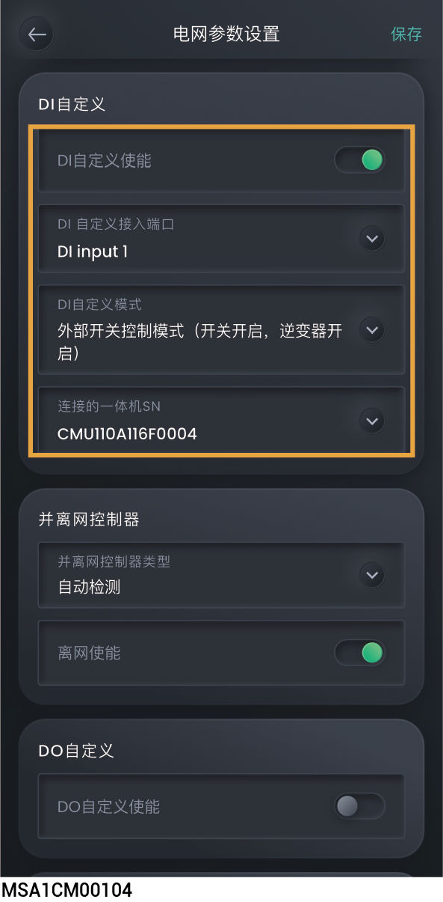
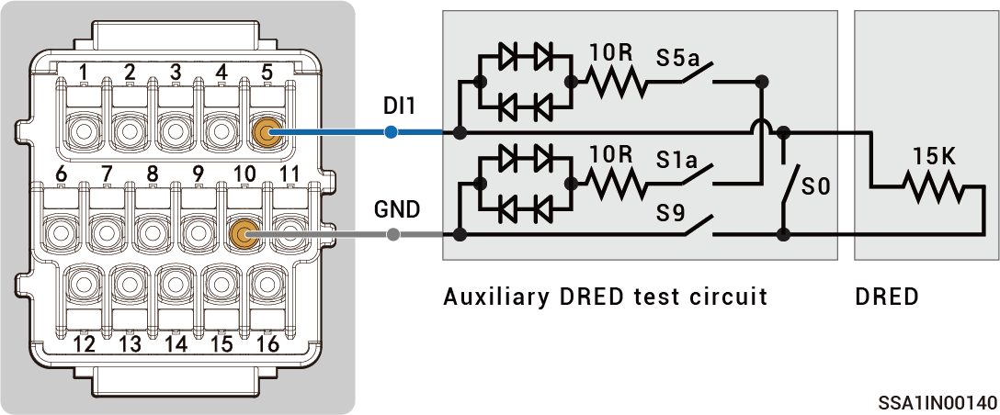
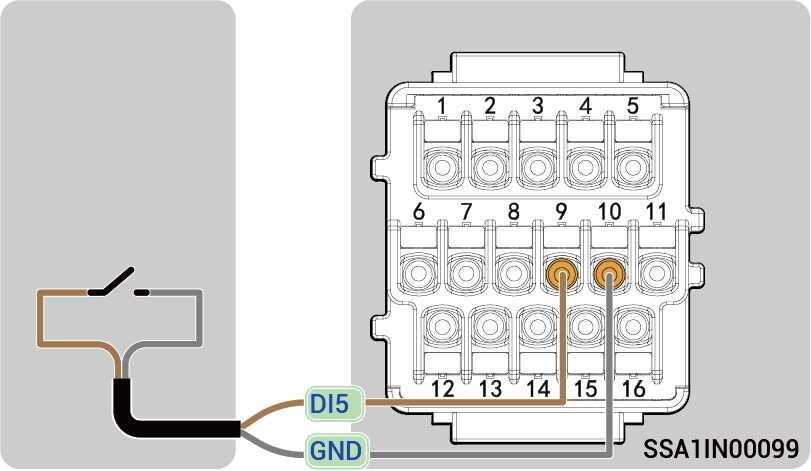

# DI自定义

## **DI自定义说明**

<figure><figcaption></figcaption></figure>

<table><thead><tr><th width="60" align="center" valign="middle">序号</th><th width="173" valign="middle">参数名称</th><th valign="middle">说明</th></tr></thead><tbody><tr><td align="center" valign="middle">1</td><td valign="middle">DI 自定义使能</td><td valign="middle">当设置为时，DI自定义功能生效，可设置相关参数，反之功能不生效。</td></tr><tr><td align="center" valign="middle">2</td><td valign="middle">DI 自定义接入端口</td><td valign="middle">根据实际接线，设置连接设备的DI端口。</td></tr><tr><td align="center" valign="middle">3</td><td valign="middle">DI 自定义模式</td><td valign="middle"><ul><li>设置为“外部开关控制模式（开关开启，逆变器开启）”时，所连设备开关闭合，逆变器开机；设备开关断开，逆变器关机。</li></ul><ul><li>设置为“澳大利亚 DRM0（开关 ON, 逆变器 OFF）”时，所连设备开关闭合，逆变器关机；设备开关断开，逆变器开机。</li></ul><ul><li>设置为“微电网控制模式：（关闭：离网逆变器待机，联网逆变器开启）”时，所连设备开关断开，电网掉电时，逆变器交流侧为待机状态，电网恢复并网时，逆变器正常运行；设备开关闭合，电网掉电时，允许逆变器离网运行。</li></ul><ul><li>设置为“微电网控制模式：（开关开启：离网逆变器待机，并网逆变器开启）”时，所连设备开关闭合，电网掉电时，逆变器交流侧为待机状态，电网恢复并网时，逆变器正常运行；设备开关断开，电网掉电时，允许逆变器离网运行。</li></ul><ul><li>设置为“思格能源备电柜旁路模式（开关状态）”时，所连设备开关断开，思格能源备电柜旁路开关闭合，禁止逆变器离网运行；设备开关闭合，思格能源备电柜旁路开关断开，允许逆变器离网运行。</li></ul><ul><li>设置为“手动开关盒位置 II 状态”时，所连设备开关断开，转换开关处理并网状态，禁止逆变器离网运行；设备开关闭合，转换开关处于离网状态，允许逆变器离网运行。</li></ul></td></tr><tr><td align="center" valign="middle">4</td><td valign="middle">连接的一体机 SN</td><td valign="middle">设置连接设备的逆变器SN。</td></tr></tbody></table>

## **DRM0参数设置**

根据澳大利亚AS/NZS 4777.2:2020+A1:2021标准，逆变器并网需要满足DRM（Demand Response Mode）功能，其中DRM0是强制性要求。

接线关系示意：

<figure><figcaption></figcaption></figure>



在设置DRM0参数前，请确保设备DI1未被占用，且已正确连接DRED装置。

<table><thead><tr><th width="73" valign="top">序号</th><th width="187" valign="top">参数名称</th><th valign="top">设置值</th></tr></thead><tbody><tr><td valign="top">1</td><td valign="top">DI 自定义使能</td><td valign="top"></td></tr><tr><td valign="top">2</td><td valign="top">DI 自定义接入端口</td><td valign="top">DI Input 1</td></tr><tr><td valign="top">3</td><td valign="top">DI 自定义模式</td><td valign="top">
澳大利亚 DRM0（开关 ON, 逆变器 OFF）

注：

DRED装置的开关S5a、S1a和S9为常闭，通过控制S0来控制逆变器的开关机：S0闭合，逆变器关机；S0断开， 逆变器开机。
</td></tr><tr><td valign="top">4</td><td valign="top">连接的一体机 SN</td><td valign="top">连接DRED装置的逆变器SN。</td></tr></tbody></table>

## **NS保护参数**



* <mark style="color:blue;">推荐连接至DI5，若DI1～DI4未被占用，DI1～DI5均可接入NS保护装置。</mark>
* <mark style="color:blue;">设置参数前，请确保已正确连接NS保护装置。</mark>

<figure><figcaption></figcaption></figure>

<table><thead><tr><th width="75" align="center" valign="middle">序号</th><th width="185" valign="middle">参数名称</th><th valign="top">设置值</th></tr></thead><tbody><tr><td align="center" valign="middle">1</td><td valign="middle">DI 自定义使能</td><td valign="top"></td></tr><tr><td align="center" valign="middle">2</td><td valign="middle">DI 自定义接入端口</td><td valign="top">DI Input 5 (若NS保护装置连接在其他DI端口，请根据实际端口设置)</td></tr><tr><td align="center" valign="middle">3</td><td valign="middle">DI 自定义模式</td><td valign="top">
澳大利亚 DRM0（开关 ON, 逆变器 OFF）

注：

电网异常时，NS保护装置开关闭合，逆变器自动关机；电网恢复正常时，NS保护装置开关断开，逆变器开机。
</td></tr><tr><td align="center" valign="middle">4</td><td valign="middle">连接的一体机 SN</td><td valign="top">连接NS保护装置的逆变器SN。</td></tr></tbody></table>
