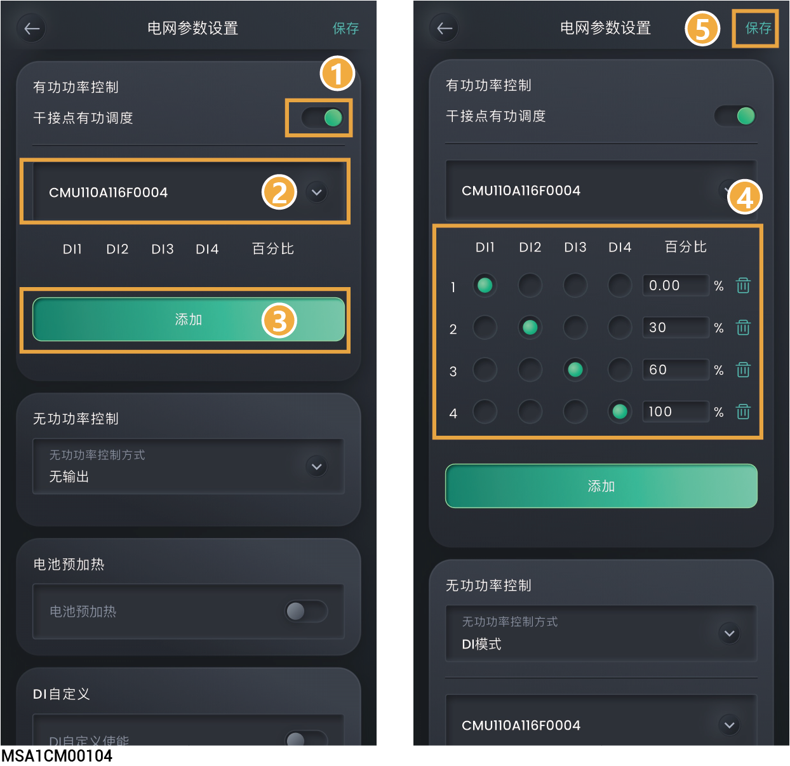
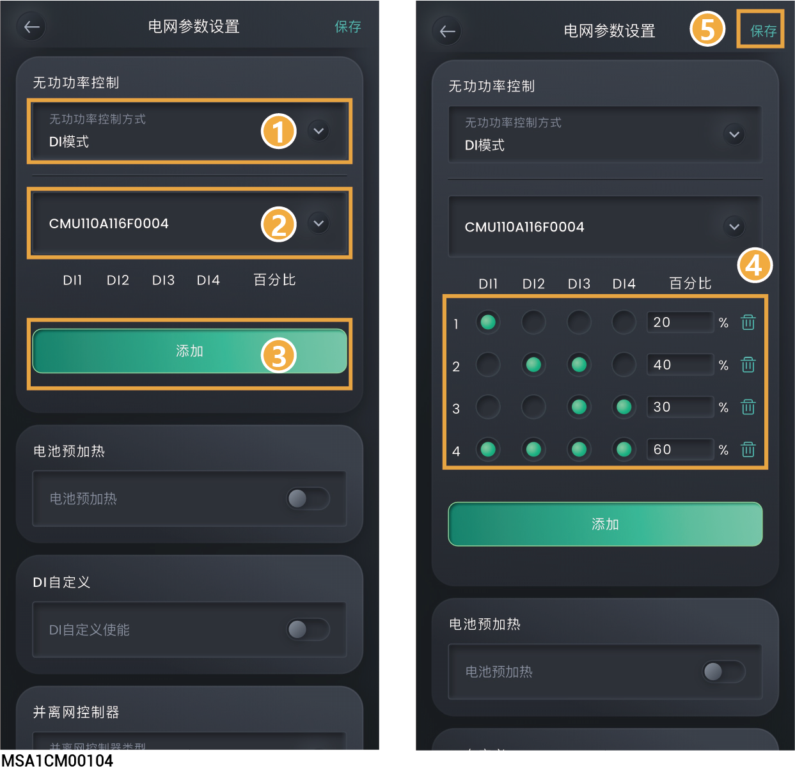

# 电网调度

## **功率调节说明**



* <mark style="color:blue;">在德国及部分欧洲地区，电网公司将电网调度信号通过Ripple Control Receiver装置转换成干接点信号方式传送到各个电站，需要电站支持使用干接点通信方式接收电网调度信号，实现电站的有功调度和无功调度。</mark>
* <mark style="color:blue;">操作前请确保需设置的逆变器已连接Ripple Control Receiver，且设备的DI1～DI4（航插端子的5～8接口）端口未被占用，具体操作步骤请参见产品对应的《安装指南》。</mark>

## **设置有功功率控制**



<mark style="color:blue;">电站有限功率需求时，电网调度人员需临时限制电站的有功馈入，或直接断开电站的所有有功功率馈入，即有功功率降额。</mark>

<figure><figcaption></figcaption></figure>

<table><thead><tr><th width="70" align="center" valign="middle">序号</th><th width="175" valign="middle">参数名称</th><th valign="top">说明</th></tr></thead><tbody><tr><td align="center" valign="middle">1</td><td valign="middle">干接点有功调度使能</td><td valign="top">设置为后，单台设备无需设置SN号，多台设备需下拉选择Ripple Control Receiver（RCR）连接的设备SN号，SN号可通过设备侧边的SN查看。</td></tr><tr><td align="center" valign="middle">2</td><td valign="middle">DI1、DI2、DI3、DI4</td><td valign="top">
表示所设置的DI线缆上的开关闭合，为低电平。

表示所设置的DI线缆上的开关断开，为高电平。

图示参数仅为示例，设置时请根据实际情况进行配置。
<ul><li>DI1～DI4的状态组合不得有重复，否则命令解析将执行异常。</li></ul><ul><li>如果实际输入DI信号与App设置不匹配，设备将会以最大有功功率指令（100%）运行。</li></ul></td></tr><tr><td align="center" valign="middle">3</td><td valign="middle">百分比(%)</td><td valign="top"><ul><li>百分数值为设备最终执行的功率百分比，需根据当地电网要求设置为对应数值。</li></ul><ul><li>百分比正值表示逆变（逆变器输出有功功率），负值表示整流（逆变器吸收有功功率）。</li></ul><ul><li>最大支持添加16个百分比数值配置。</li></ul></td></tr></tbody></table>

## **设置无功功率控制**



<mark style="color:blue;">电网公司要求大型电站对并网点电压具备一定得调节能力，电网调度人员根据电网中实时无功功率传输情况，要求电站向并网点吸收或注入无功功率，即无功功率补偿。</mark>

<figure><figcaption></figcaption></figure>

<table><thead><tr><th width="70" align="center" valign="middle">序号</th><th width="177" valign="middle">参数名称</th><th valign="top">说明</th></tr></thead><tbody><tr><td align="center" valign="middle">1</td><td valign="middle">无功功率控制方式</td><td valign="top"><ul><li>无输出：如果电网公司不要求电站调节并网点电压，且不需要配合电网实施无功功率补偿，设备可以保持纯有功功率输出状态运行，设置为“无输出”。</li><li>DI模式：设置无功干接点调度参数时，需设置为“DI模式”。</li><li>并网点功率因数控制：当分布式电站需要执行分布式无功功率补偿功能，以减少或避免力调电费，提高电站收益时，需要设置“并网点功率因数控制”。</li></ul>
选择DI模式后，单台设备无需设置SN号，多台设备需下拉选择Ripple Control Receiver（RCR）连接的设备SN号，SN号可通过设备侧边的SN查看。
</td></tr><tr><td align="center" valign="middle">2</td><td valign="middle">DI1、DI2、DI3、DI4</td><td valign="top">
表示所设置的DI线缆上的开关闭合，为低电平。

表示所设置的DI线缆上的开关断开，为高电平。
<ul><li>图示参数仅为示例，设置时请根据实际情况进行配置。</li></ul><ul><li>DI1～DI4的状态组合不得有重复，否则命令解析将执行异常。</li></ul><ul><li>如果实际输入DI信号与App设置不匹配，设备将会以最小无功功率指令（0%）运行。</li></ul></td></tr><tr><td align="center" valign="middle">3</td><td valign="middle">百分比(%)</td><td valign="top"><ul><li>百分数值为设备最终执行的功率百分比，需根据当地电网要求设置为对应数值。</li></ul><ul><li>百分比正值表示输出容性无功（抬升电压），负值表示输出感性无功（降低电压）。</li></ul><ul><li>最大支持添加16个百分比数值配置。</li></ul></td></tr></tbody></table>
