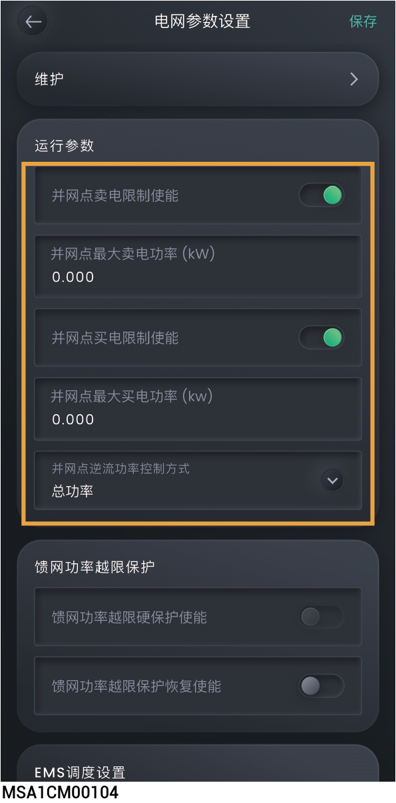

# 防逆流参数设置



* <mark style="color:blue;">开局时，安装商根据用户需求设置防逆流参数。</mark>
* <mark style="color:blue;">若开局后要更改参数，请根据当地法律法规和电网协议手动设置防逆流参数。</mark>
* <mark style="color:blue;">在设置防逆流参数前，请确保组网中已连接电表或</mark>思格能源备电柜<mark style="color:blue;">。</mark>
* <mark style="color:blue;">不同的设备，显示参数会有所不同，请以实际界面为准。</mark>

<figure><figcaption></figcaption></figure>

<table><thead><tr><th width="69" align="center" valign="middle">序号</th><th width="244.5555419921875" valign="middle">参数名称</th><th valign="middle">说明</th></tr></thead><tbody><tr><td align="center" valign="middle">1</td><td valign="middle">并网点卖电限制使能</td><td valign="middle">设置为时，并网点向电网的输出功率将受到限制。</td></tr><tr><td align="center" valign="middle">2</td><td valign="middle">并网点最大卖电功率</td><td valign="middle">设置并网点输出的最大功率值。</td></tr><tr><td align="center" valign="middle">3</td><td valign="middle">并网点买电限制使能</td><td valign="middle">设置为时，从电网输入的功率将受到限制。</td></tr><tr><td align="center" valign="middle">4</td><td valign="middle">并网点最大买电功率</td><td valign="middle">设置并网点输入的最大功率值。</td></tr><tr><td align="center" valign="middle">5</td><td valign="middle">并网点逆流功率控制方式</td><td valign="middle"><ul><li>总功率：并网点按照三相总功率控制，即三相功率之和不能够超过并网点最大卖电功率和最大反向充电功率。</li></ul><ul><li>每相功率：并网点按照每相独立控制，即每相功率不能超过并网点最大卖电功率的1/3 和最大反向充电功率的1/3。</li></ul></td></tr></tbody></table>
