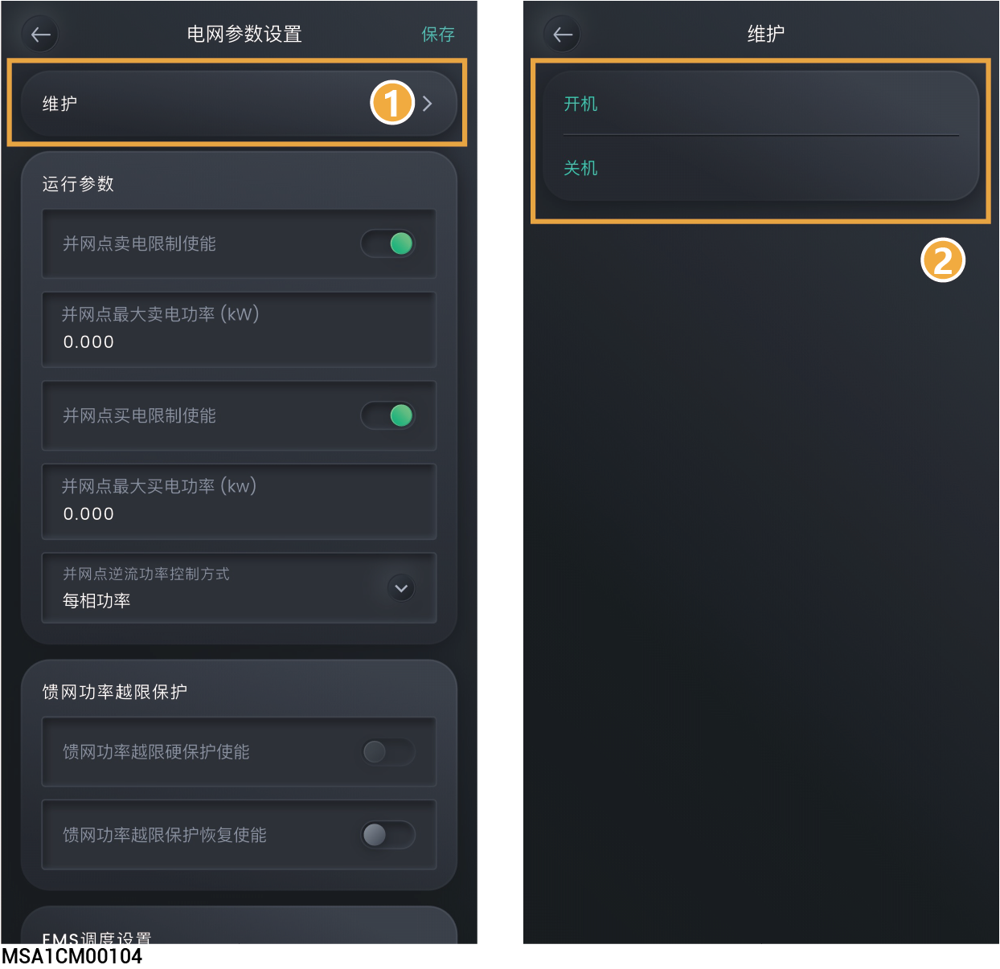

# 其他

## **批量开关机**

<figure><figcaption></figcaption></figure>

## **馈网功率越限保护**

<table><thead><tr><th width="70" align="center" valign="middle">序号</th><th width="218" valign="middle">参数名称</th><th valign="top">说明</th></tr></thead><tbody><tr><td align="center" valign="middle">1</td><td valign="middle">馈网功率超限保护使能</td><td valign="top">
设置为时，逆流功率超过所设的阈值或思格能源备电柜/思格功率传感器断链时设备关机。
<ul><li>
馈网功率硬性保护阈值：
<ul><li>实际馈入电网功率＞“馈网功率硬性保护阈值”，设备关机。</li><li>实际馈入电网功率＜“馈网功率硬性保护阈值” ，设备开机。</li></ul></li></ul></td></tr><tr><td align="center" valign="middle">2</td><td valign="middle">馈网功率超限保护恢复使能</td><td valign="top">设置电网故障恢复后，设备并网后功率上升梯度。</td></tr></tbody></table>

## **EMS调度设置**

<table><thead><tr><th width="70" align="center" valign="middle">序号</th><th width="218" valign="middle">参数名称</th><th valign="top">说明</th></tr></thead><tbody><tr><td align="center" valign="middle">1</td><td valign="middle">远程EMS调度使能</td><td valign="top">设置为时，允许远程EMS调度使能。</td></tr></tbody></table>

## **电网标准码**



<mark style="color:blue;">根据所在地区选择对应电网码。</mark>

## **电池预加热**

<table><thead><tr><th width="70" align="center" valign="middle">序号</th><th width="162" valign="middle">参数名称</th><th valign="top">说明</th></tr></thead><tbody><tr><td align="center" valign="middle">1</td><td valign="middle">加热膜预约</td><td valign="top">点击可设置加热膜预约时间。</td></tr></tbody></table>

## **并离网控制器**

<table><thead><tr><th width="69" align="center" valign="middle">序号</th><th width="191" valign="middle">参数名称</th><th valign="top">说明</th></tr></thead><tbody><tr><td align="center" valign="middle">1</td><td valign="middle">并离网控制器类型</td><td valign="top"><ul><li>自动检测：控制离网运行的设备为本公司设备时（如思格能源备电柜），设置为本参数。</li></ul><ul><li>第三方备电盒：控制离网运行的设备为第三方厂家的设备时（如转换开关），设置为本参数。</li></ul></td></tr></tbody></table>

## **电网控制**

<table><thead><tr><th width="70" align="center" valign="middle">序号</th><th width="206" valign="middle">参数名称</th><th valign="top">说明</th></tr></thead><tbody><tr><td align="center" valign="middle">1</td><td valign="middle">并网点电压控制使能</td><td valign="top">当设置为时，当并网点电压升高，限制交流输出功率。防止输出功率过大，导致并网点电压过高触发电网电压过压关机。</td></tr></tbody></table>

## **充放电与备电量设置**

<table><thead><tr><th width="70" align="center" valign="middle">序号</th><th width="153" valign="middle">参数名称</th><th valign="top">说明</th></tr></thead><tbody><tr><td align="center" valign="middle">1</td><td valign="middle">充电截止 SOC</td><td valign="top">设置电池包停止充电的容量。</td></tr><tr><td align="center" valign="middle">2</td><td valign="middle">放电截止 SOC</td><td valign="top">
设置电池包停止放电的容量。
<ul><li>此参数不建议设置为0，避免电池包未及时充电造成不可逆的衰减。</li><li>在备电组网时，优先执行“备电SOC”；非备电组网时，执行此参数。</li></ul></td></tr><tr><td align="center" valign="middle">3</td><td valign="middle">备电 SOC</td><td valign="top"><ul><li>组网中含有思格能源备电柜时，可设置此参数。</li></ul><ul><li>并网场景时，电池包放电至备电量值时不再放电；离网场景时，电池包给用电设备供电，放电至设置的放电截止 SOC时，停止放电。</li></ul><ul><li>用户根据地区断电频率和离家时间手动设置。不建议设置为0，避免电池包未及时充电造成不可逆的衰减。</li></ul></td></tr></tbody></table>

## **DO自定义**

<table><thead><tr><th width="70" align="center" valign="middle">序号</th><th width="282" valign="middle">参数名称</th><th valign="top">说明</th></tr></thead><tbody><tr><td align="center" valign="middle">1</td><td valign="middle">DO自定义使能</td><td valign="top">当设置为时，DO自定义功能生效，可设置相关参数，反之功能不生效。</td></tr><tr><td align="center" valign="middle">2</td><td valign="middle">DO自定义接入端口</td><td valign="top">根据实际接线，设置连接设备的DO端口。</td></tr><tr><td align="center" valign="middle">3</td><td valign="middle">DO自定义模式</td><td valign="top">设置为 DO port模式。</td></tr><tr><td align="center" valign="middle">4</td><td valign="middle">连接设备的SN</td><td valign="top">设置连接设备的逆变器SN。</td></tr></tbody></table>

## **电压保护**

<table><thead><tr><th width="70" align="center" valign="middle">序号</th><th width="222" valign="middle">参数名称</th><th valign="middle">说明</th></tr></thead><tbody><tr><td align="center" valign="middle">1</td><td valign="middle"><em><strong>N</strong></em>级过压保护点</td><td valign="middle">设置电网电压<em>N</em>级过压保护值，当实际电压＞所设置的保护值，并满足设置的保护时间时，将触发设备告警，反之告警消失。</td></tr><tr><td align="center" valign="middle">2</td><td valign="middle"><em><strong>N</strong></em>级过压保护时间</td><td valign="middle">设置电网电压<em>N</em>级过压保护时间。</td></tr><tr><td align="center" valign="middle">3</td><td valign="middle"><em><strong>N</strong></em>级欠压保护点</td><td valign="middle">设置电网电压<em>N</em>级欠压保护值，当实际电压＜所设置的保护值，并满足设置的保护时间时，将触发设备告警，反之告警消失。</td></tr><tr><td align="center" valign="middle">4</td><td valign="middle"><em><strong>N</strong></em>级欠压保护时间</td><td valign="middle">设置电网电压<em>N</em>级欠压保护时间。</td></tr><tr><td align="center" valign="middle">5</td><td valign="middle">十分钟滑窗过压保护点</td><td valign="middle">设置十分钟过压保护点。当电压以十分钟为窗口滑动的平均值＞所设置的保护值，并满足设置的保护时间时，将触发设备告警，反之告警消失。</td></tr><tr><td align="center" valign="middle">6</td><td valign="middle">十分钟滑窗过压保护时间</td><td valign="middle">设置十分钟过压保护时间。</td></tr></tbody></table>

注：_&#x4E;_&#x8868;示1到6。“电压保护”可设置参数与“电网标准码”相关联，具体可设置参数以实际界面为准。

## **频率保护**

<table><thead><tr><th width="70" align="center" valign="middle">序号</th><th width="192" valign="middle">参数名称</th><th valign="middle">说明</th></tr></thead><tbody><tr><td align="center" valign="middle">1</td><td valign="middle"><em><strong>N</strong></em>级过频保护点</td><td valign="middle">设置电网电压<em>N</em>级过频保护值，当实际电网频率＞所设置的保护值，并满足设置的保护时间时，将触发设备告警，反之告警消失。</td></tr><tr><td align="center" valign="middle">2</td><td valign="middle"><em><strong>N</strong></em>级过频保护时间</td><td valign="middle">设置电网电压<em>N</em>级过频保护时间。</td></tr><tr><td align="center" valign="middle">3</td><td valign="middle"><em><strong>N</strong></em>级欠频保护点</td><td valign="middle">设置电网电压<em>N</em>级欠频保护值，当实际电网频率＜所设置的保护值，并满足设置的保护时间时，将触发设备告警，反之告警消失。</td></tr><tr><td align="center" valign="middle">4</td><td valign="middle"><em><strong>N</strong></em>级欠频保护时间</td><td valign="middle">设置电网电压<em>N</em>级欠频保护时间。</td></tr></tbody></table>

注：_&#x4E;_&#x8868;示1到6。“频率保护”可设置参数与“电网标准码”相关联，具体可设置参数以实际界面为准。

## **电网故障重连**

<table><thead><tr><th width="70" align="center" valign="middle">序号</th><th width="220" valign="middle">参数名称</th><th valign="top">说明</th></tr></thead><tbody><tr><td align="center" valign="middle">1</td><td valign="middle">电网故障恢复使能</td><td valign="top">当设置为时，电网故障恢复后，实际电网电压和频率在所设置范围内并持续设定时间后，才允许设备并网。</td></tr><tr><td align="center" valign="middle">2</td><td valign="middle">电网故障恢复频率上限</td><td valign="top">电网故障恢复后，电网频率高于“Reconnection Upper Frequency”的设定值时不允许设备重新并网</td></tr><tr><td align="center" valign="middle">3</td><td valign="middle">电网故障恢复频率下限</td><td valign="top">电网故障恢复后，电网频率低于“Reconnection Lower Frequency”的设定值时不允许设备重新并网</td></tr><tr><td align="center" valign="middle">4</td><td valign="middle">电网故障恢复电压上限</td><td valign="top">电网故障恢复后，电网电压高于“Reconnection Upper Voltage”的设定值时不允许设备重新并网</td></tr><tr><td align="center" valign="middle">5</td><td valign="middle">电网故障恢复电压下限</td><td valign="top">电网故障恢复后，电网电压低于“Reconnection Lower Voltage”的设定值时不允许设备重新并网</td></tr><tr><td align="center" valign="middle">6</td><td valign="middle">电网故障恢复功率梯度</td><td valign="top">电网故障恢复时，按照设置的功率梯度输出功率。</td></tr><tr><td align="center" valign="middle">7</td><td valign="middle">电网故障恢复并网时间</td><td valign="top">设置电网故障恢复以后，设备重新启动的等待时间。</td></tr><tr><td align="center" valign="middle">8</td><td valign="middle">最大视在电流</td><td valign="top">设置本参数可调整设备的最大视在电流。</td></tr></tbody></table>

## **P-U调节**

<table><thead><tr><th width="70" align="center" valign="middle">序号</th><th width="213" valign="middle">参数名称</th><th valign="top">说明</th></tr></thead><tbody><tr><td align="center" valign="middle">1</td><td valign="middle">电压上升抑制使能</td><td valign="top">当设置为时，电网电压根据PU曲线对应关系，调节设备输出有功功率。</td></tr></tbody></table>

## **无功调节**

<table><thead><tr><th width="82" valign="top">序号</th><th width="247" valign="top">参数名称</th><th valign="top">说明</th></tr></thead><tbody><tr><td valign="top">1</td><td valign="top">无功功率调节模式</td><td valign="top">按照所设置的模式调节无功功率。</td></tr><tr><td valign="top">2</td><td valign="top">QU曲线使能</td><td valign="top">当设置为时，无功功率依照“QU曲线自动调节时间常数”设置的时间值完成自动调节。</td></tr><tr><td valign="top">3</td><td valign="top">无功Q/S调节</td><td valign="top">按照百分比形式调节设备的无功功率输出。</td></tr><tr><td valign="top">4</td><td valign="top">QU曲线自动调节时间常数</td><td valign="top">设置电网电压变化触发QU曲线时，无功功率完成自动调节所需要的时间。</td></tr><tr><td valign="top">5</td><td valign="top">无功功率固定值调节</td><td valign="top">按照固定值形式调节设备的无功功率输出。</td></tr><tr><td valign="top">6</td><td valign="top">功率因数调节</td><td valign="top">设置设备的功率因数。</td></tr><tr><td valign="top">7</td><td valign="top">PF-P/Pn曲线（含点数）</td><td valign="top">设置设备根据P/Pn(%)实时调整输出的功率因数。</td></tr><tr><td valign="top">8</td><td valign="top">PF-P/Pn调整时间</td><td valign="top">设置根据对应PF-P/Pn曲线关系调节设备输出无功功率值的95%所需时间。</td></tr><tr><td valign="top">9</td><td valign="top">PF-U曲线（含点数）</td><td valign="top">设置设备根据电网电压实际值与额定值的比“U/Un(%)”，实时调整的功率因数。</td></tr><tr><td valign="top">10</td><td valign="top">Q-P曲线（含点数）</td><td valign="top">设置设备根据有功功率与有功最大值的比值“P/Pmax”，实时调整无功功率与有功最大值的比Q/Pmax。</td></tr><tr><td valign="top">11</td><td valign="top">Q-P曲线调节时间</td><td valign="top">设置根据对应Q-P曲线关系调节设备输出无功功率值的95%所需时间。</td></tr><tr><td valign="top">12</td><td valign="top">Q-U曲线（含点数）</td><td valign="top">设置设备根据电网电压实际值与额定值的比值U/Un(%)，实时调整输出的无功功率和视在功率的比值Q/S。</td></tr><tr><td valign="top">13</td><td valign="top">Q-U曲线触发功率</td><td valign="top">设置设备触发Q-U曲线功能的P/Pmax。设备的实际功率＞设置值时，启动Q-U曲线调度功能。</td></tr><tr><td valign="top">14</td><td valign="top">Q-U曲线退出功率</td><td valign="top">设置设备退出Q-U曲线功能的P/Pmax。设备的实际功率＜设置值时，退出Q-U曲线调度功能。。</td></tr><tr><td valign="top">15</td><td valign="top">Q-U曲线功率调节时间</td><td valign="top">设置根据对应Q-U曲线关系调节设备输出无功功率值的95%所需时间。</td></tr></tbody></table>

## **过频降额**

<table><thead><tr><th width="84" valign="top">序号</th><th width="195" valign="top">参数名称</th><th valign="top">说明</th></tr></thead><tbody><tr><td valign="top">1</td><td valign="top">过频降额使能</td><td valign="top">当设置为时，电网频率＞触发值，会限制设备输出有功功率。</td></tr><tr><td valign="top">2</td><td valign="top">过频降额触发频率</td><td valign="top">设置过频降额触发阈值。</td></tr><tr><td valign="top">3</td><td valign="top">过频降额功率变化率</td><td valign="top">频率恢复后，有功功率按照本参数设置的梯度值恢复。</td></tr><tr><td valign="top">4</td><td valign="top">过频降额退出频率</td><td valign="top">设置过频降额退出阈值。即电网频率＜退出阈值时，设备输出有功功率停止降额。</td></tr><tr><td valign="top">5</td><td valign="top">频率响应延时生效时间</td><td valign="top">设置触发过频降额后，等待设备输出有功功率产生变化的时间。</td></tr><tr><td valign="top">6</td><td valign="top">过频降额响应延时</td><td valign="top">设置过频降额后，设备输出功率开始变化至到达平稳值的95%所需要的时间。</td></tr><tr><td valign="top">7</td><td valign="top">过频降额功率参考模式</td><td valign="top">
触发过频降额时，功率参考设置的模式进行降额。
<ul><li>触发时冻结有功功率: 触发过频降额时的实时有功功率。</li></ul><ul><li>最大有功功率：设备最大有功功率。</li></ul><ul><li>额定功率: 设备额定功率。</li></ul><ul><li>电池剩余充电功率: 触发过频降额时的实时功率+储能可充电功率。</li></ul></td></tr><tr><td valign="top">8</td><td valign="top">过频降额退出延时</td><td valign="top">“过频降额退出频率使能”设置为时，通过本参数，设置退出过频降额后，当电网频率＜“过频降额退出频率”值时，等待设备输出有功功率停止降额的时间。</td></tr><tr><td valign="top">9</td><td valign="top">过频降额退出频率使能</td><td valign="top">设置为时，过频降额退出延时生效，可设置“过频降额退出延时”值。</td></tr></tbody></table>

## **欠频升功率**

<table><thead><tr><th width="81" valign="top">序号</th><th width="200" valign="top">参数名称</th><th valign="top">说明</th></tr></thead><tbody><tr><td valign="top">1</td><td valign="top">欠频升功率使能</td><td valign="top">当设置为时，电网频率＜触发值，设备输出有功功率变大。</td></tr><tr><td valign="top">2</td><td valign="top">欠频升功率触发频率</td><td valign="top">设置欠频升功率触发阈值。</td></tr><tr><td valign="top">3</td><td valign="top">欠频降额功率变化率</td><td valign="top">频率恢复后，有功功率按照本参数设置的梯度值恢复。</td></tr><tr><td valign="top">4</td><td valign="top">欠频升功率退出频率</td><td valign="top">设置欠频升功率退出阈值。即电网频率＞退出阈值时，设备输出有功功率停止升功率。</td></tr><tr><td valign="top">5</td><td valign="top">欠频升功率功率参考模式</td><td valign="top">
触发欠频升功率时，有功功率参考设置的模式进行升功率。
<ul><li>触发时冻结有功功率: 触发欠频升功率时的实时有功功率。</li><li>最大有功功率: 设备最大有功功率。</li><li>PCS剩余有功功率能力：设备额定功率。</li><li>电池剩余放电功率能力：触发欠频升功率时的实时功率+储能可放电功率。</li></ul></td></tr><tr><td valign="top">6</td><td valign="top">欠频升功率响应延时</td><td valign="top">设置触发欠频升功率后，等待设备输出有功功率产生变化的时间。</td></tr><tr><td valign="top">7</td><td valign="top">欠频升功率退出延时</td><td valign="top">“欠频升功率退出频率使能”设置为时，通过本参数，设置退出欠频升功率后，当电网频率＞“欠频升功率退出频率”值时，等待设备输出有功功率停止升功率的时间。</td></tr><tr><td valign="top">8</td><td valign="top">欠频升功率响应时间</td><td valign="top">设置欠频升功率后，设备输出有功功率开始变化至到达预期值的95%所需要的时间。</td></tr><tr><td valign="top">9</td><td valign="top">欠频升功率退出频率使能</td><td valign="top">设置为时，欠频升功率退出延时生效，可设置“欠频升功率退出延时”。</td></tr></tbody></table>

## **低穿**

<table><thead><tr><th width="79" align="center" valign="middle">序号</th><th width="219" valign="middle">参数名称</th><th valign="top">说明</th></tr></thead><tbody><tr><td align="center" valign="middle">1</td><td valign="middle">低穿使能</td><td valign="top">当设置为时，电网异常出现短时低电压时，设备不能立即脱离电网，需要支撑一段时间。</td></tr><tr><td align="center" valign="middle">2</td><td valign="middle">低穿模式</td><td valign="top">根据所设置的模式，设备在低压穿越期间，输出对应的功率（电流）。</td></tr><tr><td align="center" valign="middle">3</td><td valign="middle">低穿曲线</td><td valign="top">设置设备低电压穿越能力。</td></tr><tr><td align="center" valign="middle">4</td><td valign="middle">低穿触发阈值</td><td valign="top">当电网电压＜本参数设置值时，将触发低电压穿越。</td></tr><tr><td align="center" valign="middle">5</td><td valign="middle">低穿零电流模式电压阈值</td><td valign="top">当电网电压＜本参数设置值时，设备将零电流输出。</td></tr></tbody></table>

## **高穿**

<table><thead><tr><th width="78" valign="top">序号</th><th width="159" valign="top">参数名称</th><th valign="top">说明</th></tr></thead><tbody><tr><td valign="top">1</td><td valign="top">高穿使能</td><td valign="top">
当设置为时，电网异常出现短时高电压时，设备不能

立即脱离电网，需要支撑一段时间。
</td></tr><tr><td valign="top">2</td><td valign="top">高穿曲线</td><td valign="top">设置设备高电压穿越能力。</td></tr><tr><td valign="top">3</td><td valign="top">高穿触发阈值</td><td valign="top">当电网电压＞本参数设置值时，将触发高电压穿越。</td></tr></tbody></table>

## **开机并网检测**

<table><thead><tr><th width="85" valign="top">序号</th><th width="213" valign="top">参数名称</th><th valign="top">说明</th></tr></thead><tbody><tr><td valign="top">1</td><td valign="top">开机并网检测使能</td><td valign="top">当设置为时，实际电网电压和频率在所设置范围内并持续设定时间后，才允许设备并网。</td></tr><tr><td valign="top">2</td><td valign="top">开机并网检测时间</td><td valign="top">设置设备开机后，实际电网电压和频率在所设置范围内，设备等待并网的时间。</td></tr><tr><td valign="top">3</td><td valign="top">开机并网检测频率上限</td><td valign="top">设置设备开机后，允许设备并网的频率最大值。</td></tr><tr><td valign="top">4</td><td valign="top">开机并网检测频率下限</td><td valign="top">设置设备开机后，允许设备并网的频率最小值。</td></tr><tr><td valign="top">5</td><td valign="top">开机并网检测电压上限</td><td valign="top">设置设备开机后，允许设备并网的电压最大值。</td></tr><tr><td valign="top">6</td><td valign="top">开机并网检测电压下限</td><td valign="top">设置设备开机后，允许设备并网的电压最小值。</td></tr><tr><td valign="top">7</td><td valign="top">开机并网检测功率梯度</td><td valign="top">设置设备开机后，设备并网后功率逐渐上升的幅度。</td></tr></tbody></table>

## **孤岛**

<table><thead><tr><th width="78" valign="top">序号</th><th width="225" valign="top">参数名称</th><th valign="top">说明</th></tr></thead><tbody><tr><td valign="top">1</td><td valign="top">主动孤岛</td><td valign="top">当设置为时，可通过控制设备，使其输出功率、频率或相位存在一定的扰动。</td></tr><tr><td valign="top">2</td><td valign="top">单相故障使能防孤岛模式</td><td valign="top">当设置为时，</td></tr><tr><td valign="top">3</td><td valign="top">被动孤岛使能</td><td valign="top">当设置为时，利用电网断电时设备输出端电压、频率、相位或谐波的变化进行孤岛效应检测。</td></tr></tbody></table>

## **离网设置**

该功能应用的场景：思格逆变器没有接光伏并且离网运行，光伏接入到三方逆变器。

<table><thead><tr><th width="70" align="center" valign="middle">序号</th><th width="284" valign="top">参数名称</th><th valign="top">说明</th></tr></thead><tbody><tr><td align="center" valign="middle">1</td><td valign="top">启用第三方光伏逆变器黑启启动</td><td valign="top">当设置为时，储能会预留SOC，在早晨启动设备。</td></tr><tr><td align="center" valign="middle">2</td><td valign="top">离网放电截止SOC差值</td><td valign="top">预留的SOC值作为第二天系统黑启的能量。</td></tr></tbody></table>

## **三相转两相**

支持在三相四线电网中，使用其中的两相接入设备。

<table><thead><tr><th width="69" align="center" valign="middle">序号</th><th width="193" valign="top">参数名称</th><th valign="top">说明</th></tr></thead><tbody><tr><td align="center" valign="middle">1</td><td valign="top">三相转两相使能</td><td valign="top">当设置为时，可以接入两相并网。</td></tr></tbody></table>

## **第三方逆变器控制**

<table><thead><tr><th width="71" align="center" valign="middle">序号</th><th width="291" valign="middle">参数名称</th><th valign="top">说明</th></tr></thead><tbody><tr><td align="center" valign="middle">1</td><td valign="middle">第三方逆变器控制分断启用</td><td valign="top">当设置为时，可断开第三方逆变器的连接。当系统检测到异常（如孤岛运行、电网故障等）时可启用此功能。</td></tr><tr><td align="center" valign="middle">2</td><td valign="middle">第三方逆变器控制分断延迟时间</td><td valign="top">设置第三方逆变器断开操作的延迟时间。设置后系统会等待设定的延迟时间再执行断开操作，避免误动作或短暂波动导致的频繁开关。</td></tr></tbody></table>
