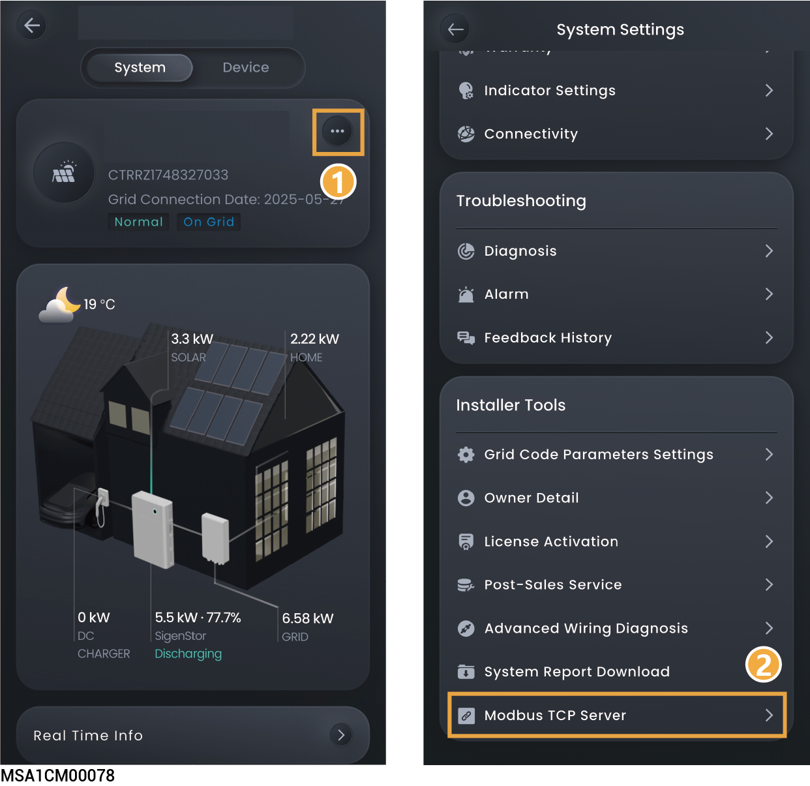

# （可选）Modbus TCP 服务设置



<mark style="color:$danger;">仅日本区域有此功能。</mark>

<figure><figcaption></figcaption></figure>

<table><thead><tr><th width="81" align="center">序号</th><th width="201">参数</th><th>参数说明</th></tr></thead><tbody><tr><td align="center">1</td><td>Configuration</td><td>点击设置ModbusTCP服务器配置详细信息。</td></tr><tr><td align="center">2</td><td>SN</td><td>填写开启ModbusTCP服务器的设备SN号。</td></tr><tr><td align="center">3</td><td>IP</td><td>填写连接至ModbusTCP服务器的客户端IP。</td></tr><tr><td align="center">4</td><td>Broken link protection</td><td>设置为时，使能通讯断链保护功能。</td></tr><tr><td align="center">5</td><td>Communication loss detection</td><td>设置为时，使能通讯丢失检测功能。</td></tr><tr><td align="center">6</td><td>Dispatch loss detection</td><td>设置为时，使能电站调度指令丢失检测功能。</td></tr><tr><td align="center">7</td><td>Communication abnormal protection mode</td><td><ul><li>No action：无保护模式，不进行任何操作。</li><li>Max self-consumption：最大自发自用模式。</li><li>Standby：储能待机模式，储能不充不放。</li><li>
Limit power：限功率模式，不支持超过限功率的调度。
<ul><li>Max active power：通讯断链保护限功率模式下的电站最大有功功率。</li><li>Min active power：通讯断链保护限功率模式下的电站最小有功功率。</li><li>Max reactive power：通讯断链保护限功率模式下的电站最大无功功率。</li><li>Min reactive power：通讯断链保护限功率模式下的电站最小无功功率。</li></ul></li><li>
Shutdown：关机保护模式，链接恢复前保持关机
<ul><li>Auto restart enable: 设置为时，使能通讯恢复后自动开机。设置为时，禁能通讯恢复后自动开机。</li></ul></li></ul></td></tr></tbody></table>
