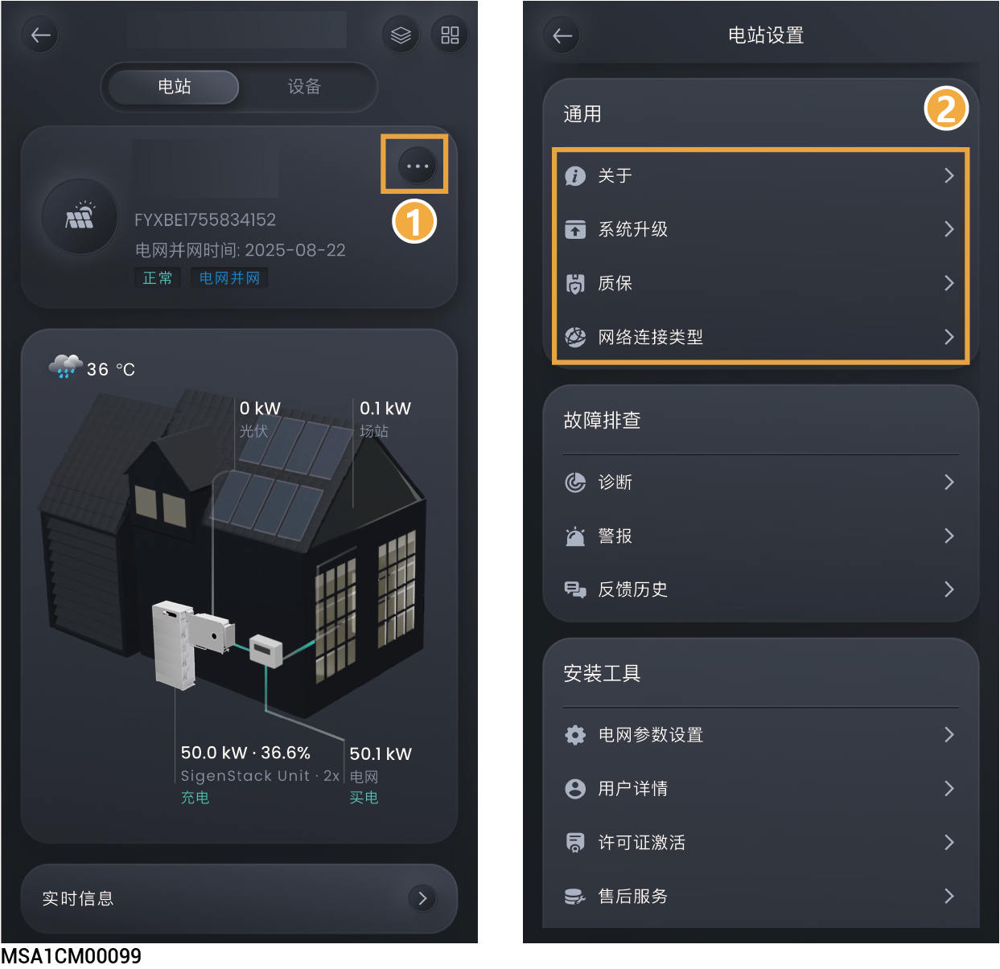

# 通用设置

<figure><figcaption></figcaption></figure>

<table><thead><tr><th width="70" align="center" valign="middle">序号</th><th width="124" valign="middle">参数名称</th><th valign="top">说明</th></tr></thead><tbody><tr><td align="center" valign="middle">1</td><td valign="middle">关于</td><td valign="top">点击可修改电站类型、名称与地址。</td></tr><tr><td align="center" valign="middle">2</td><td valign="middle">系统升级</td><td valign="top">
点击可升级电站软件。
<ul><li>您可通过本功能知晓系统中设备软件是否为最新版本，并支持将设备升级为最新版本。</li><li>点击后可升级电站所有思格设备，包含但不限于SigenStor、直流充电桩、备电柜等。</li></ul></td></tr><tr><td align="center" valign="middle">3</td><td valign="middle">质保</td><td valign="top">点击查看质保状态。</td></tr><tr><td align="center" valign="middle">4</td><td valign="middle">网络连接类型</td><td valign="top">
通信方式推荐采用FE和WLAN。思格能源通信棒赠送4G流量用完后，需用户自行充值或更换SIM卡。 <strong>以太网</strong>
<ul><li>显示FE连接状态。在网络稳定情况下不建议拔插网线。</li><li>自动获取IP地址：设置为时，自动获取IP地址。设置为时，用户设置静态IP地址。</li></ul>
<strong>WLAN</strong>

显示WLAN连接状态。此处支持为电站所有的设备配置需要连接的WLAN。
<ul><li>配置WLAN通信前，请确认设备已安装天线。</li><li>连接非加密WLAN，可能导致网络不可用，不推荐使用。</li><li>当设备仅可用WLAN连接网络时，不可切换其他无线路由器WLAN</li><li>DNS设置：域名服务器设置。</li></ul>
<strong>移动网</strong>
<ul><li>显示4G是否连接到网络。</li><li>当采用4G通信时，可查看当前每月使用的流量，同时可设置每月使用流量阈值。</li><li>移动网设置：可选择4G 运营商和APN的鉴权方式。</li></ul></td></tr></tbody></table>
