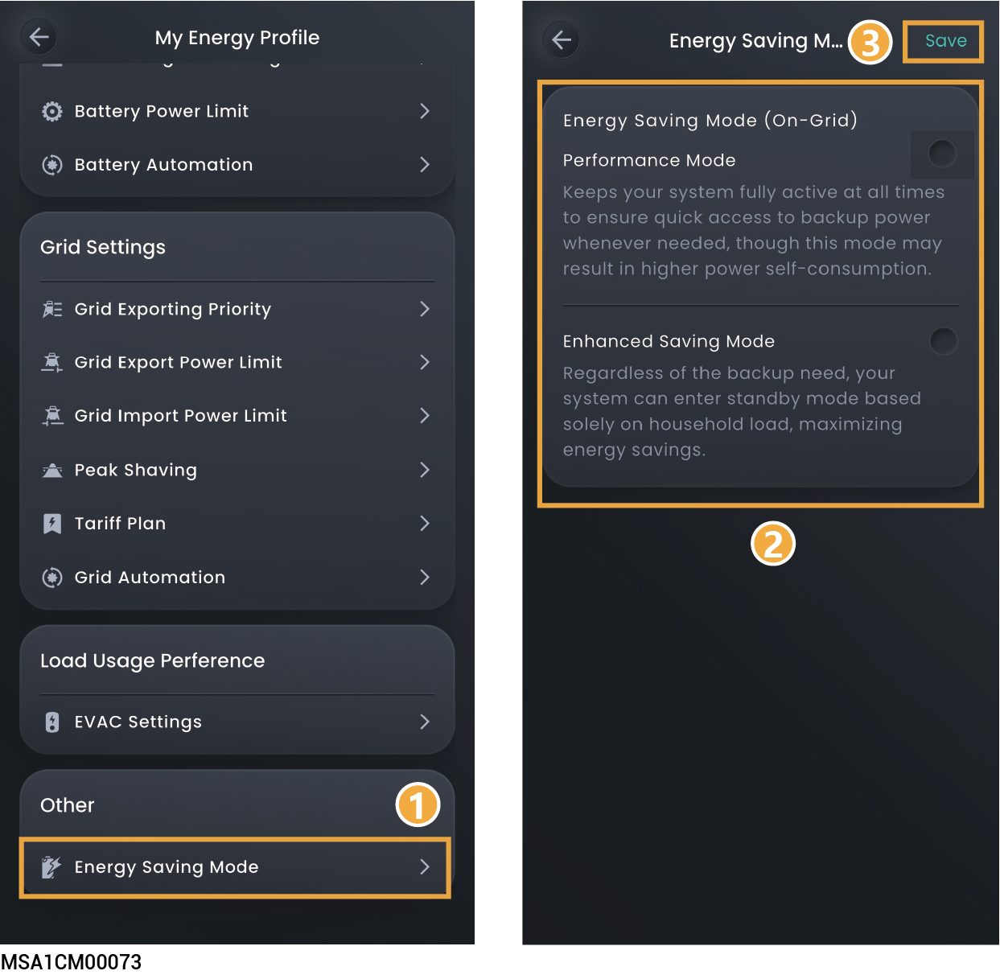

# Energy Saving Mode



* <mark style="color:blue;">Performance: In this mode, devices operate normally and supply power to loads at high speed.</mark>
* <mark style="color:blue;">Energy Saving: In this mode, devices are in standby mode with low power consumption. After being connected to loads, devices take some time to respond to supply power to loads.</mark>

<figure><figcaption></figcaption></figure>
