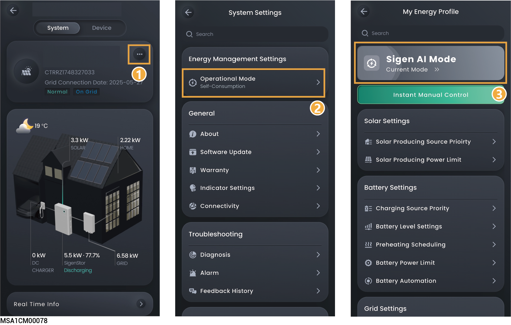
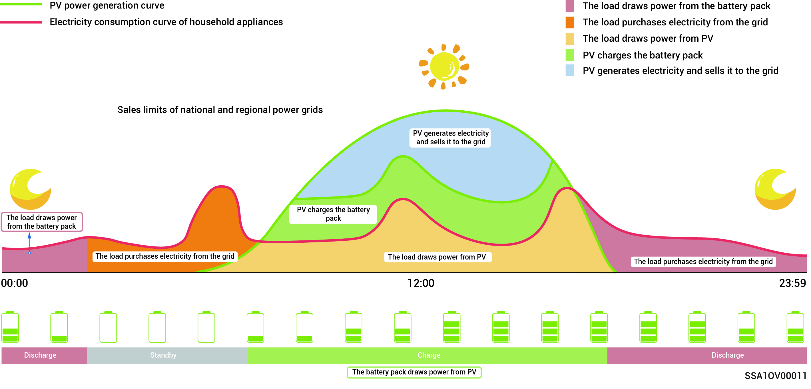
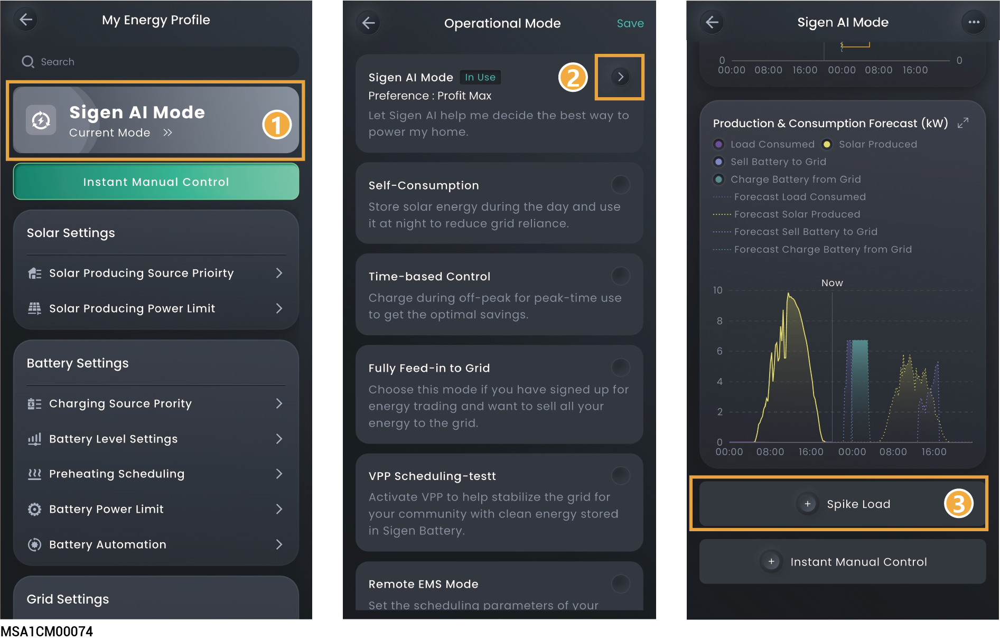
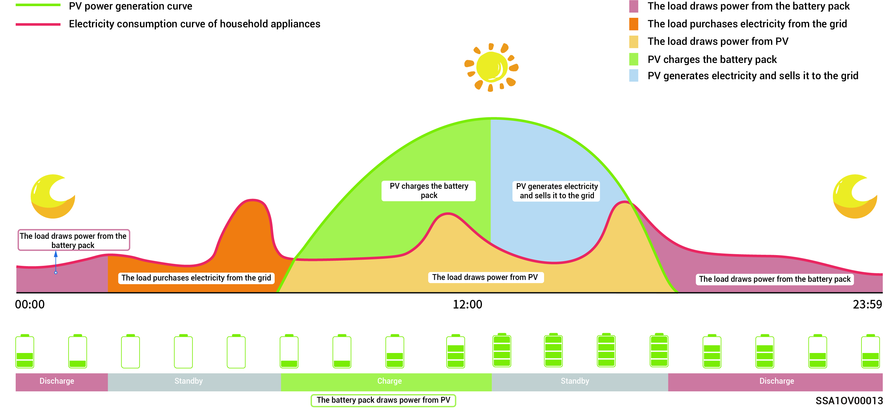
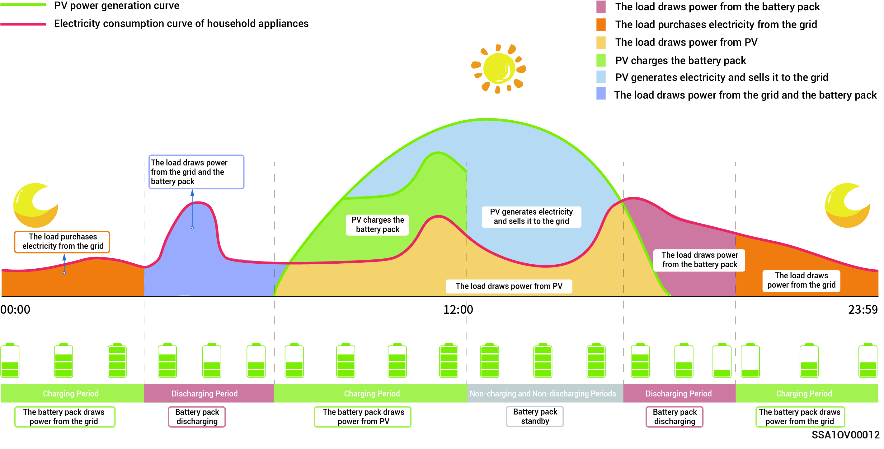
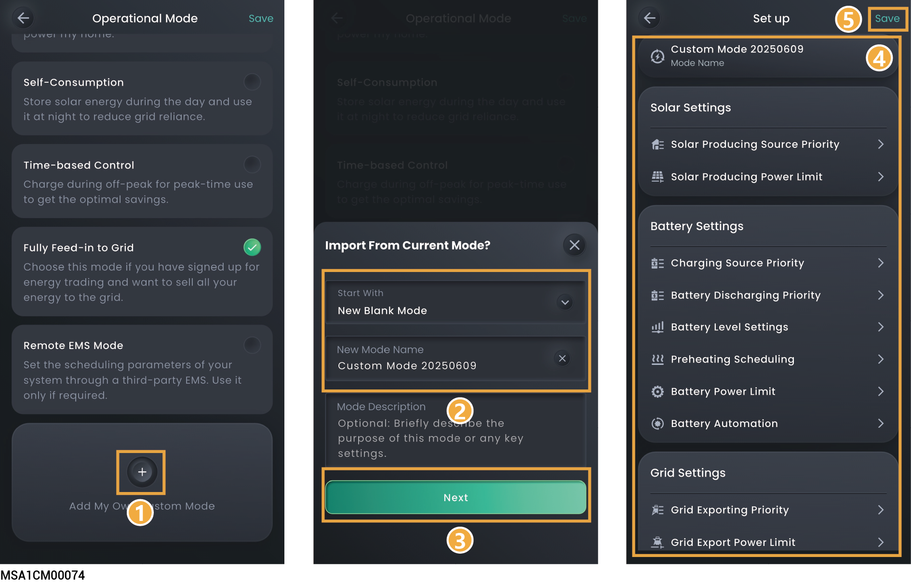

# Energy storage working mode



* <mark style="color:blue;">The SigenStor energy storage system is mainly used in household rooftop power station systems and small power station on-grid systems in C\&I scenarios. It can support up to 20 SigenStor units in parallel. If more SigenStor units are required, the digital acquisition SigenLogger can be connected to meet the needs.</mark>
* <mark style="color:blue;">The energy storage system supports multiple working modes, namely: "Sigen AI Mode," "Fully Feed-in to Grid," "Time-based Control," "Self-Consumption," "Remote EMS Mode," and "Load Shedding Mode."</mark>
* <mark style="color:blue;">Some countries support Load Shedding Mode, which is subject to the App interface display.</mark>

<figure><figcaption></figcaption></figure>

## Sigen AI Mode

By obtaining local peak and valley electricity prices and weather data, combined with user electricity consumption habits, the Sigen AI Mode can customize intelligent electricity usage solutions to maximize customers' cost savings.

<figure><figcaption></figcaption></figure>

<figure><figcaption></figcaption></figure>

### **Add Spike Load**



<mark style="color:blue;">**Peak load refers to the instantaneous surge in electricity demand.**</mark>

<figure><figcaption></figcaption></figure>

## Self-Consumption Mode

* When there is sufficient solar power, the electric energy generated by the PV system will first be used to power the loads, with any excess energy being stored in the batteries. Any remaining surplus energy will be sold to the grid. When there is insufficient solar power, the batteries will release electric energy to loads. By increasing the self-consumption ratio of the PV system and improving the self-sufficiency ratio of household energy, you can effectively save on your electric bills.
* This mode is suitable for areas with high electricity prices or zero-power grid connection restrictions.

<figure><figcaption></figcaption></figure>

## Time-based Control

* The charging period, discharging period, and self-consumption period need to be set manually.When electricity prices are high, the surplus power from photovoltaic power generation and battery power can be sold to the grid, and the battery can be charged during periods of low electricity prices to save electricity bills.
* If no period is set, the energy storage system will be in standby mode without discharging. The photovoltaic power will prioritize supplying the load, and the surplus power will be used for charging energy storage system. \*
* Up to 24 charging and discharging or self-consumption periods can be set.
* It is suitable for areas with peak and valley electricity prices and significant price differences.
* When entering this period, the battery capacity will be recorded. When the photovoltaic power is greater than the load, the remaining photovoltaic power will charge the battery. When the photovoltaic power is less than the load, the battery can be discharged to the load. However, when the battery capacity decreases and approaches the battery capacity value when entering this period, the battery will stop discharging.

<figure><figcaption></figcaption></figure>

<figure><figcaption></figcaption></figure>

<table><thead><tr><th width="54" align="center">No.</th><th width="111.4000244140625">Parameter name</th><th width="175">Parameter name</th><th>Description</th></tr></thead><tbody><tr><td align="center">1</td><td>Charging</td><td>Maximum charging power for BAT</td><td>During this period, the sum of the charging power of all battery packs in the system cannot be greater than the "PACK maximum charging power."The system defaults to the sum of rated charging power of all battery packs.</td></tr><tr><td align="center">2</td><td>Charging</td><td>Grid Charging Cut-off SOC</td><td>
Set the cut-off charging capacity value for the battery pack to be charged from the grid during this period.The system default is 100%.

When the battery SOC exceeds this parameter, the grid can charge the battery; when the battery SOC falls below this parameter, the grid cannot charge the battery.
</td></tr><tr><td align="center">3</td><td>Charging</td><td>Maximum power for importing from grid</td><td>The maximum power that can be imported from the grid during this period. System default values are effective according to the parameters in System Settings → Operational Parameters.</td></tr><tr><td align="center">4</td><td>Charging</td><td>Maximum Charging Power from Grid to BAT</td><td>The maximum power that the grid charges the battery pack during this period. </td></tr><tr><td align="center">5</td><td>Discharging</td><td>Maximum discharging power for BAT</td><td>During this period, the sum of the discharging power of all battery packs in the system cannot be greater than the "PACK maximum discharging power." The system defaults to the sum of rated charging power of all battery packs.</td></tr><tr><td align="center">6</td><td>Discharging</td><td>Maximum power for exporting to grid</td><td>The maximum power that the system is allowed to export to the grid during this period. System default values are effective according to the parameters in System Settings → Operational Parameters.</td></tr><tr><td align="center">7</td><td>Discharging</td><td>Maximum Discharging Power from BAT to Grid</td><td>The maximum power that the battery pack discharges to the grid during this period. The system defaults to the sum of rated charging power of all battery packs.</td></tr><tr><td align="center">8</td><td>Self-
Consumption</td><td>Maximum power for importing from grid</td><td>The maximum power that can be imported from the grid during this period. System default values are effective according to the parameters in System Settings → Operational Parameters.</td></tr><tr><td align="center">9</td><td>Self-
Consumption</td><td>Maximum power for exporting to grid</td><td>The maximum power that the system is allowed to export to the grid during this period. System default values are effective according to the parameters in System Settings → Operational Parameters.</td></tr></tbody></table>



<mark style="color:blue;">The system will operate based on the PV power situation in periods that you do not specify as charging and discharging periods. The PV power will first be used to power home loads, with excess energy charging the batteries, and the batteries will not discharge.</mark>

## Fully Feed-in to Grid

* You can sell excess energy back to the grid and earn credits on your energy bill.
* In the daytime, when the PV power is greater than the maximum output capacity of the inverter, the inverter maintains the maximum output while storing excess energy in the batteries. When the PV power is lower than the maximum output capacity of the inverter or there is no PV power in the nighttime, the batteries are discharged to ensure that the inverter maximizes the output.

## Remote EMS Mode

* Supports scheduling of energy storage system through third-party EMS system.
* Supports third-party EMS with RS-485 communication.Please make sure that the RS485-1 port cable of the device is properly connected and that the baud rate is set correctly according to the description in section [Operational Parameters](../../device-parameter-setup/sigenstor/operational-parameters.md).(Non-grid connection scenario)
* It supports third-party EMS with ModBus-TCP communication. Please ensure that you have completed the setup according to the description in section [ModBus parameters](../../device-parameter-setup/sigenstor/modbus-settings.md).

## Load Shedding Mode

In areas with frequent power outages, you can add your region and schedule in this mode, and the system will fully charge the battery in advance as scheduled, ensuring that you have battery power available to supply the load during outages. (currently only supported in South Africa)

## Custom Working Mode



<mark style="color:blue;">Customized operation modes can be created according to owner requirements.</mark>

<figure><figcaption></figcaption></figure>
