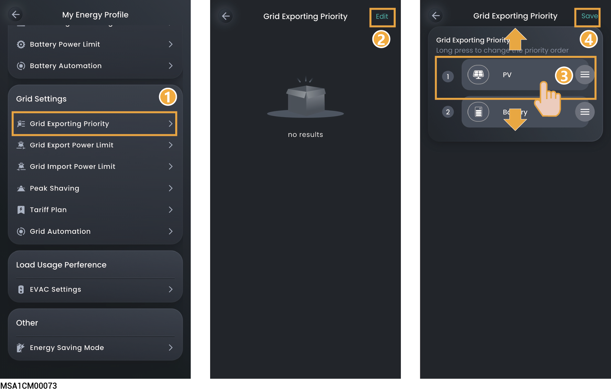
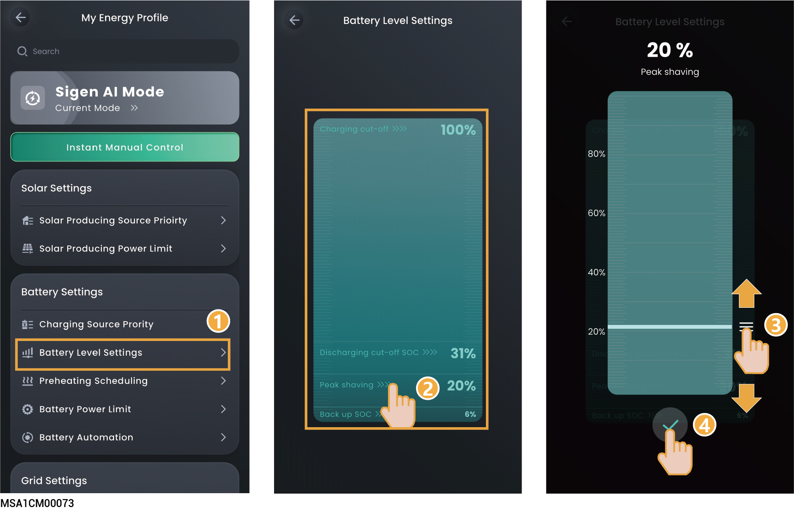
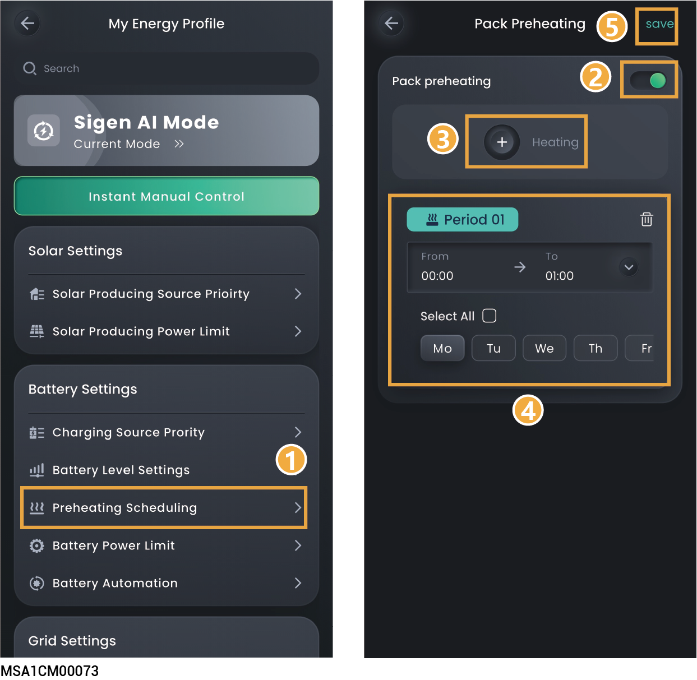

# Battery Settings

Setting battery-related parameters can optimize battery performance, extend battery life, and achieve intelligent charging and discharging strategies.

## Charging Source Prority



* <mark style="color:blue;">By default, PV is placed before Grid. In the negative electricity price scenario, Grid can be adjusted to be before PV.</mark>
* <mark style="color:blue;">The battery acquires power according to the set order.</mark>

<figure><figcaption></figcaption></figure>

## Discharging Source Prority



<mark style="color:blue;">Battery releases power according to the set order. The battery discharge priority can be configured based on the actual situation.</mark>

## Battery Level Setting

<figure><figcaption></figcaption></figure>

<table><thead><tr><th width="63" align="center">No.</th><th width="191">Parameter name</th><th>Description</th></tr></thead><tbody><tr><td align="center">1</td><td>Charge Cut-off SOC</td><td>Sets the capacity at which the battery pack stops charging.</td></tr><tr><td align="center">2</td><td>Discharge Cut-off SOC</td><td>
Sets the capacity at which the battery pack stops discharging.

Value 0 is not recommended for this parameter to avoid irreversible attenuation due to failure to charge the battery pack in time.

The priority is given to "Backup Capacity" in backup system wiring mode, while the parameter is applied in non-backup system wiring mode.
</td></tr><tr><td align="center">3</td><td>Peak shaving</td><td>Set the battery peak shaving cutoff point.</td></tr><tr><td align="center">4</td><td>Backup Reserve SOC</td><td>You can set this parameter when a gateway exists in the system wiring.
 In the on-grid scenario, the battery pack stops discharging when the backup capacity value is reached. In the off-grid scenario, the battery pack supplies power to power device and stops discharging when the Discharge Cut-off SOC setting is reached.
 Users can manually set this parameter according to the power interruption frequency of their regions and leave time. Value 0 is not recommended for this parameter to avoid irreversible attenuation due to failure to charge the battery pack in time.</td></tr></tbody></table>

## Preheating scheduling



<mark style="color:blue;">Pre-adjust the battery temperature to the optimal working range in low temperature environments to prevent performance degradation and safety hazards caused by low temperature.</mark>

<figure><figcaption></figcaption></figure>

|   | Parameter name | Description                                                                          |
| - | -------------- | ------------------------------------------------------------------------------------ |
|   |                | Set to  to set the battery preheating period. |
|   |                |                                                                                      |
|   |                |                                                                                      |
