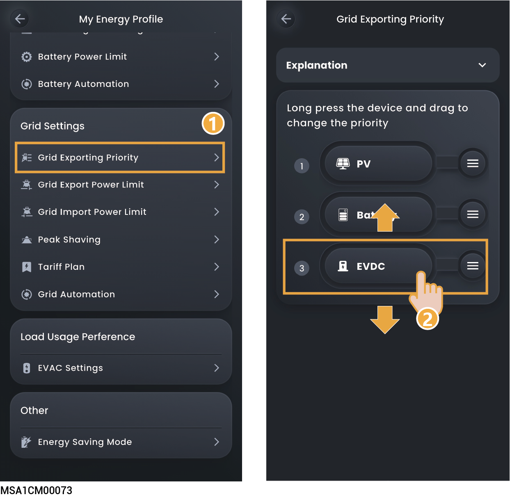
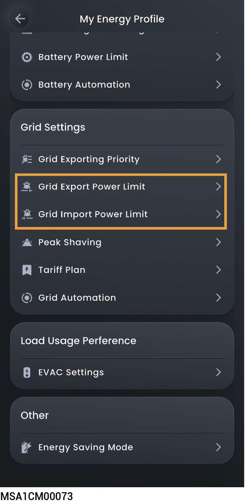
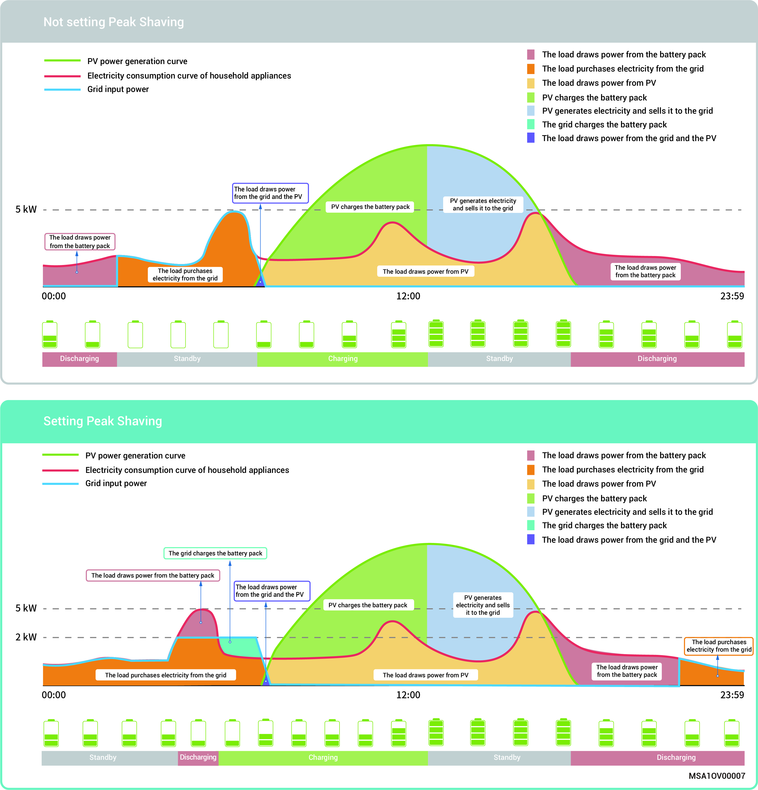
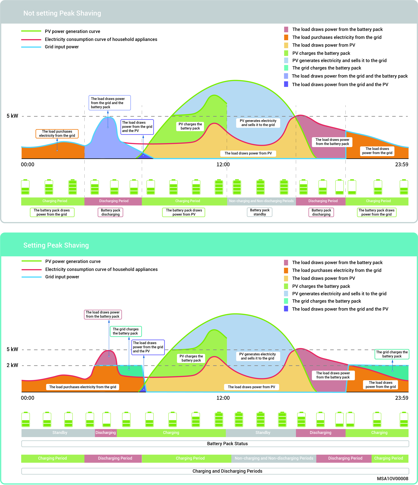
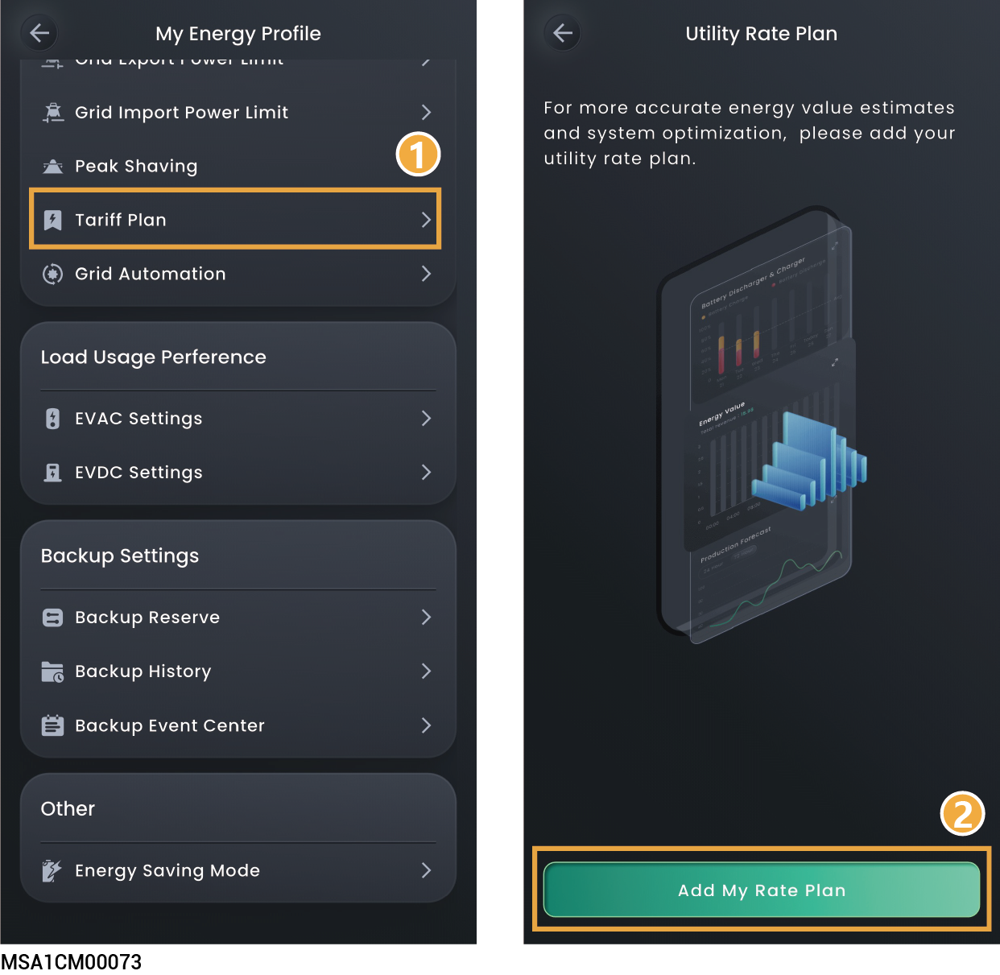
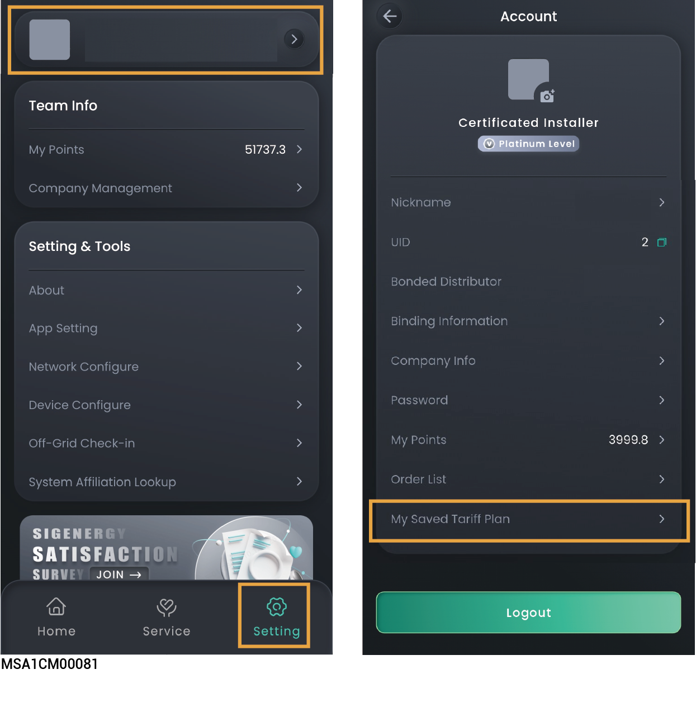
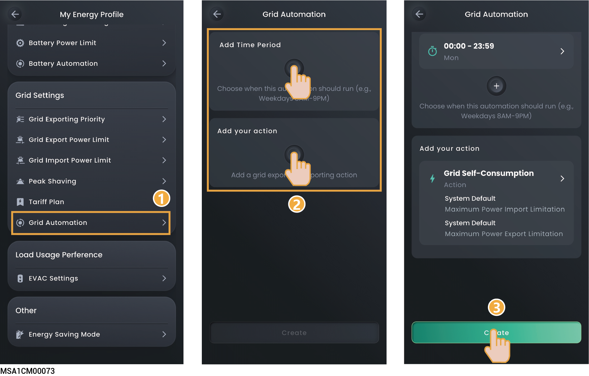

# Grid Settings

Setting grid-related parameters can ensure safe grid connection, compliant electricity sales, and maximum revenue.

## Grid Exporting Priority



* <mark style="color:blue;">By default priority, PV is placed before Battery. PV power prioritizes grid feed-in, with battery supplementing grid sales.</mark>
* <mark style="color:blue;">In the negative electricity price scenario, Battery can be adjusted to be before PV.</mark>
* <mark style="color:blue;">The device sells electricity to the grid according to the set order.</mark>

<figure><figcaption></figcaption></figure>

## Grid power setting

<figure><figcaption></figcaption></figure>

<table><thead><tr><th width="62" align="center">No.</th><th width="235.181884765625">Parameter name</th><th>Description</th></tr></thead><tbody><tr><td align="center">1 </td><td>Grid Export Power Limit</td><td>Set the system's maximum power for selling electricity to the grid.</td></tr><tr><td align="center">2</td><td>Grid Import Power Limit</td><td>Set the system's maximum power for buying electricity from the grid.</td></tr></tbody></table>

## Peak Shaving&#x20;



* <mark style="color:blue;">The electricity bill in some regions is calculated as follows: Total electricity bill = Cost at peak power + cost for electricity usage + other costs. Wherein, peak power refers to the maximum power imported from the grid. This mode is suitable for areas with peak and valley electricity prices and significant price differences.</mark>
* <mark style="color:blue;">The Peak Shaving function can be used with all working modes, configuring the maximum peak power drawn from the grid to reduce the maximum peak power drawn from the grid during peak periods, thereby lowering the electricity bill.</mark>

<figure><figcaption></figcaption></figure>

#### **Active Power Control**

<table><thead><tr><th width="71" align="center">No.</th><th width="186">Parameter name</th><th>Description</th></tr></thead><tbody><tr><td align="center">1</td><td>Peak shaving SOC</td><td>This parameter setting affects the capacity of peak shaving, and the system charges the battery to the set SOC value during the off-peak period. The larger the parameter setting, the stronger the peak shaving capability.</td></tr><tr><td align="center">2</td><td>Schedule</td><td>A maximum of 24 timetables can be added.</td></tr><tr><td align="center">3</td><td>Maximum Peak Power</td><td>Set the maximum peak power for drawing electricity from the grid for household loads and battery packcharging.</td></tr></tbody></table>

### Example 1: Self-Consumption Mode Settings for Peak Shaving

Assume that the peak shaving SOC is set to 50% and the maximum peak power is 2kW. Because Total electricity bill = Cost at peak power + cost for electricity usage + other costs. Wherein, peak power refers to the maximum power imported from the grid. After Self-Consumption Mode is set to Peak Shaving, the power purchased from the grid drops from 5 kW to 2 kW, so the total electricity bill is reduced.

<figure><figcaption></figcaption></figure>

### Example 2: Time-based Control Mode Settings for Peak Shaving

Assume that the peak shaving SOC is set to 50% and the maximum peak power is 2kW. Because Total electricity bill = Cost at peak power + cost for electricity usage + other costs. Wherein, peak power refers to the maximum power imported from the grid. After Time-based Control Mode is set to Peak Shaving, the power purchased from the grid drops from 5 kW to 2 kW, so the total electricity bill is reduced.

<figure><figcaption></figcaption></figure>

## Tariff Plan



<mark style="color:blue;">Some countries support the Tariff Rate Plan, as shown in the App interface.</mark>

<figure><figcaption></figcaption></figure>

### **Tariff Rate Plan**

<table><thead><tr><th width="70" align="center">No.</th><th width="224">Parameter name</th><th>Description</th></tr></thead><tbody><tr><td align="center">1</td><td>Utility Company</td><td>Select a power company.</td></tr><tr><td align="center">2</td><td>Rate Plan Name</td><td>Select an electricity rate plan.</td></tr><tr><td align="center">3</td><td>Currency Unit</td><td>By default, the minor currency unit is used for setting.</td></tr><tr><td align="center">4</td><td>Additional Fee</td><td>Automatically match the additional fee.</td></tr><tr><td align="center">5</td><td>Customize</td><td>Click to switch to Customize Rate Plan.</td></tr></tbody></table>

### **Customize Rate Plan**

<table><thead><tr><th width="70" align="center">No.</th><th width="224">Parameter name</th><th>Description</th></tr></thead><tbody><tr><td align="center">1</td><td>Utility Company</td><td>Enter the name of the power company.</td></tr><tr><td align="center">2</td><td>Rate Plan Name</td><td>Enter the name of the electricity rate plan.</td></tr><tr><td align="center">3</td><td>Currency Unit</td><td>By default, the minor currency unit is used for setting.</td></tr><tr><td align="center">4</td><td>Rate Plan Type</td><td>
<strong>Single Rate Tariff: All time periods adopt a single rate.</strong>
<ul><li>Rate Tariff.</li></ul>
<strong>TOU Rate Plan: Different rates are used for different time periods.</strong>
<ul><li>Add your TOU schedule: Add your Time-of-Use (TOU) rate periods.</li></ul><ul><li>Seasons Settings: Up to 6 seasons can be set within 1 year.</li></ul><ul><li>Season N time period: Set the time period within the season.</li></ul><ul><li>Price Setting: Set the price within the time period.</li></ul></td></tr><tr><td align="center">5</td><td>Go to settings to enable it</td><td>Click to switch to Tariff Rate Plan.</td></tr></tbody></table>

### Save electricity price configuration



<mark style="color:blue;">The tariff settings can be saved to the installer's account and applied to other plants.</mark>

<figure><figcaption></figcaption></figure>

## Grid Automation



<mark style="color:blue;">If this parameter is set, the grid will prioritize executing the parameters set by Grid Automation.</mark>

<figure><figcaption></figcaption></figure>

<table><thead><tr><th width="70" align="center">No.</th><th width="152">Parameter name</th><th>Description</th></tr></thead><tbody><tr><td align="center">1</td><td>Add Time Period</td><td>Click to add Time Period.</td></tr><tr><td align="center">2</td><td>Add your action</td><td>
Click to add grid operation status.

<strong>Grid Self-Consumption: The battery's power is supplied to the load first, and the surplus electric energy is sold to the grid.</strong>
<ul><li>Maximum power for importing from grid: Set the maximum input power for importing from the grid.</li></ul><ul><li>Maximum power for exporting to grid: Set the maximum output power for exporting to the grid.</li></ul>
<strong>Grid Importing: Set the maximum total input power for selling electricity to the grid, including all power sources within the system.</strong>
<ul><li>Maximum power for importing from grid：Set the maximum input power for selling electricity to the grid。</li></ul>
<strong>Grid Exporting: Set the maximum total output power for buying electricity from the grid, including all power sources within the system.</strong>
<ul><li>Maximum power for exporting to grid: Set the maximum output power for buying electricity from the grid.</li></ul><ul><li>Grid Exporting Source Priority: The device sells electricity to the grid according to the set order.</li></ul></td></tr></tbody></table>
