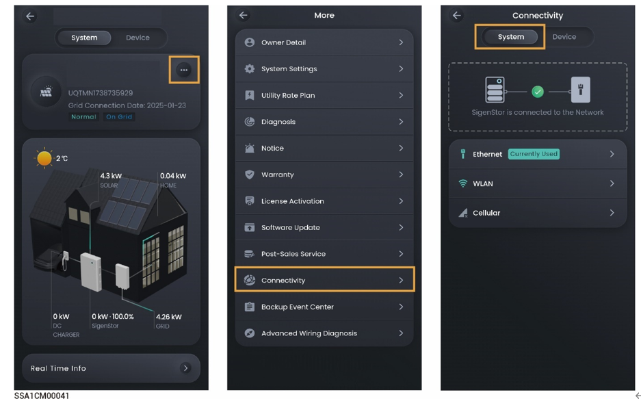

# Internet connection

Click "Connectivity" to view the communication method of the power station connecting to the network

<figure><figcaption></figcaption></figure>

<table><thead><tr><th width="70" align="center">No.</th><th width="144">Parameter name</th><th>Description</th></tr></thead><tbody><tr><td align="center"><strong>1</strong></td><td>Ethernet</td><td>Displays the connection status of Fast Ethernet. Do not disconnect the network cable when the Internet connection is stable.</td></tr><tr><td align="center"><strong>2</strong></td><td>WLAN</td><td>
Displays the connection status of WLAN. Here you can configure the WLAN for all devices in the power station.
<ul><li>Before configuring the WLAN, please make sure that antennas are installed on devices.</li><li>Non-encrypted WLAN is not recommended as it may lead to Internet access failure.</li><li>When WLAN is the only connection path for the devices to access the internet, switching WLAN to any other wireless router will be prohibited.</li></ul></td></tr><tr><td align="center"><strong>3</strong></td><td>Cellular</td><td><ul><li>Displays whether the 4G network is connected to the Internet.</li><li>When 4G is used for communication users can view the monthly traffic usage and set a traffic usage threshold for each month.</li></ul></td></tr></tbody></table>



<mark style="color:blue;">It is recommended to use Fast Ethernet and WLAN for communication with inverters. When free 4G traffic of CommMod runs out, users must top up their accounts or replace an SIM card.</mark>
