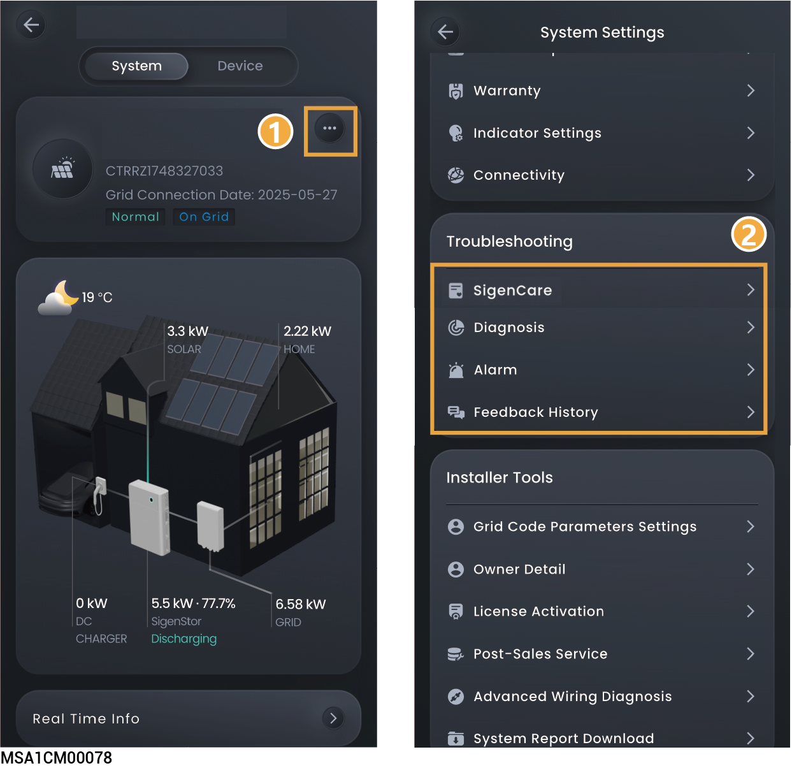

# 故障排查



<mark style="color:blue;">不同国家或电站可设置的参数不同，请以实际界面为准。</mark>

<figure><figcaption></figcaption></figure>

<table><thead><tr><th width="80" align="center" valign="top">序号</th><th width="198.2828369140625" valign="top">参数名称</th><th valign="top">说明</th></tr></thead><tbody><tr><td align="center" valign="top">1</td><td valign="top"><mark style="color:red;">（可选）SigenCare</mark></td><td valign="top"><mark style="color:$danger;">点击对电站的环境可靠性、收益性能、设备可靠性、网络可靠性、储能健康度、系统容量配置等六大核心维度进行综合分析，生成直观的健康评分和诊断报告，帮助用户快速了解电站运行状态，及时发现潜在问题,保障电站资产安全与收益最大化。</mark></td></tr><tr><td align="center" valign="top">2</td><td valign="top">Diagnosis</td><td valign="top">若您想检查电站通信状态及电站内设备连接状态，可使用本功能。 点击可进行电站诊断。</td></tr><tr><td align="center" valign="top">3</td><td valign="top">Alert</td><td valign="top">
点击查看单电站告警信息。

<mark style="color:$danger;">当系统离网运行且因Gateway通信断连导致逆变器关机，若通信恢复，Gateway无法自动上电清除告警，点击“Alert”→“Clear”重新启动逆变器后，Gateway恢复供电，可清除告警。</mark>
</td></tr><tr><td align="center" valign="top">4</td><td valign="top">Feedback History</td><td valign="top">点击查看历史工单。</td></tr><tr><td align="center" valign="top">5</td><td valign="top"><mark style="color:red;">（可选）Operation Log</mark></td><td valign="top"><mark style="color:$danger;">点击可下载电站操作记录。</mark></td></tr></tbody></table>
