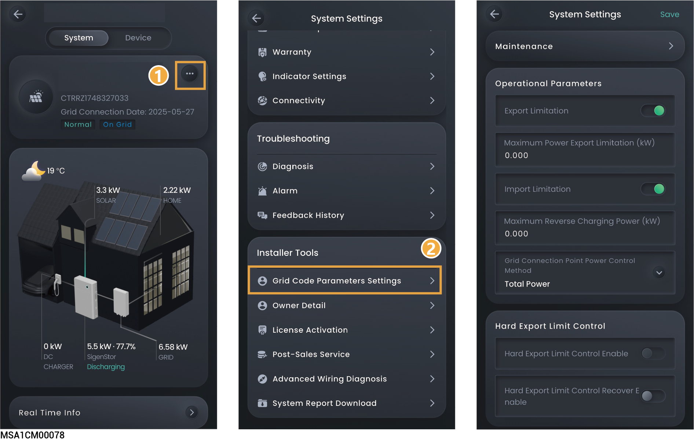

---
layout:
  width: default
  title:
    visible: true
  description:
    visible: true
  tableOfContents:
    visible: true
  outline:
    visible: true
  pagination:
    visible: true
  metadata:
    visible: true
---

# Grid Code Parameters Settings



* <mark style="color:blue;">Parameters available for setup differ depending on the grid code. The screen display shall prevail.</mark>
* <mark style="color:blue;">Parameters may vary across different devices. Please refer to the actual interface.</mark>

<figure><figcaption></figcaption></figure>
