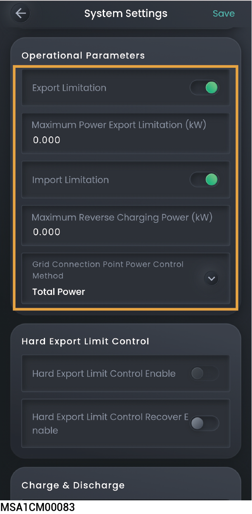

# Export/Import limitation parameters



* <mark style="color:blue;">Click to jump to EMS settings. If this parameter is set by both the owner and the system, the smaller value takes effect.</mark>
* <mark style="color:blue;">An installer can set export/import limitation parameters according to user needs when creating new systems.</mark>
* <mark style="color:blue;">To modify parameters after creating new systems, please manually set export/import limitation parameters according to local laws and regulations and grid agreements.</mark>
* <mark style="color:blue;">Before setting the export/import limitation parameters, ensure that the meter or Gateway is connected to the system wiring.</mark>
* <mark style="color:blue;">The parameter display may differ depending on the device model. The actual screen display shall prevail.</mark>

<figure><figcaption></figcaption></figure>

<table><thead><tr><th width="71" align="center">No.</th><th width="226">Parameter Name</th><th>Description</th></tr></thead><tbody><tr><td align="center">1</td><td>Export Limitation</td><td>When set to , the export power to grid in the grid connection point will be limited.</td></tr><tr><td align="center">2</td><td>Maximum Power Export Limitation</td><td>Set the maximum power value output by the grid connection point.</td></tr><tr><td align="center">3</td><td>Maximum Power Import Limitation</td><td>When set to , the imported power from grid will be limited.</td></tr><tr><td align="center">4</td><td>Maximum Power Import Limitation</td><td>Set the maximum power value input by the grid connection point.</td></tr><tr><td align="center">5</td><td>Grid Connection Point Power Control Method</td><td><ul><li>Total Power: The grid connection point is controlled according to the total three-phase power, meaning the sum of the three-phase power cannot exceed the Maximum Power Export Limitation and Maximum Reverse Charging Power.</li><li>Power Per Phase: The grid connection point is controlled independently for each phase, that is, the power of each phase cannot exceed 1/3 of the Maximum Power Export Limitation and 1/3 of the Maximum Reverse Charging Power.</li></ul></td></tr></tbody></table>
