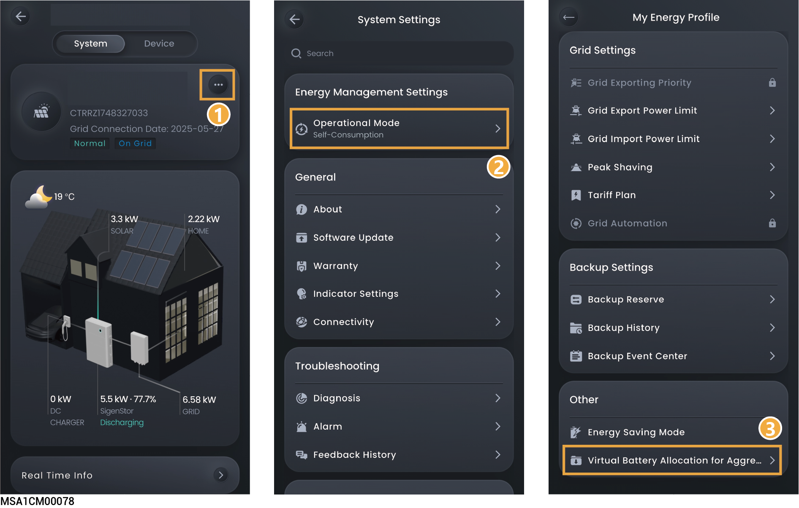

# 储能分身设置



* <mark style="color:blue;">仅瑞典地区有此功能。</mark>
* <mark style="color:blue;">该功能支持将储能系统虚拟分割为两个独立运行单元：虚拟电池可接入CheckWatt虚拟电厂（VPP）的调频服务，剩余能量可根据需求自行设置。</mark>

<figure><figcaption></figcaption></figure>

<table><thead><tr><th width="70" align="center" valign="middle">序号</th><th width="241.727294921875" valign="middle">参数名称</th><th valign="top">说明</th></tr></thead><tbody><tr><td align="center" valign="middle">1</td><td valign="middle">Virtual Battery Allocation for Aggregator</td><td valign="top">设置为时，可设置分配给Aggregator调度的虚拟电池相关参数。</td></tr><tr><td align="center" valign="middle">2</td><td valign="middle">Total Battery Capacity</td><td valign="top">指储能系统总电池容量。</td></tr><tr><td align="center" valign="middle">3</td><td valign="middle">Virtual Battery Capacity</td><td valign="top">设置分配给Aggregator调度的虚拟电池容量。（Virtual Battery Capacity≤Total Battery Capacity。）</td></tr><tr><td align="center" valign="middle">4</td><td valign="middle">Allocation Ratio for Aggregator</td><td valign="top">虚拟电池容量占总电池容量的百分比，用于量化调度权的分配。</td></tr><tr><td align="center" valign="middle">5</td><td valign="middle">Inverter Rated Max Active Input Power</td><td valign="top">逆变器允许的最大输入功率。</td></tr><tr><td align="center" valign="middle">6</td><td valign="middle">Inverter Max Active Input Power</td><td valign="top">为在对虚拟电池充电时的逆变器最大功率。（Inverter Max Active Input Power≤Inverter Rated Max Active Input Power，Inverter Max Active Input Power≥Battery Max Charging Power）</td></tr><tr><td align="center" valign="middle">7</td><td valign="middle">Inverter Rated Max Active Output Power</td><td valign="top">逆变器允许的最大输出功率。</td></tr><tr><td align="center" valign="middle">8</td><td valign="middle">Inverter Max Active Output Power</td><td valign="top">设置分配给Aggregator调度的虚拟电池的逆变器最大输出功率，小于逆变器允许最大输出功率，且不小于电池的最大允许放电功率。（Inverter Max Active Output Power≤Inverter Rated Max Active Output Power， Inverter Max Active Output Power≥Battery Rated Max Discharging Power）</td></tr><tr><td align="center" valign="middle">9</td><td valign="middle">Battery Rated Max Charging Power</td><td valign="top">电池的最大允许充电功率。</td></tr><tr><td align="center" valign="middle">10</td><td valign="middle">Battery Max Charging Power</td><td valign="top">设置分配给Aggregator调度的虚拟电池的充电功率上限，不大于电池的最大允许充电功率，且不大于设置分配给Aggregator调度的虚拟电池的逆变器最大输入功率。（Battery Max Charging Power≤Battery Rated Max Charging Power， Battery Max Charging Power≤Inverter Max Active Input Power）</td></tr><tr><td align="center" valign="middle">11</td><td valign="middle">Battery Rated Max Discharging Power</td><td valign="top">电池的最大允许放电功率。</td></tr><tr><td align="center" valign="middle">12</td><td valign="middle">Battery Max Discharging Power</td><td valign="top">设置分配给Aggregator调度的虚拟电池的放电功率上限，不大于电池的最大允许放电功率，且不大于设置分配给Aggregator调度的虚拟电池的逆变器最大输出功率。（Battery Max Discharging Power≤Battery Rated Max Discharging Power， Battery Max Discharging Power≤Inverter Max Active Output Power）</td></tr></tbody></table>

### **Virtual Battery Setting**

<table><thead><tr><th width="71" align="center" valign="middle">序号</th><th width="247.0909423828125" valign="middle">参数名称</th><th valign="top">说明</th></tr></thead><tbody><tr><td align="center" valign="middle">1</td><td valign="middle">Operational Mode</td><td valign="top">设置虚拟电池的工作模式。</td></tr><tr><td align="center" valign="middle">2</td><td valign="middle">Charging Cut-off SOC</td><td valign="top">电池充电至设定值（如80%）时停止充电，防止过充延长电池寿命，不可高于系统的充电截止Soc。</td></tr><tr><td align="center" valign="middle">3</td><td valign="middle">Discharging Cut-off SOC</td><td valign="top">电池放电至设定值（如50%）时停止放电，防止过放保护电池健康，不可低于系统的放电截止Soc。</td></tr></tbody></table>
