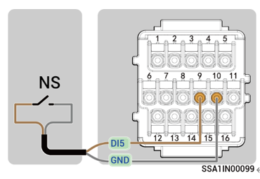

# NS protection parameter

In areas where VDE4105 standards apply, such as VDE-AR-N-4105, VDE-AR-N 4110, and VDE-AR-N 4120, power generating equipment in a power station must support connection with network and system protection (NS) devices.

Figure Connection

<figure><figcaption></figcaption></figure>



* <mark style="color:blue;">DI5 is recommended. If DI1–DI4 is not in use, any one of DI1 to DI5 can be connected to the NS protection device.</mark>
* <mark style="color:blue;">Before setting parameters, ensure that the NS protection device is correctly connected.</mark>

<table><thead><tr><th width="73">No.</th><th width="156">Parameter name</th><th>Description</th></tr></thead><tbody><tr><td><strong>1</strong></td><td>DI Custom Function Enable</td><td></td></tr><tr><td><strong>2</strong></td><td>DI Custom Function Input Port</td><td>DI Input 5 (If the NS protection device is connected to another DI port, make settings based on the</td></tr><tr><td><strong>3</strong></td><td>DI Custom Function Mode</td><td>DRM0 mode (switch ON, INV OFF) Notes: When the power grid operates abnormally, the NS protection device is turned on, and the inverter automatically shuts down. When the power grid recovers, the NS protection device is turned off, and the inverter is powered on.</td></tr><tr><td><strong>4</strong></td><td>Connected AIO Machine SN</td><td>SN of the inverter connected to the NS protection device.</td></tr></tbody></table>
