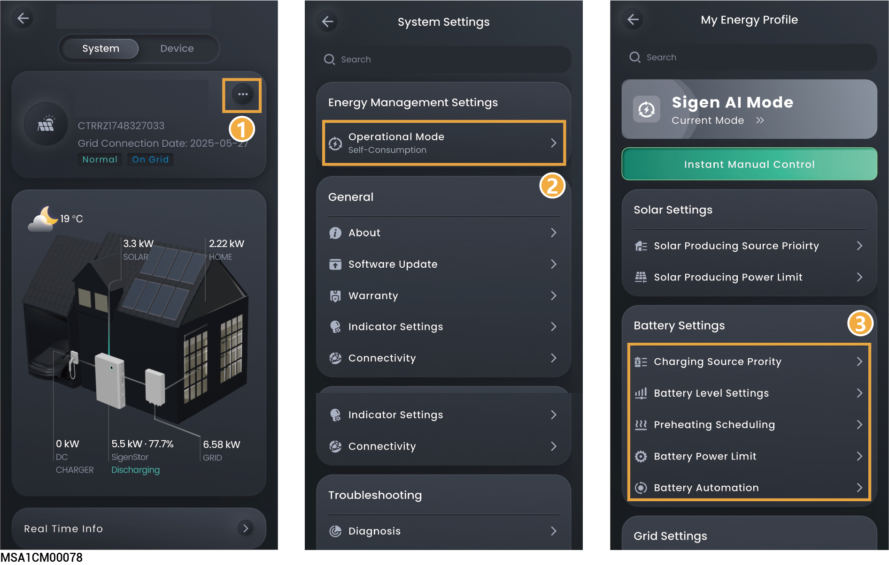

# 电池设置

设置电池相关参数可优化电池性能、延长寿命并实现智能充放电策略。

<figure><figcaption></figcaption></figure>

## Charging Source Prority



* <mark style="color:blue;">电池根据设置顺序获取电能。</mark>
* <mark style="color:blue;">默认优先级：PV＞Grid，优先使用PV光伏给电池充电，剩余由电网补充。</mark>
* <mark style="color:blue;">负电价情景下，可调整优先级为：Grid＞PV。</mark>

## Discharging Source Prority



<mark style="color:blue;">电池根据设置顺序释放电能，可根据实际情况设置电池放电优先级。</mark>

## Battery Level Setting

<table><thead><tr><th width="61" align="center" valign="middle">序号</th><th width="207" valign="middle">参数名称</th><th valign="top">说明</th></tr></thead><tbody><tr><td align="center" valign="middle">1</td><td valign="middle">Charge Cut-off SOC</td><td valign="top">设置电池包停止充电的容量。</td></tr><tr><td align="center" valign="middle">2</td><td valign="middle">Discharge Cut-off SOC</td><td valign="top">
设置电池包停止放电的容量。
<ul><li><mark style="color:$danger;">此参数建议设置为0%,</mark> 避免电池包未及时充电造成不可逆的衰减。</li><li>在备电组网时，优先执行“Backup Capacity”；非备电组网时，执行此参数。</li></ul></td></tr><tr><td align="center" valign="middle">3</td><td valign="middle">Peak shaving</td><td valign="top">设置电池峰值削峰截止点。</td></tr><tr><td align="center" valign="middle">4</td><td valign="middle">Backup Reserve SOC</td><td valign="top"><ul><li>电站中含有Gateway时，可设置此参数。</li><li>并网场景时，电池包放电至备电量值时不再放电；离网场景时，电池包给用电设备供电，放电至设置的Discharge Cut-off SOC时，停止放电。</li><li>用户根据地区断电频率和离家时间手动设置。不建议设置为0，避免电池包电量为0，在离网时无法为负载供能。</li></ul></td></tr></tbody></table>

## Battery Preheating scheduling



<mark style="color:blue;">在低温环境下预先调节电池温度至最佳工作范围，防止低温导致电池性能衰减与安全隐患。</mark>

### 户用储能电站

<table><thead><tr><th width="72" align="center" valign="top">序号</th><th width="258" valign="top">参数名称</th><th valign="top">说明</th></tr></thead><tbody><tr><td align="center" valign="top">1</td><td valign="top">Battery Preheating Scheduling</td><td valign="top">设置为时，电池加热膜提前加热功能使能。</td></tr><tr><td align="center" valign="top">2</td><td valign="top">Heating</td><td valign="top">点击设置电池加热膜加热周期。</td></tr></tbody></table>

### 工商业储能电站

Battery Preheating Scheduling设置为后，需选择预加热的模式。

#### Manual Setting

<table><thead><tr><th width="71" align="center" valign="top">序号</th><th width="202.81829833984375" valign="top">参数名称</th><th valign="top">说明</th></tr></thead><tbody><tr><td align="center" valign="top">1</td><td valign="top"><mark style="color:$danger;">Smart Pre-heating</mark></td><td valign="top">
<mark style="color:$danger;">设置为</mark><mark style="color:$danger;">时，电池加热膜提前加热功能禁能。</mark>
<ul><li><mark style="color:$danger;">Heating Duration：可设置电池加热膜加热时长。</mark></li></ul>
<mark style="color:$danger;">设置为</mark><mark style="color:$danger;">时，电池加热膜提前加热功能使能。</mark>
<ul><li><mark style="color:$danger;">Target Working Period：可设置加热膜期望充放电的时段。</mark></li></ul></td></tr><tr><td align="center" valign="top">2</td><td valign="top">Heating</td><td valign="top">
点击设置电池加热膜加热周期。 <mark style="color:$danger;">Advanced Settings</mark>
<ul><li>Target Charging Power：由于低温导致电池充电功率受限，启动加热后，当充电能力大于该值时，停止加热膜工作。</li><li>Target Discharging Power：由于低温导致电池放电功率受限，启动加热后，当放电能力大于该值时，停止加热膜工作。</li></ul></td></tr></tbody></table>

#### Depends on system（Automatic）

仅在电站处于TOU调度模式下支持自动模式。

## Battery Power Limit



<mark style="color:blue;">若需设置更详细的充放电数据，可设置此参数。</mark>

<table><thead><tr><th width="66" align="center" valign="top">序号</th><th width="296" valign="top">参数名称</th><th valign="top">说明</th></tr></thead><tbody><tr><td align="center" valign="top">1</td><td valign="top">Battery Max Charging Power</td><td valign="top">设置电站中所有电池的允许总最大充电功率。</td></tr><tr><td align="center" valign="top">2</td><td valign="top">Battery Max Discharging Power</td><td valign="top">设置电站中所有电池的允许总最大放电功率。</td></tr></tbody></table>

## Battery Automation



<mark style="color:blue;">若设置此参数，电池优先执行Battery Automation设置的参数。</mark>

<table><thead><tr><th width="60" align="center" valign="middle">序号</th><th width="150" valign="middle">参数名称</th><th valign="top">说明</th></tr></thead><tbody><tr><td align="center" valign="middle">1</td><td valign="middle">Add Time Period</td><td valign="top">点击添加时间段。</td></tr><tr><td align="center" valign="middle">2</td><td valign="middle">Add your action</td><td valign="top">
点击添加电池运行状态。

<strong>Battery Charging</strong>
<ul><li>Maximum Charging Power：设置电站中所有电池允许的总最大充电功率，在该时间窗口下生效。</li><li>Maximum Charging Power From Grid to BAT：设置电网向电池的最大充电输入功率。</li><li>Battery Charging From Grid Cut-off SOC：当电池SOC达到此阈值时，强制停止电网给电池充电。</li><li>Battery Charging Source Priority：调整电池电能来源优先级。</li></ul>
<strong>Battery Discharging</strong>
<ul><li>Maximum Discharging Power：设置电站中所有电池允许的总最大放电功率，在该时间窗口下生效。</li><li>Maximum Discharging power from BAT to Grid：设置电池向电网最大放电输出功率。</li><li>Discharge Cut-off SOC from BAT to Grid：当电池SOC达到此阈值时，强制停止电池给电网输电。</li></ul>
<strong>Battery Preserve：电池不充电也不放电。</strong>

<strong>Battery Self Consumption：电池的电能优先供给负载，剩余电能卖给电网。</strong>
<ul><li>Maximum Charging Power：设置电站中所有电池的允许总最大充电功率，在该时间窗口下生效。</li><li>Maximum Discharging Power：设置电站中所有电池的允许总最大放电功率，在该时间窗口下生效。</li></ul></td></tr></tbody></table>
