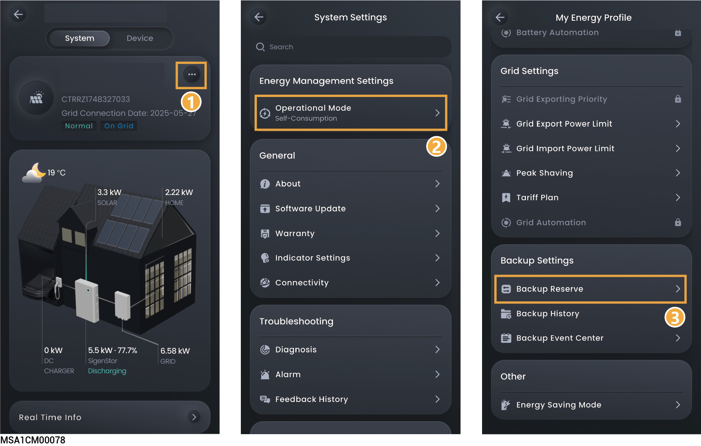

# 备电设置

## **备电储备**



* <mark style="color:blue;">若未配置Gateway请忽略此章节。</mark>
* <mark style="color:blue;">根据地区断电频率和离家时间手动设置。</mark>

组网中含有Gateway时，可在mySigen App中手动设置“Backup Reserve”值。在电网并网时，电池放电至设置的备电SOC时停止放电；在电网掉电时，可以使用备电的电池电量。

示例： Self-Consumption Mode下设置了备电SOC。

<figure><figcaption></figcaption></figure>

<figure><figcaption></figcaption></figure>

## **备电历史**



<mark style="color:blue;">系统中安装Gateway后，当出现并离网事件时，系统将进行记录。您可通过以下方式查看并离网切换的时间与原因。</mark>

## **风暴预警**



* <mark style="color:$primary;">本功能仅对有电池且开启离网使能的电站开放。</mark>
* <mark style="color:$primary;">开启本功能后，系统获取极端天气信息后，提前给电池充电。</mark>

<figure><figcaption></figcaption></figure>

<table><thead><tr><th width="81.88885498046875" align="center" valign="middle">序号</th><th width="178.3233642578125" valign="middle">参数名称</th><th width="458.888916015625" valign="top">说明</th></tr></thead><tbody><tr><td align="center" valign="middle">1</td><td valign="middle">Storm Watch</td><td valign="top">设置为时，风暴预警功能使能。</td></tr><tr><td align="center" valign="middle">2</td><td valign="middle">Backup Settings</td><td valign="top">Enable backup before the storm：设置极端天气前备电时长。</td></tr><tr><td align="center" valign="middle">3</td><td valign="middle">Weather Warnings</td><td valign="top">选择极端天气类型。</td></tr></tbody></table>
