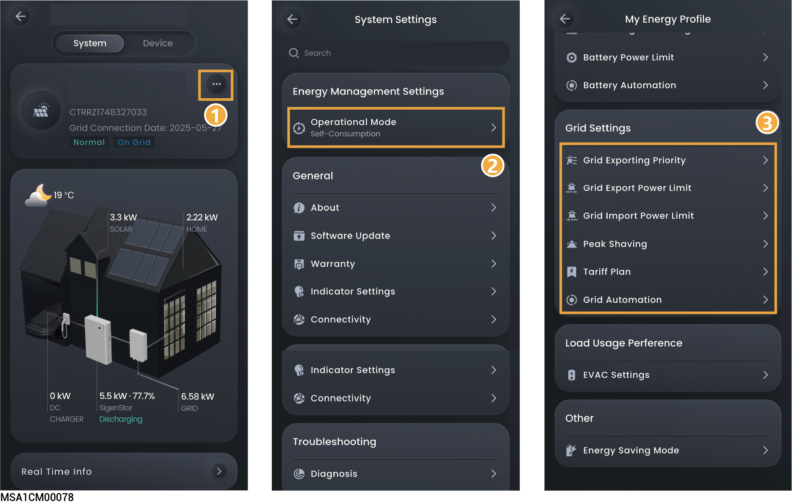

# 电网设置

设置电网相关参数可确保安全并网、合规售电和收益最大化。

<figure><figcaption></figcaption></figure>

## Grid Exporting Priority



* <mark style="color:blue;">默认优先级：PV＞Battery，PV光伏功率优先向电网卖售电，电池补充向电网售电。</mark>
* <mark style="color:blue;">负电价情景下，优先级可以调整为： Battery> PV。尽量放出电池电量，负电价时从电网买电给电池充电。</mark>
* <mark style="color:blue;">设备根据设置顺序向电网售电。</mark>

## Grid power setting

<table><thead><tr><th width="110" align="center" valign="top">序号</th><th width="220.888916015625" valign="top">参数名称</th><th valign="top">说明</th></tr></thead><tbody><tr><td align="center" valign="top">1</td><td valign="top">Grid Export Power Limit</td><td valign="top">设置系统向电网卖电的最大功率。</td></tr><tr><td align="center" valign="top">2</td><td valign="top">Grid Import Power Limit</td><td valign="top">设置系统从电网买电的最大功率。</td></tr></tbody></table>

## Peak Shaving



* <mark style="color:blue;">某些地区的电费计算方式为：总电费 = 峰值功率费用 + 用电电量费用 + 其它费用。其中，峰值功率指的是从电网取电的最大功率值。该模式适用于有峰谷电价且价差较大的区域。</mark>
* <mark style="color:blue;">Peak Shaving功能可以配合所有工作模式使用，通过配置从电网取电最大峰值功率，降低高峰期电网取电最大峰值功率，降低用电费用。</mark>

#### **Active Power Control**

<table><thead><tr><th width="86" align="center" valign="middle">序号</th><th width="196" valign="middle">参数名称</th><th valign="top">说明</th></tr></thead><tbody><tr><td align="center" valign="middle">1</td><td valign="middle">Peak shaving SOC</td><td valign="top">本参数的设置值将影响削峰的能力，在用电低谷期，系统给电池充电到设置的SOC值。本参数设置值越大，削峰的能力越强。</td></tr><tr><td align="center" valign="middle">2</td><td valign="middle">Schedule</td><td valign="top">最多可以添加24个时间表。</td></tr><tr><td align="center" valign="middle">3</td><td valign="middle">Maximum Peak Power</td><td valign="top">设置从电网取电用于家庭负载和电池包充电的最大峰值功率。</td></tr></tbody></table>

### **案例一：Self-Consumption设置Peak Shaving**

假设Peak Shaving设置的削峰SOC为50%，最大峰值功率为2 kW。

因为总电费 = 峰值功率费用 + 用电电量费用 + 其它费用。其中，峰值功率指的是从电网取电的最大功率值。Self-Consumption Mode设置Peak Shaving后，电网购电功率从5 kW下降到2 kW，所以总电费降低了。

<figure><figcaption></figcaption></figure>

### **案例二：Time-based Control设置Peak Shaving**

假设Peak Shaving设置的削峰SOC为50%，最大峰值功率为2 kW。

因为总电费 = 峰值功率费用 + 用电电量费用 + 其它费用。其中，峰值功率指的是从电网取电的最大功率值。Time-based Control设置Peak Shaving后，电网购电功率从5 kW下降到2 kW，所以总电费降低了。

<figure><figcaption></figcaption></figure>

## **电价设置**



<mark style="color:blue;">部分电价运营商需输入Secret Key ，以App界面显示为准。</mark>

### **Tariff Rate Plan**

静态电价是指在整个计费周期内，电价保持固定不变，不随时间、供需状况或系统成本波动而调整的定价模式。

<table><thead><tr><th width="84" align="center" valign="top">序号</th><th width="220" valign="top">参数名称</th><th valign="top">说明</th></tr></thead><tbody><tr><td align="center" valign="top">1</td><td valign="top">Utility Company</td><td valign="top">选择电价运营商。</td></tr><tr><td align="center" valign="top">2</td><td valign="top">(Optional) Secret Key</td><td valign="top">设置电价运营商密钥，设置后App可获取电价并展示。</td></tr><tr><td align="center" valign="top">3</td><td valign="top">Rate Plan Name</td><td valign="top">选择电价方案。</td></tr><tr><td align="center" valign="top">4</td><td valign="top">Currency Unit</td><td valign="top"><mark style="color:$danger;">默认为电站所在国家电价最小货币单位，此参数无法编辑。</mark></td></tr><tr><td align="center" valign="top">5</td><td valign="top">Additional Fee</td><td valign="top">自动匹配附加费用。</td></tr><tr><td align="center" valign="top">6</td><td valign="top"><mark style="color:$danger;">Demand Charge</mark></td><td valign="top"><mark style="color:$danger;">点击“Go To Setting”，可设置需量电价。</mark></td></tr><tr><td align="center" valign="top">7</td><td valign="top"><mark style="color:$danger;">Customize</mark></td><td valign="top"><mark style="color:$danger;">点击切换到Customize Rate Plan。</mark></td></tr></tbody></table>

### **Customize Rate Plan**

动态电价是指电力价格随时间和不同地区实时变化的定价模式。

<table><thead><tr><th width="80" align="center" valign="middle">序号</th><th width="207.0909423828125" valign="middle">参数名称</th><th valign="top">说明</th></tr></thead><tbody><tr><td align="center" valign="middle">1</td><td valign="middle">Utility Company</td><td valign="top">选择电价运营商。</td></tr><tr><td align="center" valign="middle">2</td><td valign="middle">Rate Plan Name</td><td valign="top">填写电价方案名称。</td></tr><tr><td align="center" valign="middle">3</td><td valign="middle">Currency Unit</td><td valign="top"><mark style="color:$danger;">默认为电站所在国家电价最小货币单位，此参数无法编辑。</mark></td></tr><tr><td align="center" valign="middle">4</td><td valign="middle">Rate Plan Type</td><td valign="top">
<strong>Single Rate Tariff：所有时段采用同一电价。</strong>
<ul><li>Rate Tariff：设置电价费率。</li></ul>
<strong>TOU Rate Plan：不同时段采用不同电价。</strong>

点击，可添加自定义时段和电价等信息。
</td></tr><tr><td align="center" valign="middle">5</td><td valign="middle"><mark style="color:$primary;">Dynamic Trariff</mark></td><td valign="top">点击切换到Tariff Rate Plan。</td></tr></tbody></table>

### Demand Charge Settings

<mark style="color:$danger;">需量电价是一种除按用电量收费外，还根据用户在一个计费周期内的最高用电功率来收取容量电费的两部制电价模式。</mark>

<table><thead><tr><th width="80" align="center" valign="middle">序号</th><th width="180.727294921875" valign="middle">参数名称</th><th valign="top">说明</th></tr></thead><tbody><tr><td align="center" valign="middle">1</td><td valign="middle">Currency Unit</td><td valign="top"><mark style="color:$danger;">默认为电站所在国家电价最小货币单位，此参数无法编辑。</mark></td></tr><tr><td align="center" valign="middle">2</td><td valign="middle">Demand Interval</td><td valign="top"><mark style="color:$danger;">设置账单结算周期。</mark></td></tr><tr><td align="center" valign="middle">3</td><td valign="middle">Reset Frequency</td><td valign="top"><mark style="color:$danger;">设置功率计算周期。</mark></td></tr><tr><td align="center" valign="middle">4</td><td valign="middle">Rate Plan Type</td><td valign="top">
<mark style="color:$danger;"><strong>Single Rate Tariff：所有时段采用同一需量电价。</strong></mark>
<ul><li><mark style="color:$danger;">Demand Rate Tariff：设置需量电价费率。</mark></li></ul>
<mark style="color:$danger;"><strong>TOU Rate Plan：不同时段采用不同需量电价。</strong></mark>

<mark style="color:$danger;">点击</mark><mark style="color:$danger;">，可添加自定义时段和电价等信息。</mark>
</td></tr></tbody></table>

### **保存电价配置**



<mark style="color:blue;">可将电价配置保存到安装商个人账号，并将电价配置应用于其他电站。</mark>

<figure><figcaption></figcaption></figure>

## Grid Automation



<mark style="color:blue;">若设置此参数，电网优先执行Grid Automation设置的参数。</mark>

<table><thead><tr><th width="60" align="center" valign="middle">序号</th><th width="149" valign="middle">参数名称</th><th valign="top">说明</th></tr></thead><tbody><tr><td align="center" valign="middle">1</td><td valign="middle">Add Time Period</td><td valign="top">点击添加时间段。</td></tr><tr><td align="center" valign="middle">2</td><td valign="middle">Add your action</td><td valign="top">
点击添加电网运行状态。
<ol><li><strong>Grid Self-Consumption：电池的电能优先供给负载，剩余电能卖给电网。</strong></li><li><strong>Grid Importing：系统从电网买电模式。</strong></li><li><strong>Grid Exporting：系统向电网卖电模式。</strong></li></ol><ul><li>Maximum power for importing from grid：设置从电网购买电力的最大输入功率。</li><li>Maximum power for exporting to grid：设置系统向电网卖电的最大输出功率。</li><li>Grid Exporting Source Priority：根据设置优先级向电网卖电。</li></ul></td></tr></tbody></table>
