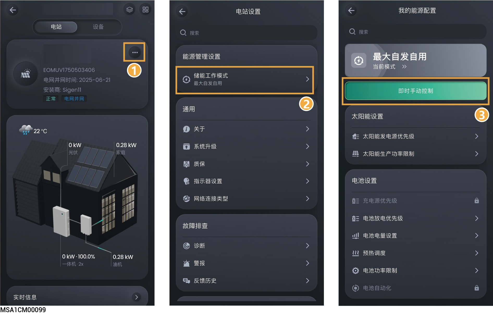

# 即时手动控制



<mark style="color:blue;">当电池电量过多或不足时，可强制设置电池充电或放电时长，设置后优先执行此参数。</mark>

<figure><figcaption></figcaption></figure>

<table><thead><tr><th width="81.88885498046875" align="center" valign="middle">序号</th><th width="117.111083984375" valign="middle">参数名称</th><th width="564.888916015625" valign="top">说明</th></tr></thead><tbody><tr><td align="center" valign="middle">1</td><td valign="middle">操作</td><td valign="top"><ul><li>充电：强制给电池充电。</li></ul><ul><li>放电：强制使电池放电。</li><li>电池保持：电池非充非放。</li><li>自发自用：电池自发自用。</li></ul></td></tr><tr><td align="center" valign="middle">2</td><td valign="middle">周期</td><td valign="top">设置充电或放电持续时间。</td></tr></tbody></table>
